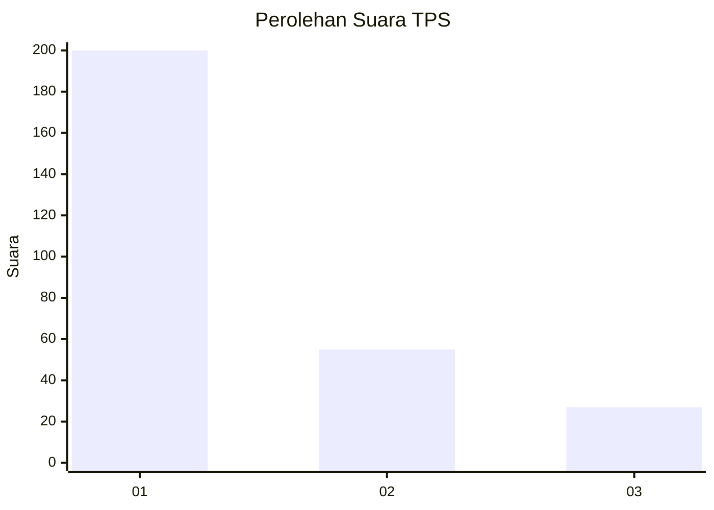
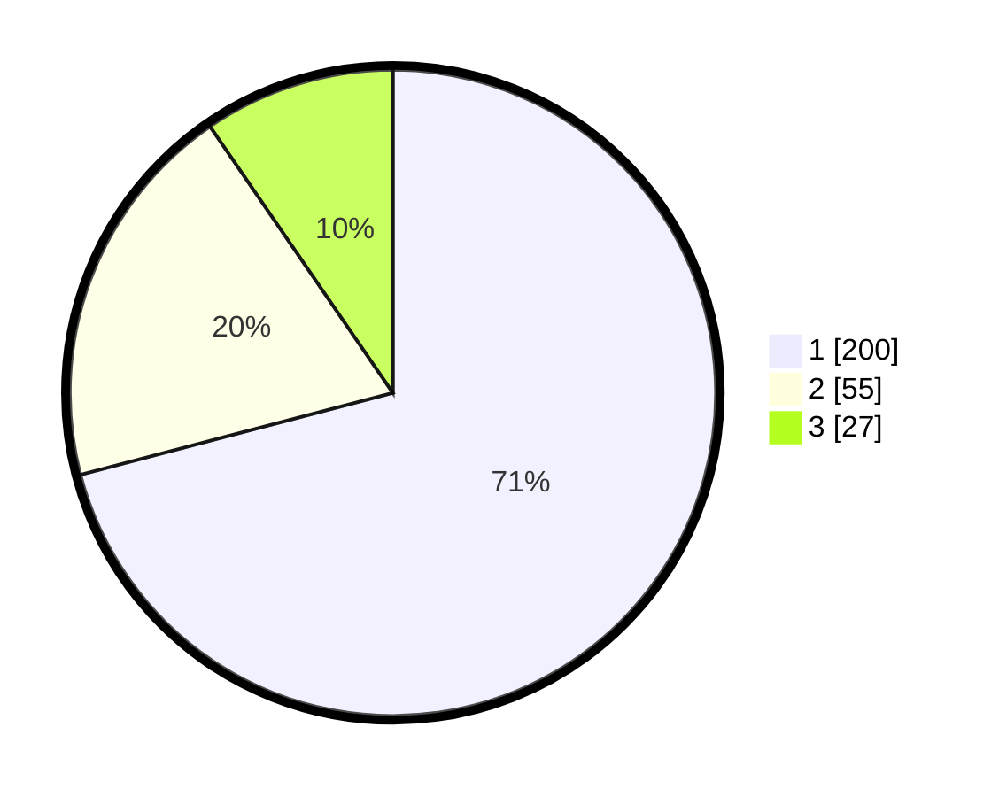

# Hasil

## Grafik

## Tabel

| No. | Nama Paslon    | Suara | Suara (raw) | Persentase |
|:--- |:-------------- | -----:| -----------:| ----------:|
| 1   | ANIES MUHAIMIN | 200   | [200][p-1]  | 70,92      |
| 2   | PRABOWO GIBRAN | 55    | [55][p-2]   | 19,50      |
| 3   | GANJAR MAHFUD  | 27    | [27][p-3]   | 9,57       |

[p-1]: https://github.com/gigit-pemilu/pemilu-2024-31-dki-jakarta/blob/main/pilpres/hitung-suara/sub/31-dki-jakarta/sub/75-jakarta-timur/sub/07-duren-sawit/sub/1004-pondok-kelapa/sub/196-tps/sub/paslon-1.txt
[p-2]: https://github.com/gigit-pemilu/pemilu-2024-31-dki-jakarta/blob/main/pilpres/hitung-suara/sub/31-dki-jakarta/sub/75-jakarta-timur/sub/07-duren-sawit/sub/1004-pondok-kelapa/sub/196-tps/sub/paslon-2.txt
[p-3]: https://github.com/gigit-pemilu/pemilu-2024-31-dki-jakarta/blob/main/pilpres/hitung-suara/sub/31-dki-jakarta/sub/75-jakarta-timur/sub/07-duren-sawit/sub/1004-pondok-kelapa/sub/196-tps/sub/paslon-3.txt

## Foto C Plano

https://sirekap-obj-formc.kpu.go.id/c2a9/pemilu/ppwp/31/75/07/10/04/3175071004196-20240214-233714--33ae6f52-6532-4b42-aa6b-ff30392c73d7.jpg

https://sirekap-obj-formc.kpu.go.id/c2a9/pemilu/ppwp/31/75/07/10/04/3175071004196-20240214-233731--a21b7f00-5981-4f2e-b3a8-692c6515a206.jpg

https://sirekap-obj-formc.kpu.go.id/c2a9/pemilu/ppwp/31/75/07/10/04/3175071004196-20240214-233748--66437b0a-efff-43ff-acb1-ee04032af333.jpg

## Metadata

| Key        | Value               |
| ---------- | ------------------- |
| Time Stamp | 2024-02-15 15:00:29 |

