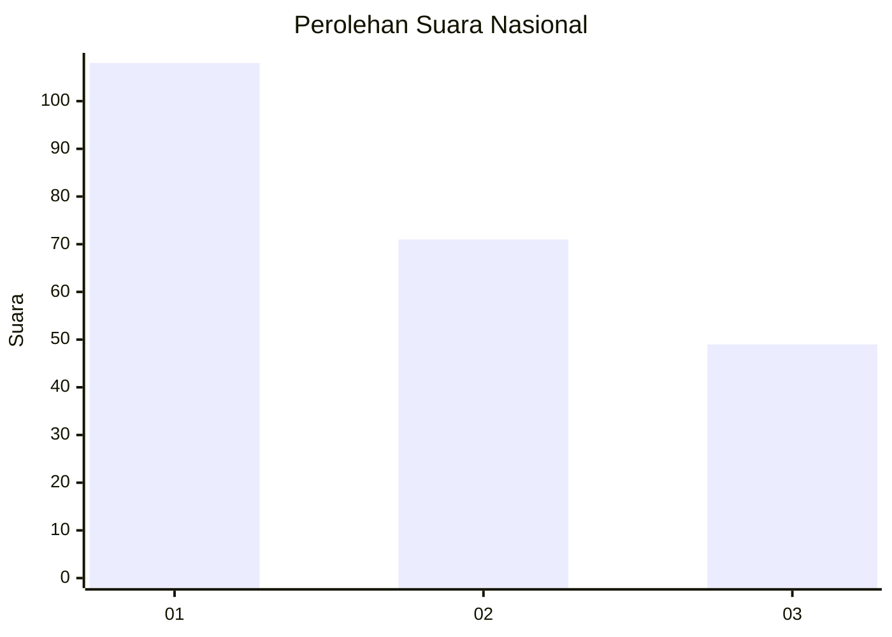
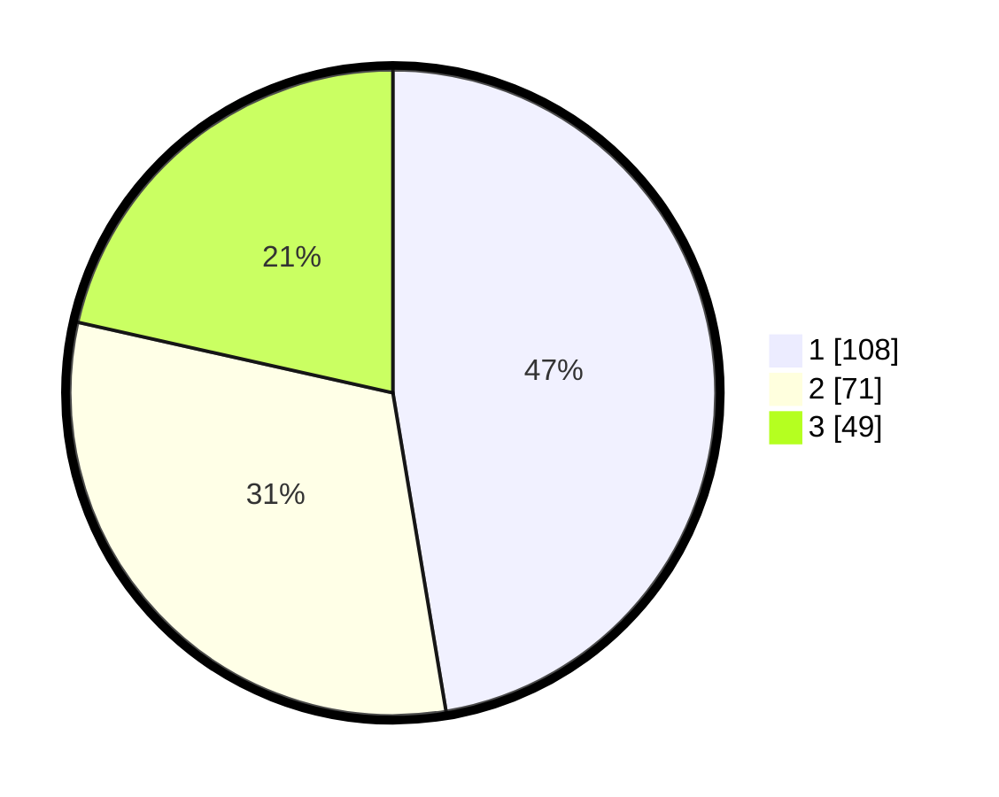

# Hasil

## Grafik

## Tabel

| No.    | Nama Paslon    | Suara | Suara (raw) | Persentase |
|:------ |:-------------- | -----:| -----------:| ----------:|
| 100025 | ANIES MUHAIMIN | 108   | [108][p-1]  | 47,37      |
| 100026 | PRABOWO GIBRAN | 71    | [71][p-2]   | 31,14      |
| 100027 | GANJAR MAHFUD  | 49    | [49][p-3]   | 21,49      |

[p-1]: https://github.com/gigit-pemilu/pemilu-2024/blob/main/pilpres/hitung-suara/sub/31-dki-jakarta/sub/75-jakarta-timur/sub/07-duren-sawit/sub/1004-pondok-kelapa/sub/206-tps/sub/paslon-1.txt
[p-2]: https://github.com/gigit-pemilu/pemilu-2024/blob/main/pilpres/hitung-suara/sub/31-dki-jakarta/sub/75-jakarta-timur/sub/07-duren-sawit/sub/1004-pondok-kelapa/sub/206-tps/sub/paslon-2.txt
[p-3]: https://github.com/gigit-pemilu/pemilu-2024/blob/main/pilpres/hitung-suara/sub/31-dki-jakarta/sub/75-jakarta-timur/sub/07-duren-sawit/sub/1004-pondok-kelapa/sub/206-tps/sub/paslon-3.txt

## Foto C Plano

https://sirekap-obj-formc.kpu.go.id/6a2e/pemilu/ppwp/31/75/07/10/04/3175071004206-20240214-193429--9729d7f4-a31b-4a5b-8883-fa21c9515489.jpg

https://sirekap-obj-formc.kpu.go.id/6a2e/pemilu/ppwp/31/75/07/10/04/3175071004206-20240214-190119--15308111-b07d-4d13-ba20-3bb992875875.jpg

https://sirekap-obj-formc.kpu.go.id/6a2e/pemilu/ppwp/31/75/07/10/04/3175071004206-20240214-190126--1db9d8fd-565b-46af-a652-90d5f71ca9bc.jpg

## Metadata

| Key        | Value               |
| ---------- | ------------------- |
| Time Stamp | 2024-02-24 22:31:28 |

