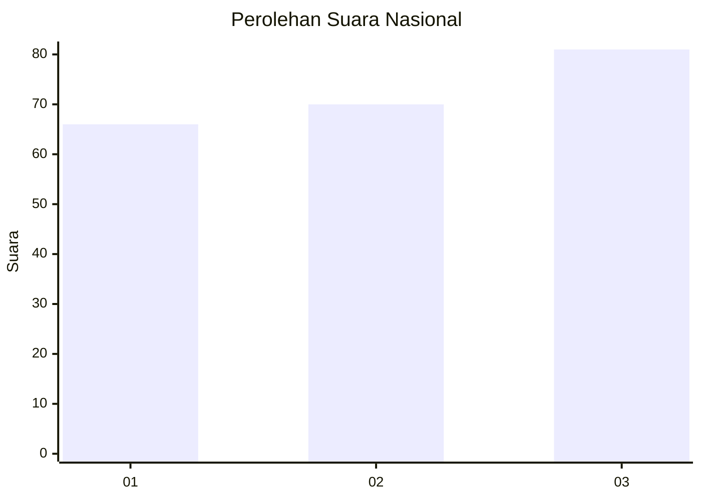
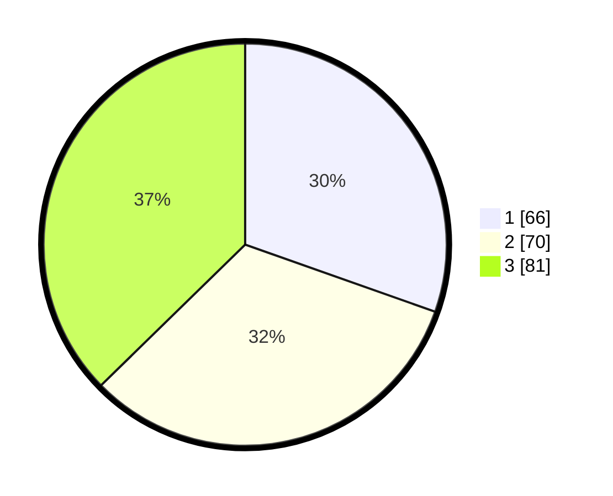

# Hasil

## Grafik

## Tabel

| No.    | Nama Paslon    | Suara | Suara (raw) | Persentase |
|:------ |:-------------- | -----:| -----------:| ----------:|
| 100025 | ANIES MUHAIMIN | 66    | [66][p-1]   | 30,41      |
| 100026 | PRABOWO GIBRAN | 70    | [70][p-2]   | 32,26      |
| 100027 | GANJAR MAHFUD  | 81    | [81][p-3]   | 37,33      |

[p-1]: https://github.com/gigit-pemilu/pemilu-2024/blob/main/pilpres/hitung-suara/sub/31-dki-jakarta/sub/75-jakarta-timur/sub/07-duren-sawit/sub/1004-pondok-kelapa/sub/207-tps/sub/paslon-1.txt
[p-2]: https://github.com/gigit-pemilu/pemilu-2024/blob/main/pilpres/hitung-suara/sub/31-dki-jakarta/sub/75-jakarta-timur/sub/07-duren-sawit/sub/1004-pondok-kelapa/sub/207-tps/sub/paslon-2.txt
[p-3]: https://github.com/gigit-pemilu/pemilu-2024/blob/main/pilpres/hitung-suara/sub/31-dki-jakarta/sub/75-jakarta-timur/sub/07-duren-sawit/sub/1004-pondok-kelapa/sub/207-tps/sub/paslon-3.txt

## Foto C Plano

https://sirekap-obj-formc.kpu.go.id/032b/pemilu/ppwp/31/75/07/10/04/3175071004207-20240214-203138--fbd80bb0-a2f9-418c-9f5d-af8e38caf650.jpg

https://sirekap-obj-formc.kpu.go.id/032b/pemilu/ppwp/31/75/07/10/04/3175071004207-20240214-213445--f4b0177f-96d6-4a7d-a342-7e61d18f799c.jpg

https://sirekap-obj-formc.kpu.go.id/032b/pemilu/ppwp/31/75/07/10/04/3175071004207-20240214-213608--73419b88-daab-4073-b666-a0d45d617e8d.jpg

## Metadata

| Key        | Value               |
| ---------- | ------------------- |
| Time Stamp | 2024-02-16 03:00:26 |

