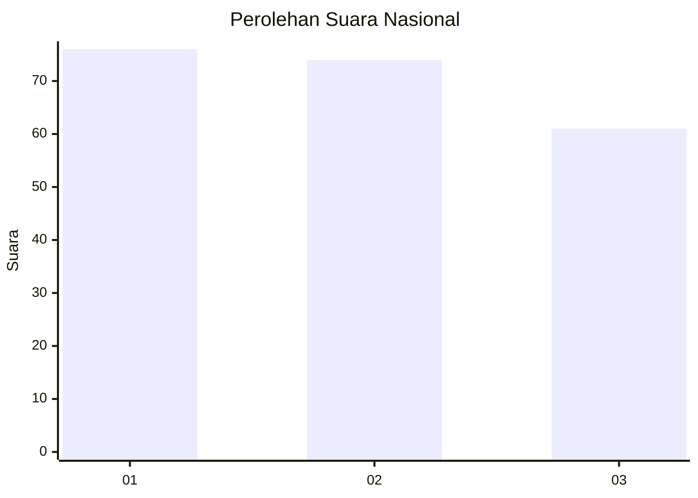
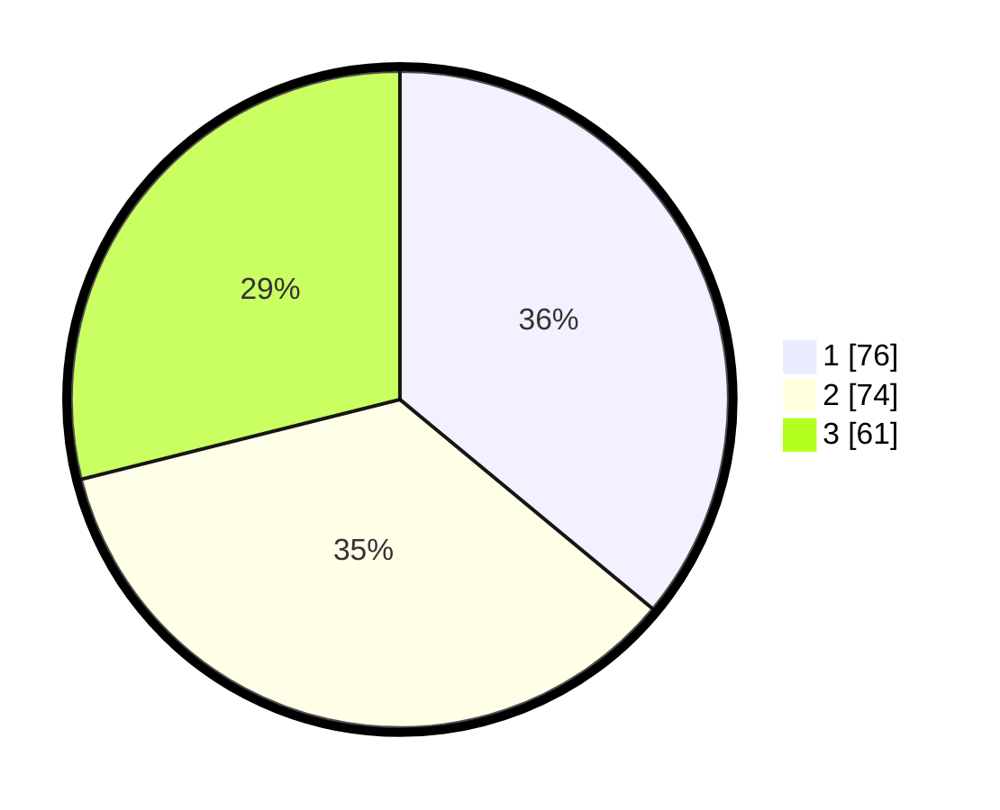

# Hasil

## Grafik

## Tabel

| No.    | Nama Paslon    | Suara | Suara (raw) | Persentase |
|:------ |:-------------- | -----:| -----------:| ----------:|
| 100025 | ANIES MUHAIMIN | 76    | [76][p-1]   | 36,02      |
| 100026 | PRABOWO GIBRAN | 74    | [74][p-2]   | 35,07      |
| 100027 | GANJAR MAHFUD  | 61    | [61][p-3]   | 28,91      |

[p-1]: https://github.com/gigit-pemilu/pemilu-2024/blob/main/pilpres/hitung-suara/sub/31-dki-jakarta/sub/75-jakarta-timur/sub/07-duren-sawit/sub/1004-pondok-kelapa/sub/212-tps/sub/paslon-1.txt
[p-2]: https://github.com/gigit-pemilu/pemilu-2024/blob/main/pilpres/hitung-suara/sub/31-dki-jakarta/sub/75-jakarta-timur/sub/07-duren-sawit/sub/1004-pondok-kelapa/sub/212-tps/sub/paslon-2.txt
[p-3]: https://github.com/gigit-pemilu/pemilu-2024/blob/main/pilpres/hitung-suara/sub/31-dki-jakarta/sub/75-jakarta-timur/sub/07-duren-sawit/sub/1004-pondok-kelapa/sub/212-tps/sub/paslon-3.txt

## Foto C Plano

https://sirekap-obj-formc.kpu.go.id/f542/pemilu/ppwp/31/75/07/10/04/3175071004212-20240215-151917--70880205-228c-4413-9cd2-900d1ba9fabb.jpg

https://sirekap-obj-formc.kpu.go.id/f542/pemilu/ppwp/31/75/07/10/04/3175071004212-20240214-214556--622f3aeb-8125-4dd1-b7d4-6a0f0f07f5a8.jpg

https://sirekap-obj-formc.kpu.go.id/f542/pemilu/ppwp/31/75/07/10/04/3175071004212-20240214-214655--913e9b08-907e-4093-8355-7b5aeb5697d9.jpg

## Metadata

| Key        | Value               |
| ---------- | ------------------- |
| Time Stamp | 2024-02-16 03:00:26 |

