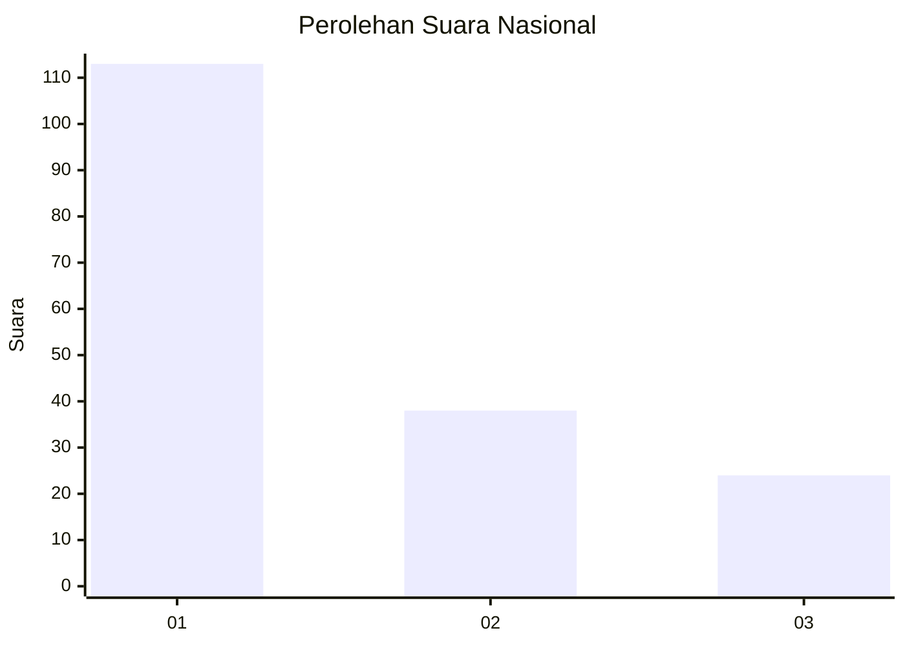
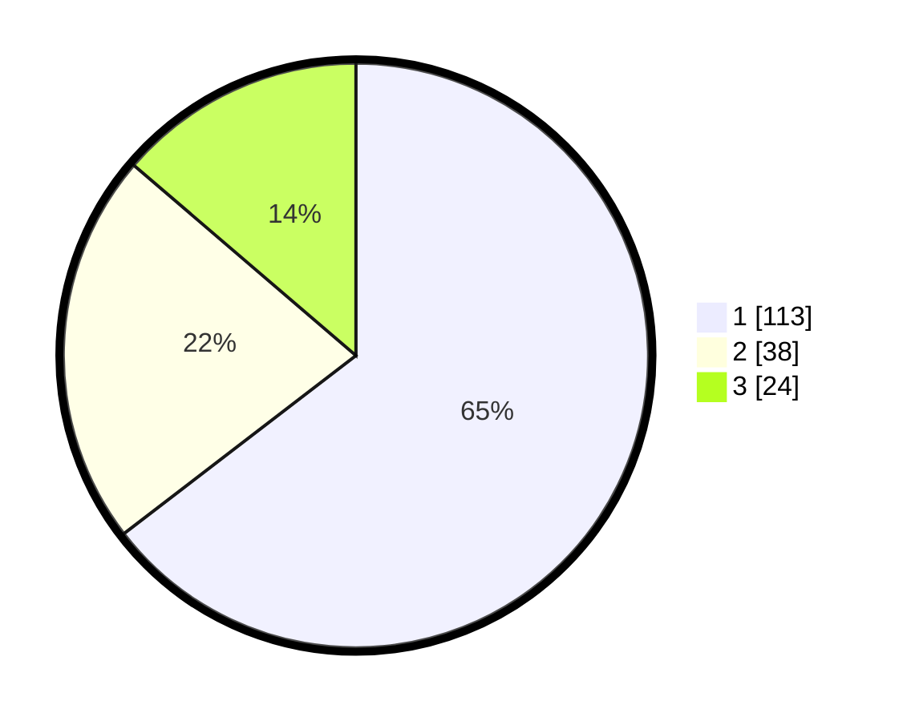

# Hasil

## Grafik

## Tabel

| No.    | Nama Paslon    | Suara | Suara (raw) | Persentase |
|:------ |:-------------- | -----:| -----------:| ----------:|
| 100025 | ANIES MUHAIMIN | 113   | [113][p-1]  | 64,57      |
| 100026 | PRABOWO GIBRAN | 38    | [38][p-2]   | 21,71      |
| 100027 | GANJAR MAHFUD  | 24    | [24][p-3]   | 13,71      |

[p-1]: https://github.com/gigit-pemilu/pemilu-2024/blob/main/pilpres/hitung-suara/sub/31-dki-jakarta/sub/75-jakarta-timur/sub/07-duren-sawit/sub/1004-pondok-kelapa/sub/225-tps/sub/paslon-1.txt
[p-2]: https://github.com/gigit-pemilu/pemilu-2024/blob/main/pilpres/hitung-suara/sub/31-dki-jakarta/sub/75-jakarta-timur/sub/07-duren-sawit/sub/1004-pondok-kelapa/sub/225-tps/sub/paslon-2.txt
[p-3]: https://github.com/gigit-pemilu/pemilu-2024/blob/main/pilpres/hitung-suara/sub/31-dki-jakarta/sub/75-jakarta-timur/sub/07-duren-sawit/sub/1004-pondok-kelapa/sub/225-tps/sub/paslon-3.txt

## Foto C Plano

https://sirekap-obj-formc.kpu.go.id/94ea/pemilu/ppwp/31/75/07/10/04/3175071004225-20240214-221601--a1e35766-7cf3-44df-bb54-68fb36365d06.jpg

https://sirekap-obj-formc.kpu.go.id/94ea/pemilu/ppwp/31/75/07/10/04/3175071004225-20240214-221726--f900c9b5-2a2e-480d-81fd-ab4fc0531054.jpg

https://sirekap-obj-formc.kpu.go.id/94ea/pemilu/ppwp/31/75/07/10/04/3175071004225-20240214-221903--aac6d56f-0c67-444b-a4f9-b63898efd391.jpg

## Metadata

| Key        | Value               |
| ---------- | ------------------- |
| Time Stamp | 2024-02-16 03:00:26 |

