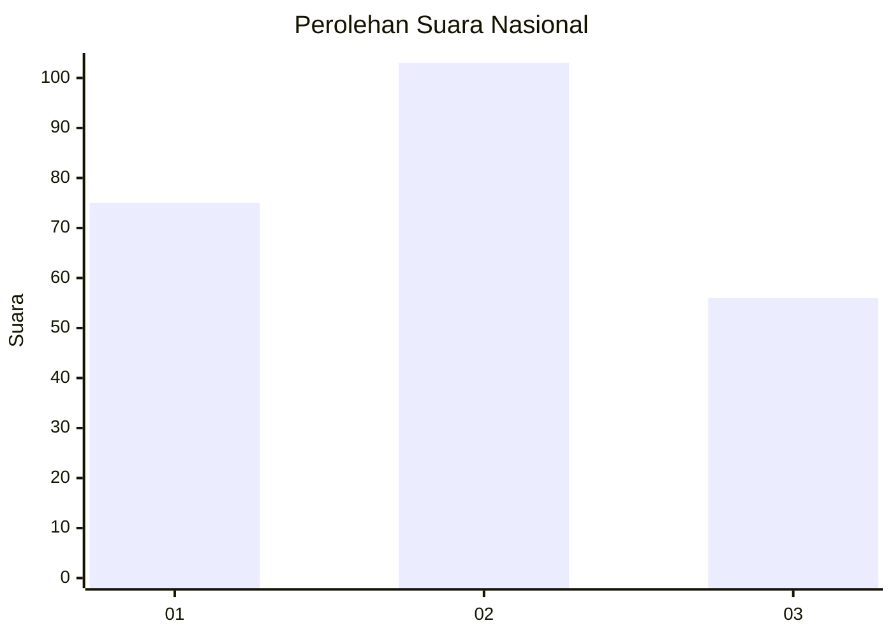
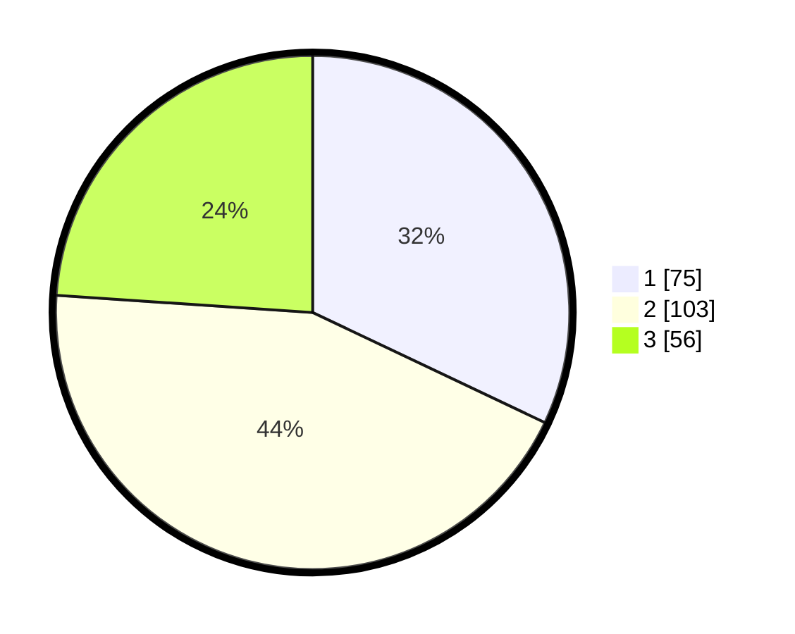

# Hasil

## Grafik

## Tabel

| No.    | Nama Paslon    | Suara | Suara (raw) | Persentase |
|:------ |:-------------- | -----:| -----------:| ----------:|
| 100025 | ANIES MUHAIMIN | 75    | [75][p-1]   | 32,05      |
| 100026 | PRABOWO GIBRAN | 103   | [103][p-2]  | 44,02      |
| 100027 | GANJAR MAHFUD  | 56    | [56][p-3]   | 23,93      |

[p-1]: https://github.com/gigit-pemilu/pemilu-2024/blob/main/pilpres/hitung-suara/sub/31-dki-jakarta/sub/75-jakarta-timur/sub/07-duren-sawit/sub/1004-pondok-kelapa/sub/241-tps/sub/paslon-1.txt
[p-2]: https://github.com/gigit-pemilu/pemilu-2024/blob/main/pilpres/hitung-suara/sub/31-dki-jakarta/sub/75-jakarta-timur/sub/07-duren-sawit/sub/1004-pondok-kelapa/sub/241-tps/sub/paslon-2.txt
[p-3]: https://github.com/gigit-pemilu/pemilu-2024/blob/main/pilpres/hitung-suara/sub/31-dki-jakarta/sub/75-jakarta-timur/sub/07-duren-sawit/sub/1004-pondok-kelapa/sub/241-tps/sub/paslon-3.txt

## Foto C Plano

https://sirekap-obj-formc.kpu.go.id/1879/pemilu/ppwp/31/75/07/10/04/3175071004241-20240215-162502--b630575d-a800-47b5-9957-58a4d5ec0168.jpg

https://sirekap-obj-formc.kpu.go.id/1879/pemilu/ppwp/31/75/07/10/04/3175071004241-20240215-162524--66bbda5b-0e64-4102-8973-cc3074d2aaa9.jpg

https://sirekap-obj-formc.kpu.go.id/1879/pemilu/ppwp/31/75/07/10/04/3175071004241-20240215-162539--e5174ed3-21bf-461f-9da2-bddcff5e94a6.jpg

## Metadata

| Key        | Value               |
| ---------- | ------------------- |
| Time Stamp | 2024-02-16 03:00:26 |

