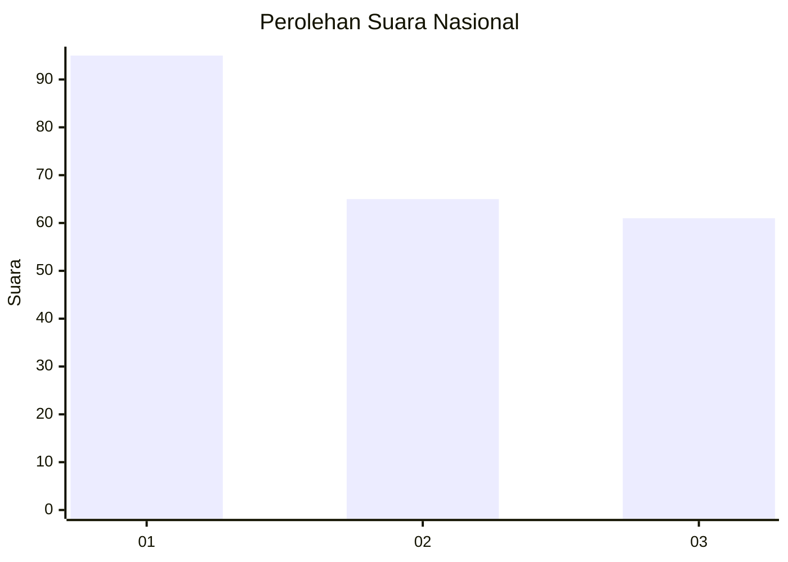
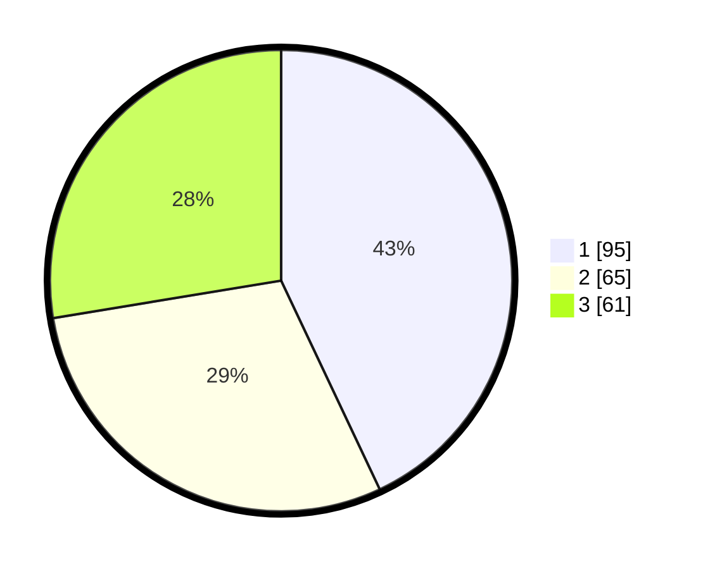

# Hasil

## Grafik

## Tabel

| No.    | Nama Paslon    | Suara | Suara (raw) | Persentase |
|:------ |:-------------- | -----:| -----------:| ----------:|
| 100025 | ANIES MUHAIMIN | 95    | [95][p-1]   | 42,99      |
| 100026 | PRABOWO GIBRAN | 65    | [65][p-2]   | 29,41      |
| 100027 | GANJAR MAHFUD  | 61    | [61][p-3]   | 27,60      |

[p-1]: https://github.com/gigit-pemilu/pemilu-2024/blob/main/pilpres/hitung-suara/sub/31-dki-jakarta/sub/75-jakarta-timur/sub/07-duren-sawit/sub/1004-pondok-kelapa/sub/252-tps/sub/paslon-1.txt
[p-2]: https://github.com/gigit-pemilu/pemilu-2024/blob/main/pilpres/hitung-suara/sub/31-dki-jakarta/sub/75-jakarta-timur/sub/07-duren-sawit/sub/1004-pondok-kelapa/sub/252-tps/sub/paslon-2.txt
[p-3]: https://github.com/gigit-pemilu/pemilu-2024/blob/main/pilpres/hitung-suara/sub/31-dki-jakarta/sub/75-jakarta-timur/sub/07-duren-sawit/sub/1004-pondok-kelapa/sub/252-tps/sub/paslon-3.txt

## Foto C Plano

https://sirekap-obj-formc.kpu.go.id/de87/pemilu/ppwp/31/75/07/10/04/3175071004252-20240214-231535--2e42bc88-35f8-48b3-9d24-5b20e98bd6ed.jpg

https://sirekap-obj-formc.kpu.go.id/de87/pemilu/ppwp/31/75/07/10/04/3175071004252-20240214-232506--66637dcf-8c2e-434d-a4ef-5d250a875197.jpg

https://sirekap-obj-formc.kpu.go.id/de87/pemilu/ppwp/31/75/07/10/04/3175071004252-20240214-232547--1c35b3a6-47eb-46b5-af9a-947842b5eebd.jpg

## Metadata

| Key        | Value               |
| ---------- | ------------------- |
| Time Stamp | 2024-02-24 22:31:28 |

