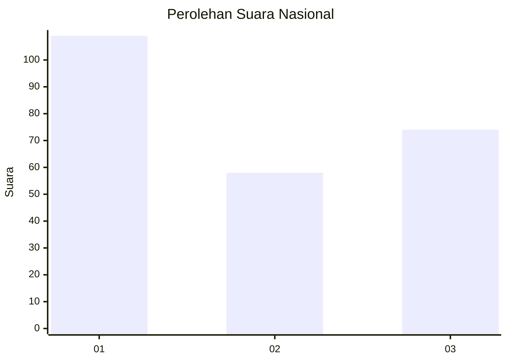
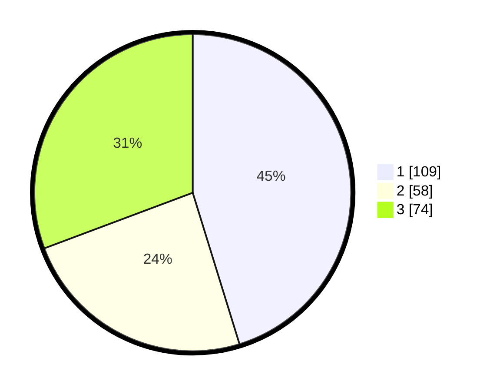

# Hasil

## Grafik

## Tabel

| No.    | Nama Paslon    | Suara | Suara (raw) | Persentase |
|:------ |:-------------- | -----:| -----------:| ----------:|
| 100025 | ANIES MUHAIMIN | 109   | [109][p-1]  | 45,23      |
| 100026 | PRABOWO GIBRAN | 58    | [58][p-2]   | 24,07      |
| 100027 | GANJAR MAHFUD  | 74    | [74][p-3]   | 30,71      |

[p-1]: https://github.com/gigit-pemilu/pemilu-2024/blob/main/pilpres/hitung-suara/sub/31-dki-jakarta/sub/75-jakarta-timur/sub/07-duren-sawit/sub/1005-malaka-sari/sub/009-tps/sub/paslon-1.txt
[p-2]: https://github.com/gigit-pemilu/pemilu-2024/blob/main/pilpres/hitung-suara/sub/31-dki-jakarta/sub/75-jakarta-timur/sub/07-duren-sawit/sub/1005-malaka-sari/sub/009-tps/sub/paslon-2.txt
[p-3]: https://github.com/gigit-pemilu/pemilu-2024/blob/main/pilpres/hitung-suara/sub/31-dki-jakarta/sub/75-jakarta-timur/sub/07-duren-sawit/sub/1005-malaka-sari/sub/009-tps/sub/paslon-3.txt

## Foto C Plano

https://sirekap-obj-formc.kpu.go.id/a1a4/pemilu/ppwp/31/75/07/10/05/3175071005009-20240214-190446--965db0ae-27bc-4fab-ad80-302495f4f219.jpg

https://sirekap-obj-formc.kpu.go.id/a1a4/pemilu/ppwp/31/75/07/10/05/3175071005009-20240214-190505--6791e954-06e6-499b-8789-87647a07db47.jpg

https://sirekap-obj-formc.kpu.go.id/a1a4/pemilu/ppwp/31/75/07/10/05/3175071005009-20240214-190521--3fb1413c-908f-4681-b512-5b35b286dbc2.jpg

## Metadata

| Key        | Value               |
| ---------- | ------------------- |
| Time Stamp | 2024-02-16 03:30:26 |

