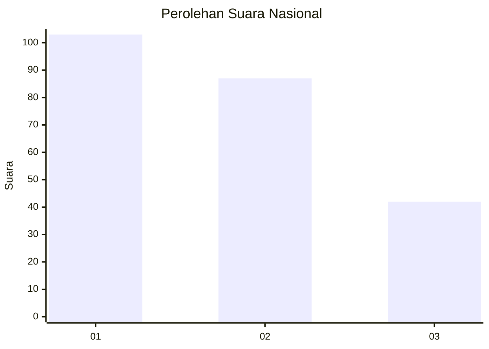
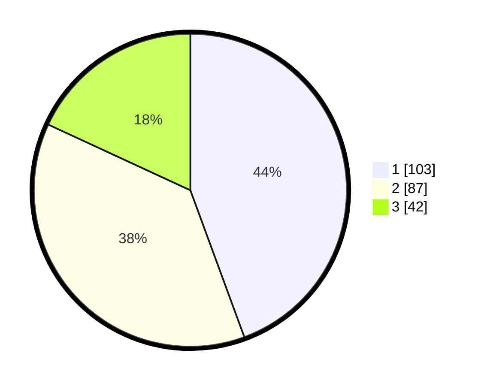

# Hasil

## Grafik

## Tabel

| No.    | Nama Paslon    | Suara | Suara (raw) | Persentase |
|:------ |:-------------- | -----:| -----------:| ----------:|
| 100025 | ANIES MUHAIMIN | 103   | [103][p-1]  | 44,40      |
| 100026 | PRABOWO GIBRAN | 87    | [87][p-2]   | 37,50      |
| 100027 | GANJAR MAHFUD  | 42    | [42][p-3]   | 18,10      |

[p-1]: https://github.com/gigit-pemilu/pemilu-2024/blob/main/pilpres/hitung-suara/sub/31-dki-jakarta/sub/75-jakarta-timur/sub/07-duren-sawit/sub/1005-malaka-sari/sub/034-tps/sub/paslon-1.txt
[p-2]: https://github.com/gigit-pemilu/pemilu-2024/blob/main/pilpres/hitung-suara/sub/31-dki-jakarta/sub/75-jakarta-timur/sub/07-duren-sawit/sub/1005-malaka-sari/sub/034-tps/sub/paslon-2.txt
[p-3]: https://github.com/gigit-pemilu/pemilu-2024/blob/main/pilpres/hitung-suara/sub/31-dki-jakarta/sub/75-jakarta-timur/sub/07-duren-sawit/sub/1005-malaka-sari/sub/034-tps/sub/paslon-3.txt

## Foto C Plano

https://sirekap-obj-formc.kpu.go.id/b51c/pemilu/ppwp/31/75/07/10/05/3175071005034-20240214-214415--47b065a1-2149-47ed-bf14-3f9e01dbcdd2.jpg

https://sirekap-obj-formc.kpu.go.id/b51c/pemilu/ppwp/31/75/07/10/05/3175071005034-20240214-222714--7e7e5512-5c8e-4386-9d47-99af5824f851.jpg

https://sirekap-obj-formc.kpu.go.id/b51c/pemilu/ppwp/31/75/07/10/05/3175071005034-20240214-222109--5e496348-5770-4936-935e-e8540a3396b1.jpg

## Metadata

| Key        | Value               |
| ---------- | ------------------- |
| Time Stamp | 2024-02-24 22:31:28 |

