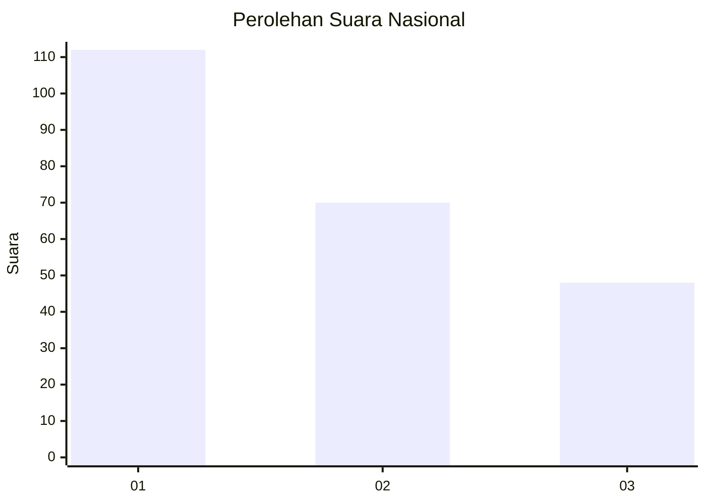
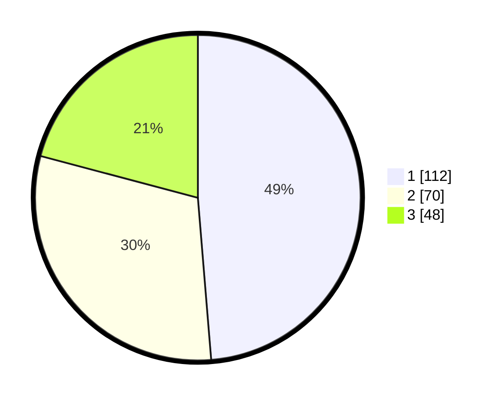

# Hasil

## Grafik

## Tabel

| No.    | Nama Paslon    | Suara | Suara (raw) | Persentase |
|:------ |:-------------- | -----:| -----------:| ----------:|
| 100025 | ANIES MUHAIMIN | 112   | [112][p-1]  | 48,70      |
| 100026 | PRABOWO GIBRAN | 70    | [70][p-2]   | 30,43      |
| 100027 | GANJAR MAHFUD  | 48    | [48][p-3]   | 20,87      |

[p-1]: https://github.com/gigit-pemilu/pemilu-2024/blob/main/pilpres/hitung-suara/sub/31-dki-jakarta/sub/75-jakarta-timur/sub/07-duren-sawit/sub/1005-malaka-sari/sub/037-tps/sub/paslon-1.txt
[p-2]: https://github.com/gigit-pemilu/pemilu-2024/blob/main/pilpres/hitung-suara/sub/31-dki-jakarta/sub/75-jakarta-timur/sub/07-duren-sawit/sub/1005-malaka-sari/sub/037-tps/sub/paslon-2.txt
[p-3]: https://github.com/gigit-pemilu/pemilu-2024/blob/main/pilpres/hitung-suara/sub/31-dki-jakarta/sub/75-jakarta-timur/sub/07-duren-sawit/sub/1005-malaka-sari/sub/037-tps/sub/paslon-3.txt

## Foto C Plano

https://sirekap-obj-formc.kpu.go.id/7816/pemilu/ppwp/31/75/07/10/05/3175071005037-20240214-193142--59a94aa8-74a5-457a-9190-0a76bb9974ee.jpg

https://sirekap-obj-formc.kpu.go.id/7816/pemilu/ppwp/31/75/07/10/05/3175071005037-20240214-193158--c58bdf34-eef9-4c21-9be3-49409c4c076b.jpg

https://sirekap-obj-formc.kpu.go.id/7816/pemilu/ppwp/31/75/07/10/05/3175071005037-20240214-155206--c636ecd6-8465-429c-ac05-c56cb2c0c564.jpg

## Metadata

| Key        | Value               |
| ---------- | ------------------- |
| Time Stamp | 2024-02-16 03:30:26 |

