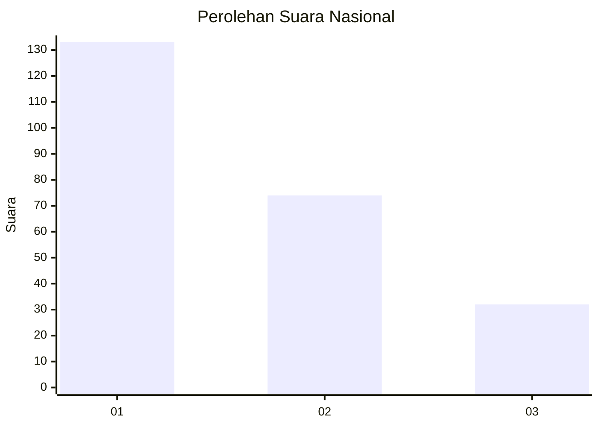
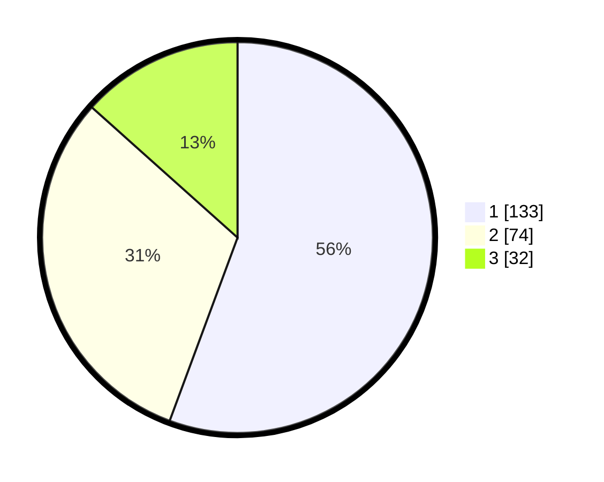

# Hasil

## Grafik

## Tabel

| No.    | Nama Paslon    | Suara | Suara (raw) | Persentase |
|:------ |:-------------- | -----:| -----------:| ----------:|
| 100025 | ANIES MUHAIMIN | 133   | [133][p-1]  | 55,65      |
| 100026 | PRABOWO GIBRAN | 74    | [74][p-2]   | 30,96      |
| 100027 | GANJAR MAHFUD  | 32    | [32][p-3]   | 13,39      |

[p-1]: https://github.com/gigit-pemilu/pemilu-2024/blob/main/pilpres/hitung-suara/sub/31-dki-jakarta/sub/75-jakarta-timur/sub/07-duren-sawit/sub/1005-malaka-sari/sub/039-tps/sub/paslon-1.txt
[p-2]: https://github.com/gigit-pemilu/pemilu-2024/blob/main/pilpres/hitung-suara/sub/31-dki-jakarta/sub/75-jakarta-timur/sub/07-duren-sawit/sub/1005-malaka-sari/sub/039-tps/sub/paslon-2.txt
[p-3]: https://github.com/gigit-pemilu/pemilu-2024/blob/main/pilpres/hitung-suara/sub/31-dki-jakarta/sub/75-jakarta-timur/sub/07-duren-sawit/sub/1005-malaka-sari/sub/039-tps/sub/paslon-3.txt

## Foto C Plano

https://sirekap-obj-formc.kpu.go.id/7389/pemilu/ppwp/31/75/07/10/05/3175071005039-20240214-214757--54c60fc1-d1ff-46cb-a650-3ffe43e10631.jpg

https://sirekap-obj-formc.kpu.go.id/7389/pemilu/ppwp/31/75/07/10/05/3175071005039-20240214-214928--b169a445-b407-4a7a-af4e-ae3c01518324.jpg

https://sirekap-obj-formc.kpu.go.id/7389/pemilu/ppwp/31/75/07/10/05/3175071005039-20240214-215056--791455b4-d73a-45e4-a1b0-1c40600ab765.jpg

## Metadata

| Key        | Value               |
| ---------- | ------------------- |
| Time Stamp | 2024-02-25 00:00:00 |

