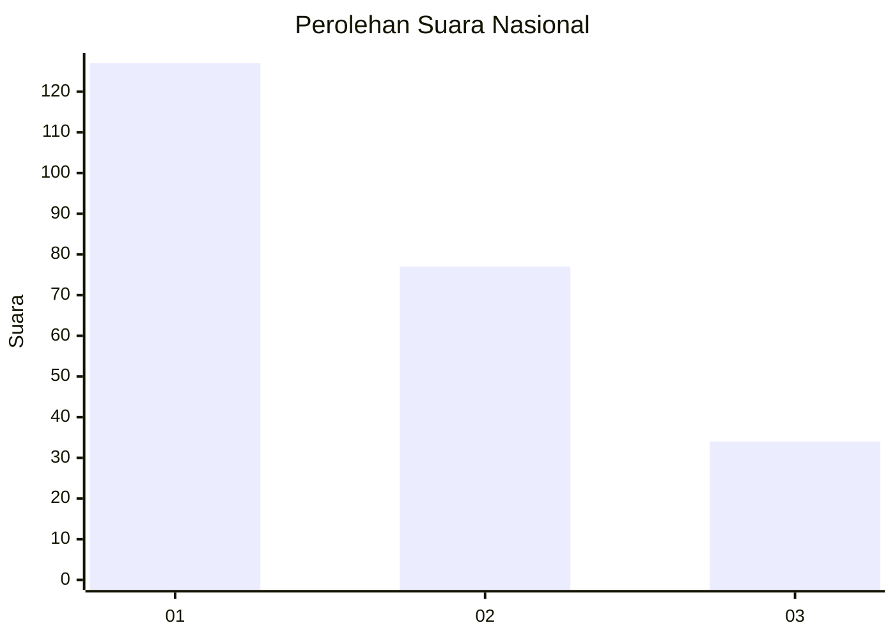
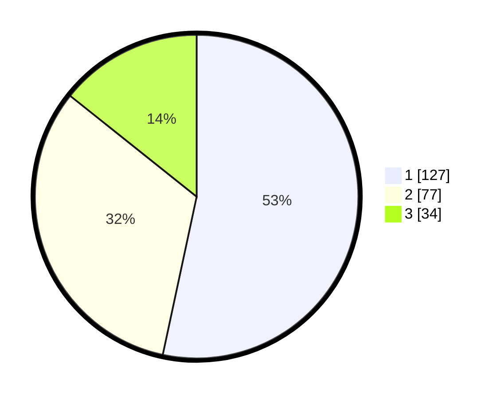

# Hasil

## Grafik

## Tabel

| No.    | Nama Paslon    | Suara | Suara (raw) | Persentase |
|:------ |:-------------- | -----:| -----------:| ----------:|
| 100025 | ANIES MUHAIMIN | 127   | [127][p-1]  | 53,36      |
| 100026 | PRABOWO GIBRAN | 77    | [77][p-2]   | 32,35      |
| 100027 | GANJAR MAHFUD  | 34    | [34][p-3]   | 14,29      |

[p-1]: https://github.com/gigit-pemilu/pemilu-2024/blob/main/pilpres/hitung-suara/sub/31-dki-jakarta/sub/75-jakarta-timur/sub/07-duren-sawit/sub/1005-malaka-sari/sub/059-tps/sub/paslon-1.txt
[p-2]: https://github.com/gigit-pemilu/pemilu-2024/blob/main/pilpres/hitung-suara/sub/31-dki-jakarta/sub/75-jakarta-timur/sub/07-duren-sawit/sub/1005-malaka-sari/sub/059-tps/sub/paslon-2.txt
[p-3]: https://github.com/gigit-pemilu/pemilu-2024/blob/main/pilpres/hitung-suara/sub/31-dki-jakarta/sub/75-jakarta-timur/sub/07-duren-sawit/sub/1005-malaka-sari/sub/059-tps/sub/paslon-3.txt

## Foto C Plano

https://sirekap-obj-formc.kpu.go.id/ffdc/pemilu/ppwp/31/75/07/10/05/3175071005059-20240214-191653--c0077cce-33f3-416f-9d52-8576b67e34b2.jpg

https://sirekap-obj-formc.kpu.go.id/ffdc/pemilu/ppwp/31/75/07/10/05/3175071005059-20240214-191819--891adcd0-908d-4ed5-8d27-11b485b3b78c.jpg

https://sirekap-obj-formc.kpu.go.id/ffdc/pemilu/ppwp/31/75/07/10/05/3175071005059-20240214-192231--b7425b94-a18e-4abb-a626-990b5158b56f.jpg

## Metadata

| Key        | Value               |
| ---------- | ------------------- |
| Time Stamp | 2024-02-24 22:31:28 |

