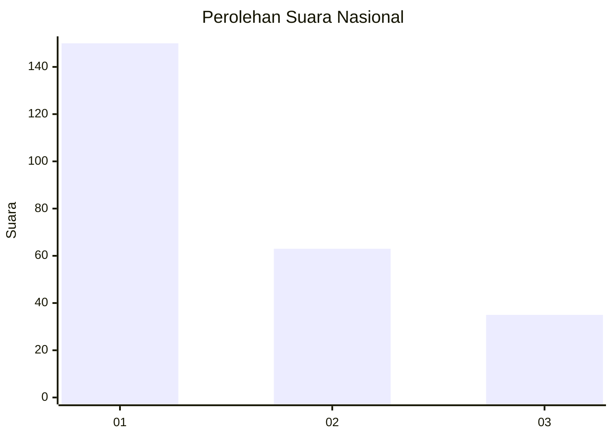
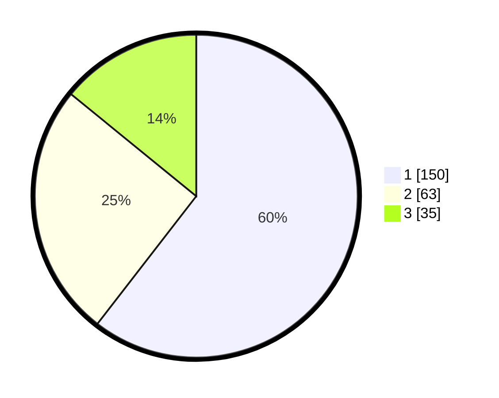

# Hasil

## Grafik

## Tabel

| No.    | Nama Paslon    | Suara | Suara (raw) | Persentase |
|:------ |:-------------- | -----:| -----------:| ----------:|
| 100025 | ANIES MUHAIMIN | 150   | [150][p-1]  | 60,48      |
| 100026 | PRABOWO GIBRAN | 63    | [63][p-2]   | 25,40      |
| 100027 | GANJAR MAHFUD  | 35    | [35][p-3]   | 14,11      |

[p-1]: https://github.com/gigit-pemilu/pemilu-2024/blob/main/pilpres/hitung-suara/sub/31-dki-jakarta/sub/75-jakarta-timur/sub/07-duren-sawit/sub/1005-malaka-sari/sub/064-tps/sub/paslon-1.txt
[p-2]: https://github.com/gigit-pemilu/pemilu-2024/blob/main/pilpres/hitung-suara/sub/31-dki-jakarta/sub/75-jakarta-timur/sub/07-duren-sawit/sub/1005-malaka-sari/sub/064-tps/sub/paslon-2.txt
[p-3]: https://github.com/gigit-pemilu/pemilu-2024/blob/main/pilpres/hitung-suara/sub/31-dki-jakarta/sub/75-jakarta-timur/sub/07-duren-sawit/sub/1005-malaka-sari/sub/064-tps/sub/paslon-3.txt

## Foto C Plano

https://sirekap-obj-formc.kpu.go.id/738a/pemilu/ppwp/31/75/07/10/05/3175071005064-20240214-195815--7f322052-172d-40c9-a227-98edabdb67f2.jpg

https://sirekap-obj-formc.kpu.go.id/738a/pemilu/ppwp/31/75/07/10/05/3175071005064-20240214-195903--81e1b59f-b79a-418b-8836-fae150781e8c.jpg

https://sirekap-obj-formc.kpu.go.id/738a/pemilu/ppwp/31/75/07/10/05/3175071005064-20240214-210309--1580366a-b3a4-43dd-9385-304783e786cd.jpg

## Metadata

| Key        | Value               |
| ---------- | ------------------- |
| Time Stamp | 2024-02-15 12:00:28 |

