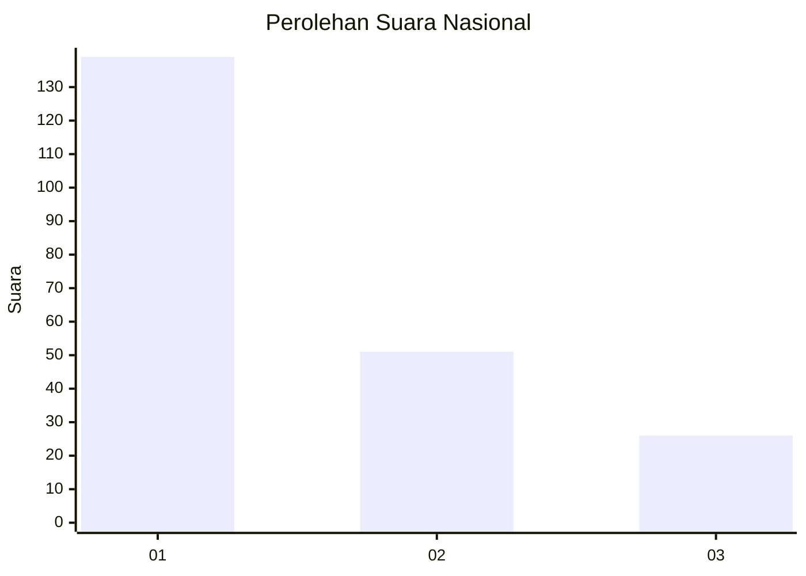
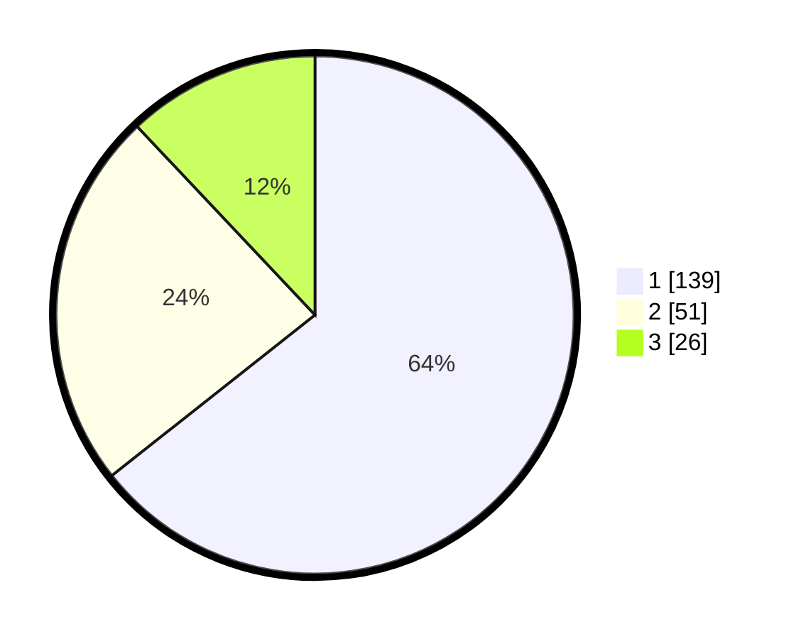

# Hasil

## Grafik

## Tabel

| No.    | Nama Paslon    | Suara | Suara (raw) | Persentase |
|:------ |:-------------- | -----:| -----------:| ----------:|
| 100025 | ANIES MUHAIMIN | 139   | [139][p-1]  | 64,35      |
| 100026 | PRABOWO GIBRAN | 51    | [51][p-2]   | 23,61      |
| 100027 | GANJAR MAHFUD  | 26    | [26][p-3]   | 12,04      |

[p-1]: https://github.com/gigit-pemilu/pemilu-2024/blob/main/pilpres/hitung-suara/sub/31-dki-jakarta/sub/75-jakarta-timur/sub/07-duren-sawit/sub/1005-malaka-sari/sub/065-tps/sub/paslon-1.txt
[p-2]: https://github.com/gigit-pemilu/pemilu-2024/blob/main/pilpres/hitung-suara/sub/31-dki-jakarta/sub/75-jakarta-timur/sub/07-duren-sawit/sub/1005-malaka-sari/sub/065-tps/sub/paslon-2.txt
[p-3]: https://github.com/gigit-pemilu/pemilu-2024/blob/main/pilpres/hitung-suara/sub/31-dki-jakarta/sub/75-jakarta-timur/sub/07-duren-sawit/sub/1005-malaka-sari/sub/065-tps/sub/paslon-3.txt

## Foto C Plano

https://sirekap-obj-formc.kpu.go.id/c855/pemilu/ppwp/31/75/07/10/05/3175071005065-20240214-220720--f2f05449-4b4d-41d1-adb4-75a54b170db0.jpg

https://sirekap-obj-formc.kpu.go.id/c855/pemilu/ppwp/31/75/07/10/05/3175071005065-20240214-205201--18f6ddaa-a40c-4f15-b2e7-7217f88585d0.jpg

https://sirekap-obj-formc.kpu.go.id/c855/pemilu/ppwp/31/75/07/10/05/3175071005065-20240214-205215--b14f16bb-8e58-4cc5-a536-14976e4e79c2.jpg

## Metadata

| Key        | Value               |
| ---------- | ------------------- |
| Time Stamp | 2024-02-24 22:31:28 |

