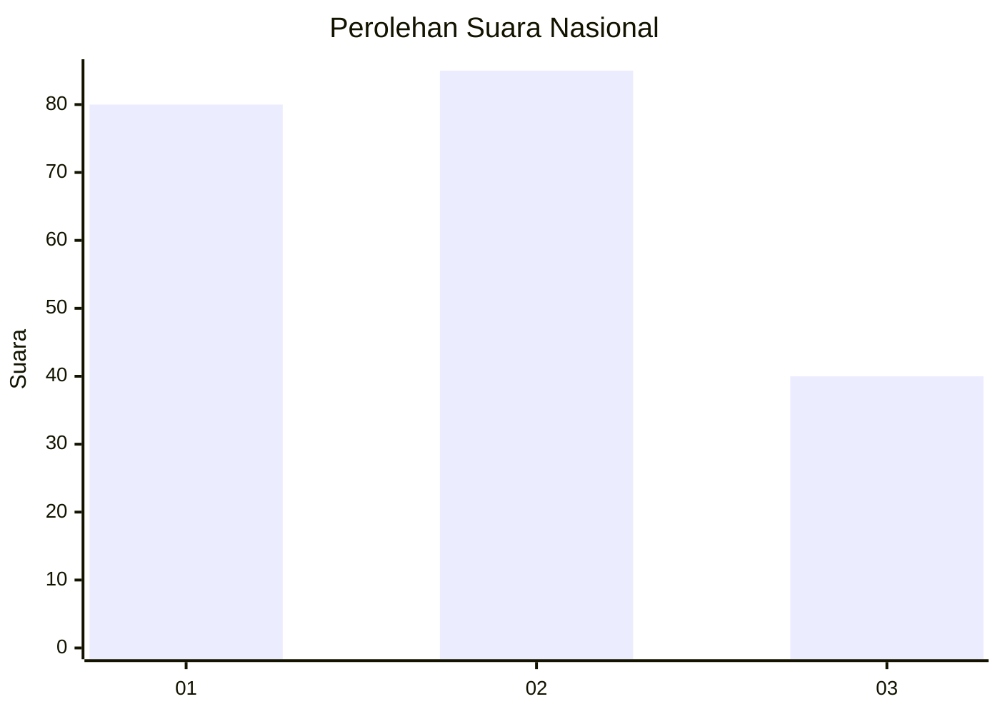
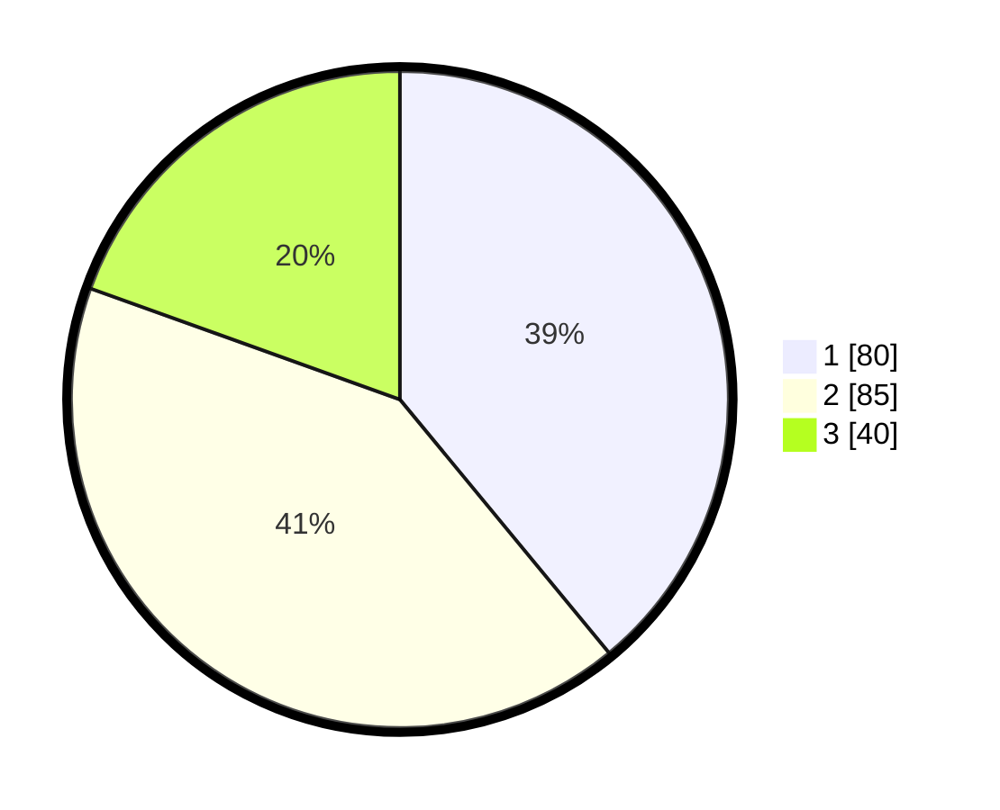

# Hasil

## Grafik

## Tabel

| No.    | Nama Paslon    | Suara | Suara (raw) | Persentase |
|:------ |:-------------- | -----:| -----------:| ----------:|
| 100025 | ANIES MUHAIMIN | 80    | [80][p-1]   | 39,02      |
| 100026 | PRABOWO GIBRAN | 85    | [85][p-2]   | 41,46      |
| 100027 | GANJAR MAHFUD  | 40    | [40][p-3]   | 19,51      |

[p-1]: https://github.com/gigit-pemilu/pemilu-2024/blob/main/pilpres/hitung-suara/sub/31-dki-jakarta/sub/75-jakarta-timur/sub/07-duren-sawit/sub/1005-malaka-sari/sub/070-tps/sub/paslon-1.txt
[p-2]: https://github.com/gigit-pemilu/pemilu-2024/blob/main/pilpres/hitung-suara/sub/31-dki-jakarta/sub/75-jakarta-timur/sub/07-duren-sawit/sub/1005-malaka-sari/sub/070-tps/sub/paslon-2.txt
[p-3]: https://github.com/gigit-pemilu/pemilu-2024/blob/main/pilpres/hitung-suara/sub/31-dki-jakarta/sub/75-jakarta-timur/sub/07-duren-sawit/sub/1005-malaka-sari/sub/070-tps/sub/paslon-3.txt

## Foto C Plano

https://sirekap-obj-formc.kpu.go.id/7901/pemilu/ppwp/31/75/07/10/05/3175071005070-20240214-223827--683dbfc7-6716-4200-aeff-39f03308ef73.jpg

https://sirekap-obj-formc.kpu.go.id/7901/pemilu/ppwp/31/75/07/10/05/3175071005070-20240214-223849--dac42f5b-4d57-4a35-96de-decd2997ae87.jpg

https://sirekap-obj-formc.kpu.go.id/7901/pemilu/ppwp/31/75/07/10/05/3175071005070-20240214-223920--ff7c1ad3-9fbb-4cb3-99db-ca4a4c74f0f5.jpg

## Metadata

| Key        | Value               |
| ---------- | ------------------- |
| Time Stamp | 2024-02-24 22:31:28 |

