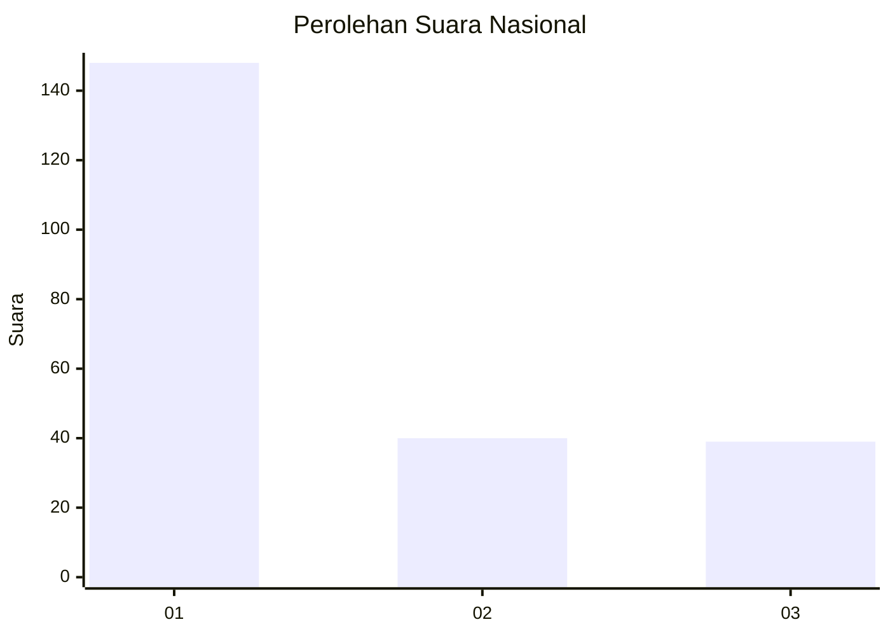
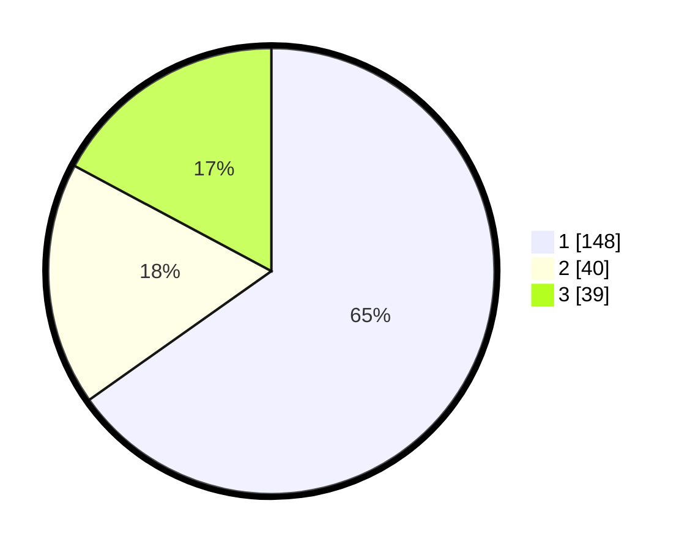

# Hasil

## Grafik

## Tabel

| No.    | Nama Paslon    | Suara | Suara (raw) | Persentase |
|:------ |:-------------- | -----:| -----------:| ----------:|
| 100025 | ANIES MUHAIMIN | 148   | [148][p-1]  | 65,20      |
| 100026 | PRABOWO GIBRAN | 40    | [40][p-2]   | 17,62      |
| 100027 | GANJAR MAHFUD  | 39    | [39][p-3]   | 17,18      |

[p-1]: https://github.com/gigit-pemilu/pemilu-2024/blob/main/pilpres/hitung-suara/sub/31-dki-jakarta/sub/75-jakarta-timur/sub/07-duren-sawit/sub/1005-malaka-sari/sub/080-tps/sub/paslon-1.txt
[p-2]: https://github.com/gigit-pemilu/pemilu-2024/blob/main/pilpres/hitung-suara/sub/31-dki-jakarta/sub/75-jakarta-timur/sub/07-duren-sawit/sub/1005-malaka-sari/sub/080-tps/sub/paslon-2.txt
[p-3]: https://github.com/gigit-pemilu/pemilu-2024/blob/main/pilpres/hitung-suara/sub/31-dki-jakarta/sub/75-jakarta-timur/sub/07-duren-sawit/sub/1005-malaka-sari/sub/080-tps/sub/paslon-3.txt

## Foto C Plano

https://sirekap-obj-formc.kpu.go.id/7198/pemilu/ppwp/31/75/07/10/05/3175071005080-20240214-231603--ffd1ce51-b49a-48bf-8006-7e515b77e115.jpg

https://sirekap-obj-formc.kpu.go.id/7198/pemilu/ppwp/31/75/07/10/05/3175071005080-20240214-231648--4f357994-92ff-46f6-8f9b-e260cd2f7c54.jpg

https://sirekap-obj-formc.kpu.go.id/7198/pemilu/ppwp/31/75/07/10/05/3175071005080-20240214-231715--0818fb9e-3d4e-45d8-a190-dda1f0a27d83.jpg

## Metadata

| Key        | Value               |
| ---------- | ------------------- |
| Time Stamp | 2024-02-24 22:31:28 |

