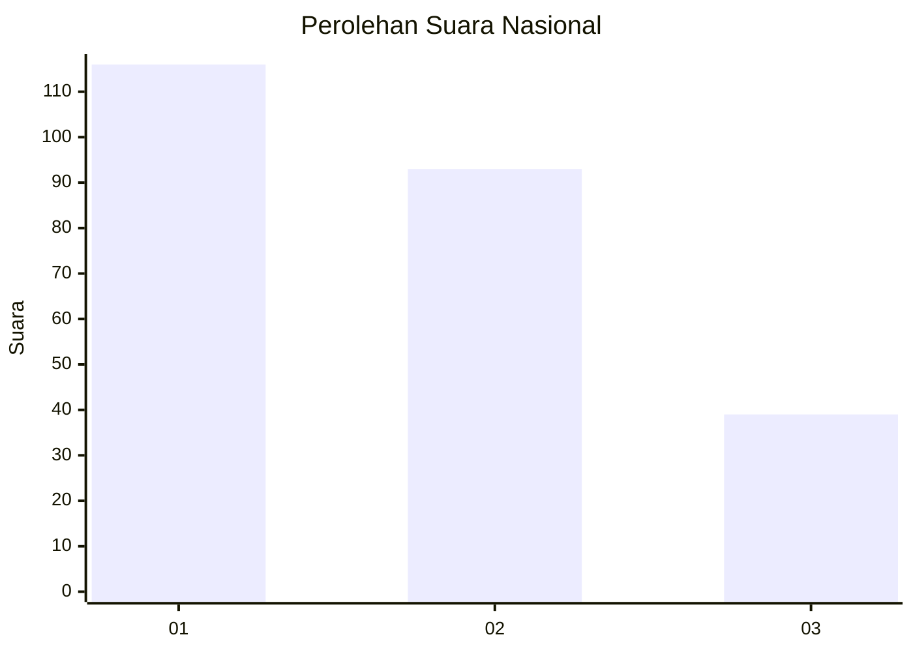
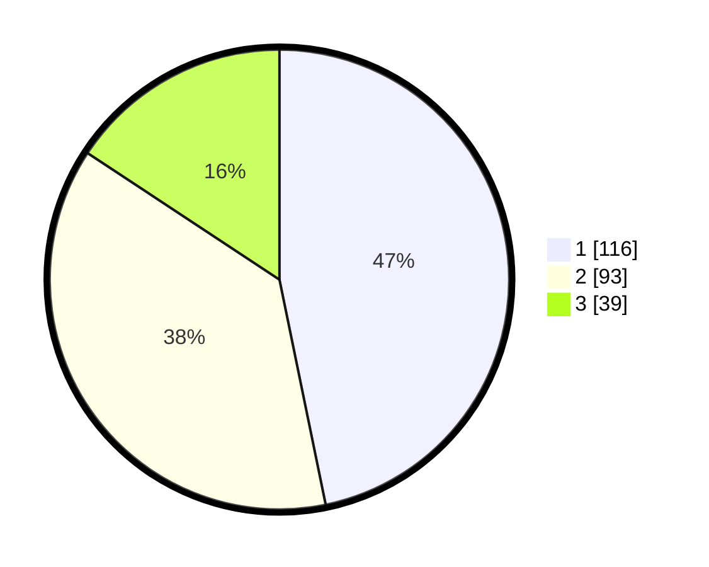

# Hasil

## Grafik

## Tabel

| No.    | Nama Paslon    | Suara | Suara (raw) | Persentase |
|:------ |:-------------- | -----:| -----------:| ----------:|
| 100025 | ANIES MUHAIMIN | 116   | [116][p-1]  | 46,77      |
| 100026 | PRABOWO GIBRAN | 93    | [93][p-2]   | 37,50      |
| 100027 | GANJAR MAHFUD  | 39    | [39][p-3]   | 15,73      |

[p-1]: https://github.com/gigit-pemilu/pemilu-2024/blob/main/pilpres/hitung-suara/sub/31-dki-jakarta/sub/75-jakarta-timur/sub/07-duren-sawit/sub/1005-malaka-sari/sub/084-tps/sub/paslon-1.txt
[p-2]: https://github.com/gigit-pemilu/pemilu-2024/blob/main/pilpres/hitung-suara/sub/31-dki-jakarta/sub/75-jakarta-timur/sub/07-duren-sawit/sub/1005-malaka-sari/sub/084-tps/sub/paslon-2.txt
[p-3]: https://github.com/gigit-pemilu/pemilu-2024/blob/main/pilpres/hitung-suara/sub/31-dki-jakarta/sub/75-jakarta-timur/sub/07-duren-sawit/sub/1005-malaka-sari/sub/084-tps/sub/paslon-3.txt

## Foto C Plano

https://sirekap-obj-formc.kpu.go.id/b4a2/pemilu/ppwp/31/75/07/10/05/3175071005084-20240214-213513--709b9364-95d7-475a-9c42-454dcafdfc26.jpg

https://sirekap-obj-formc.kpu.go.id/b4a2/pemilu/ppwp/31/75/07/10/05/3175071005084-20240214-214131--66f32225-b1ca-4068-8bc4-f5f65cd4fdc0.jpg

https://sirekap-obj-formc.kpu.go.id/b4a2/pemilu/ppwp/31/75/07/10/05/3175071005084-20240214-214215--fb8edcc2-80a9-488d-8bdf-3c6f9d869e0a.jpg

## Metadata

| Key        | Value               |
| ---------- | ------------------- |
| Time Stamp | 2024-02-24 22:31:28 |

