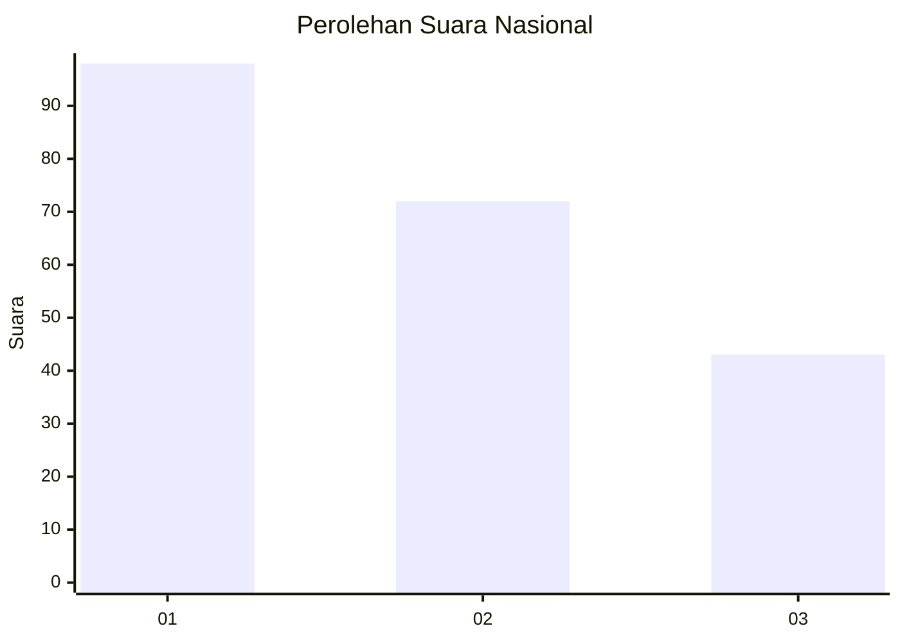
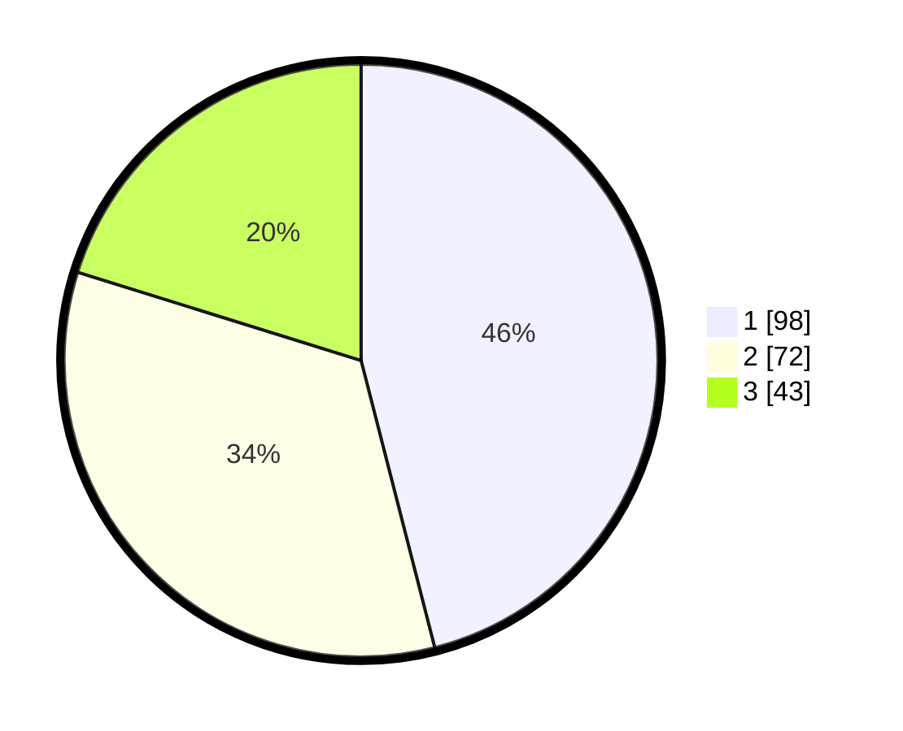

# Hasil

## Grafik

## Tabel

| No.    | Nama Paslon    | Suara | Suara (raw) | Persentase |
|:------ |:-------------- | -----:| -----------:| ----------:|
| 100025 | ANIES MUHAIMIN | 98    | [98][p-1]   | 46,01      |
| 100026 | PRABOWO GIBRAN | 72    | [72][p-2]   | 33,80      |
| 100027 | GANJAR MAHFUD  | 43    | [43][p-3]   | 20,19      |

[p-1]: https://github.com/gigit-pemilu/pemilu-2024/blob/main/pilpres/hitung-suara/sub/31-dki-jakarta/sub/75-jakarta-timur/sub/07-duren-sawit/sub/1006-malaka-jaya/sub/021-tps/sub/paslon-1.txt
[p-2]: https://github.com/gigit-pemilu/pemilu-2024/blob/main/pilpres/hitung-suara/sub/31-dki-jakarta/sub/75-jakarta-timur/sub/07-duren-sawit/sub/1006-malaka-jaya/sub/021-tps/sub/paslon-2.txt
[p-3]: https://github.com/gigit-pemilu/pemilu-2024/blob/main/pilpres/hitung-suara/sub/31-dki-jakarta/sub/75-jakarta-timur/sub/07-duren-sawit/sub/1006-malaka-jaya/sub/021-tps/sub/paslon-3.txt

## Foto C Plano

https://sirekap-obj-formc.kpu.go.id/d531/pemilu/ppwp/31/75/07/10/06/3175071006021-20240214-235530--70400ec3-b5be-46c3-a23c-12771dc4c032.jpg

https://sirekap-obj-formc.kpu.go.id/d531/pemilu/ppwp/31/75/07/10/06/3175071006021-20240214-235723--2154e46d-5a54-4eae-831d-fc7b1ddcc1e3.jpg

https://sirekap-obj-formc.kpu.go.id/d531/pemilu/ppwp/31/75/07/10/06/3175071006021-20240214-235820--ae1f53ab-84f9-4d23-a17f-36614fd0030c.jpg

## Metadata

| Key        | Value               |
| ---------- | ------------------- |
| Time Stamp | 2024-02-24 22:31:28 |

