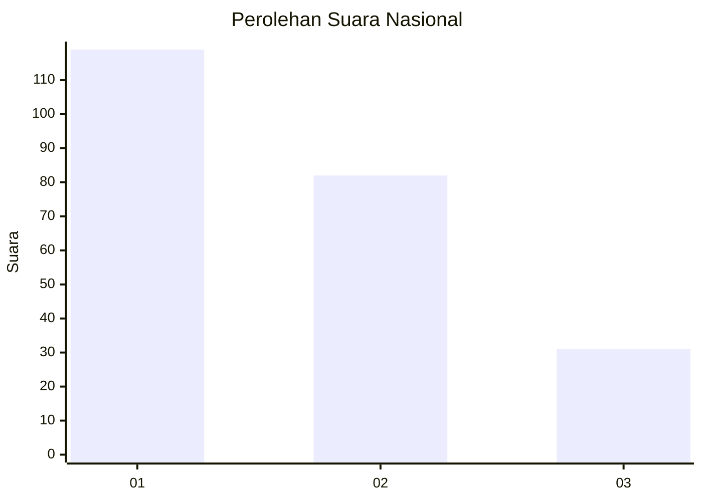
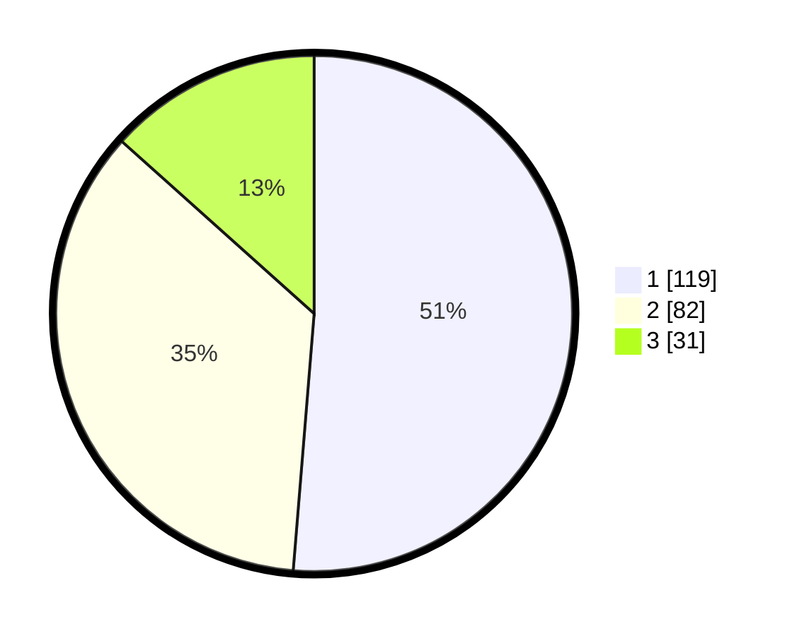

# Hasil

## Grafik

## Tabel

| No.    | Nama Paslon    | Suara | Suara (raw) | Persentase |
|:------ |:-------------- | -----:| -----------:| ----------:|
| 100025 | ANIES MUHAIMIN | 119   | [119][p-1]  | 51,29      |
| 100026 | PRABOWO GIBRAN | 82    | [82][p-2]   | 35,34      |
| 100027 | GANJAR MAHFUD  | 31    | [31][p-3]   | 13,36      |

[p-1]: https://github.com/gigit-pemilu/pemilu-2024/blob/main/pilpres/hitung-suara/sub/31-dki-jakarta/sub/75-jakarta-timur/sub/07-duren-sawit/sub/1006-malaka-jaya/sub/047-tps/sub/paslon-1.txt
[p-2]: https://github.com/gigit-pemilu/pemilu-2024/blob/main/pilpres/hitung-suara/sub/31-dki-jakarta/sub/75-jakarta-timur/sub/07-duren-sawit/sub/1006-malaka-jaya/sub/047-tps/sub/paslon-2.txt
[p-3]: https://github.com/gigit-pemilu/pemilu-2024/blob/main/pilpres/hitung-suara/sub/31-dki-jakarta/sub/75-jakarta-timur/sub/07-duren-sawit/sub/1006-malaka-jaya/sub/047-tps/sub/paslon-3.txt

## Foto C Plano

https://sirekap-obj-formc.kpu.go.id/74b3/pemilu/ppwp/31/75/07/10/06/3175071006047-20240214-212526--763a8db5-1e32-4816-8f59-25fa12d1bdcb.jpg

https://sirekap-obj-formc.kpu.go.id/74b3/pemilu/ppwp/31/75/07/10/06/3175071006047-20240214-214839--4eebfe7c-ff01-4ec7-bc42-8d03c1461a4d.jpg

https://sirekap-obj-formc.kpu.go.id/74b3/pemilu/ppwp/31/75/07/10/06/3175071006047-20240214-214929--a51a8619-a499-4db4-aeec-98404f60cf5d.jpg

## Metadata

| Key        | Value               |
| ---------- | ------------------- |
| Time Stamp | 2024-02-24 22:31:28 |

