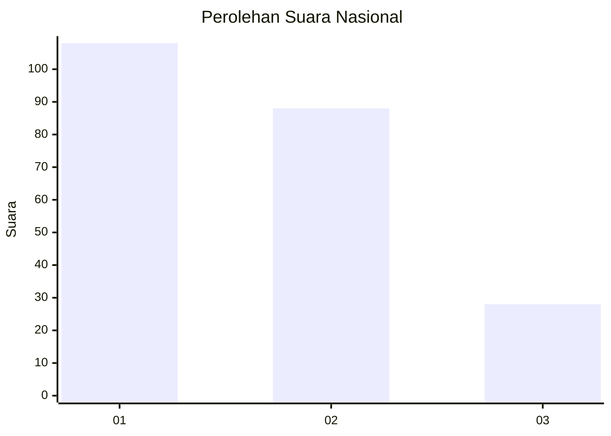
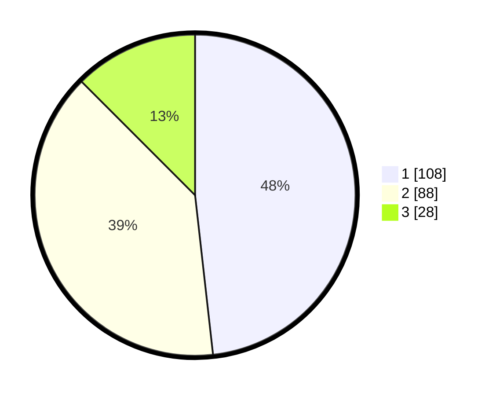

# Hasil

## Grafik

## Tabel

| No.    | Nama Paslon    | Suara | Suara (raw) | Persentase |
|:------ |:-------------- | -----:| -----------:| ----------:|
| 100025 | ANIES MUHAIMIN | 108   | [108][p-1]  | 48,21      |
| 100026 | PRABOWO GIBRAN | 88    | [88][p-2]   | 39,29      |
| 100027 | GANJAR MAHFUD  | 28    | [28][p-3]   | 12,50      |

[p-1]: https://github.com/gigit-pemilu/pemilu-2024/blob/main/pilpres/hitung-suara/sub/31-dki-jakarta/sub/75-jakarta-timur/sub/07-duren-sawit/sub/1006-malaka-jaya/sub/065-tps/sub/paslon-1.txt
[p-2]: https://github.com/gigit-pemilu/pemilu-2024/blob/main/pilpres/hitung-suara/sub/31-dki-jakarta/sub/75-jakarta-timur/sub/07-duren-sawit/sub/1006-malaka-jaya/sub/065-tps/sub/paslon-2.txt
[p-3]: https://github.com/gigit-pemilu/pemilu-2024/blob/main/pilpres/hitung-suara/sub/31-dki-jakarta/sub/75-jakarta-timur/sub/07-duren-sawit/sub/1006-malaka-jaya/sub/065-tps/sub/paslon-3.txt

## Foto C Plano

https://sirekap-obj-formc.kpu.go.id/ff98/pemilu/ppwp/31/75/07/10/06/3175071006065-20240214-222534--237ef564-3a59-46d0-903d-bd440e75383f.jpg

https://sirekap-obj-formc.kpu.go.id/ff98/pemilu/ppwp/31/75/07/10/06/3175071006065-20240214-224528--11778c21-c74d-45e8-9c4f-a9c5be2cc4e2.jpg

https://sirekap-obj-formc.kpu.go.id/ff98/pemilu/ppwp/31/75/07/10/06/3175071006065-20240214-224823--e1c051a5-6156-4089-9496-e3ba02f6ed43.jpg

## Metadata

| Key        | Value               |
| ---------- | ------------------- |
| Time Stamp | 2024-02-16 04:00:27 |

