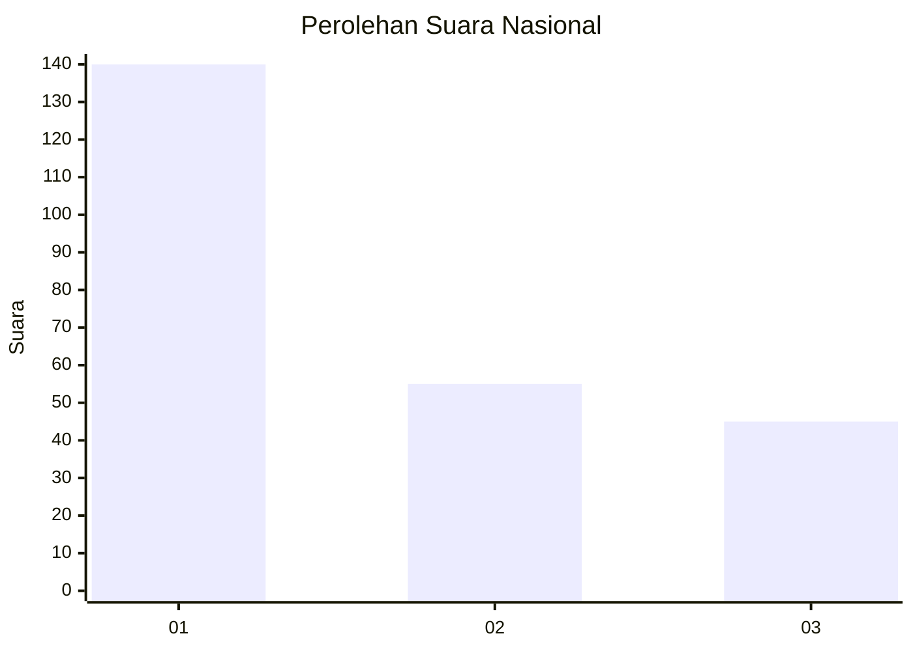
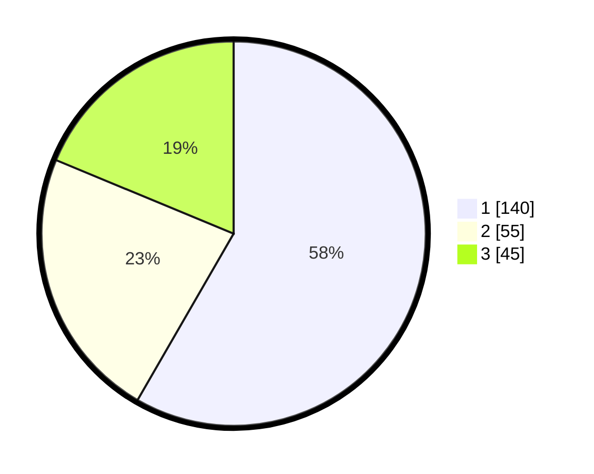

# Hasil

## Grafik

## Tabel

| No.    | Nama Paslon    | Suara | Suara (raw) | Persentase |
|:------ |:-------------- | -----:| -----------:| ----------:|
| 100025 | ANIES MUHAIMIN | 140   | [140][p-1]  | 58,33      |
| 100026 | PRABOWO GIBRAN | 55    | [55][p-2]   | 22,92      |
| 100027 | GANJAR MAHFUD  | 45    | [45][p-3]   | 18,75      |

[p-1]: https://github.com/gigit-pemilu/pemilu-2024/blob/main/pilpres/hitung-suara/sub/31-dki-jakarta/sub/75-jakarta-timur/sub/07-duren-sawit/sub/1006-malaka-jaya/sub/086-tps/sub/paslon-1.txt
[p-2]: https://github.com/gigit-pemilu/pemilu-2024/blob/main/pilpres/hitung-suara/sub/31-dki-jakarta/sub/75-jakarta-timur/sub/07-duren-sawit/sub/1006-malaka-jaya/sub/086-tps/sub/paslon-2.txt
[p-3]: https://github.com/gigit-pemilu/pemilu-2024/blob/main/pilpres/hitung-suara/sub/31-dki-jakarta/sub/75-jakarta-timur/sub/07-duren-sawit/sub/1006-malaka-jaya/sub/086-tps/sub/paslon-3.txt

## Foto C Plano

https://sirekap-obj-formc.kpu.go.id/4dc9/pemilu/ppwp/31/75/07/10/06/3175071006086-20240214-185752--09a315f3-be61-42a7-8663-9510da5f23c0.jpg

https://sirekap-obj-formc.kpu.go.id/4dc9/pemilu/ppwp/31/75/07/10/06/3175071006086-20240214-185501--13f6a205-1a41-41c1-bebb-0adc1d7761e0.jpg

https://sirekap-obj-formc.kpu.go.id/4dc9/pemilu/ppwp/31/75/07/10/06/3175071006086-20240214-185511--25323f48-90cb-42e7-bad9-ff9ce554263f.jpg

## Metadata

| Key        | Value               |
| ---------- | ------------------- |
| Time Stamp | 2024-02-15 21:30:27 |

