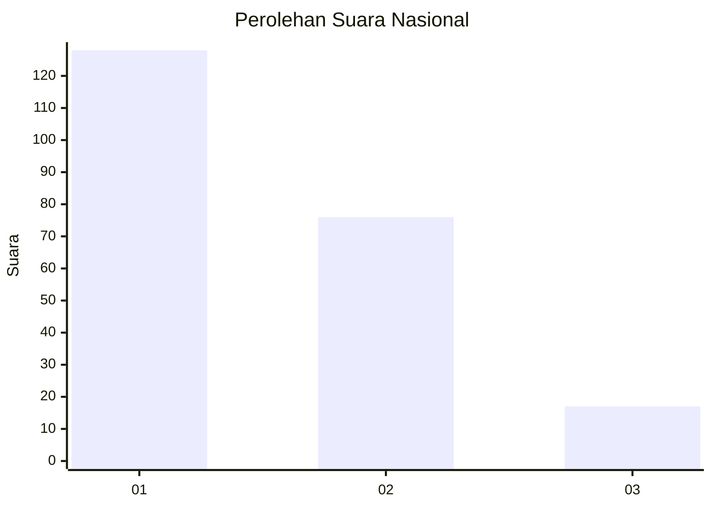
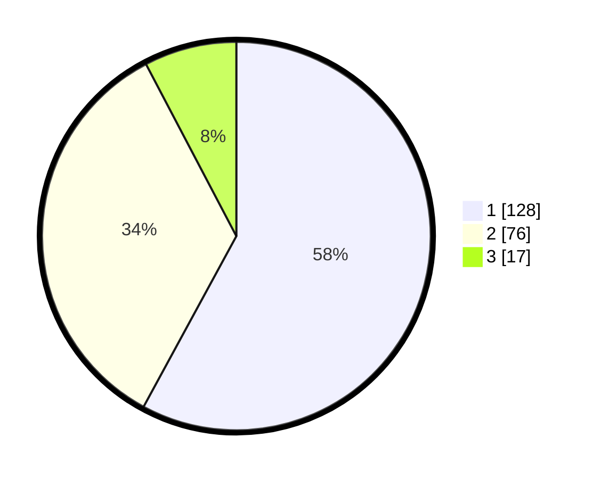

# Hasil

## Grafik

## Tabel

| No.    | Nama Paslon    | Suara | Suara (raw) | Persentase |
|:------ |:-------------- | -----:| -----------:| ----------:|
| 100025 | ANIES MUHAIMIN | 128   | [128][p-1]  | 57,92      |
| 100026 | PRABOWO GIBRAN | 76    | [76][p-2]   | 34,39      |
| 100027 | GANJAR MAHFUD  | 17    | [17][p-3]   | 7,69       |

[p-1]: https://github.com/gigit-pemilu/pemilu-2024/blob/main/pilpres/hitung-suara/sub/31-dki-jakarta/sub/75-jakarta-timur/sub/07-duren-sawit/sub/1006-malaka-jaya/sub/094-tps/sub/paslon-1.txt
[p-2]: https://github.com/gigit-pemilu/pemilu-2024/blob/main/pilpres/hitung-suara/sub/31-dki-jakarta/sub/75-jakarta-timur/sub/07-duren-sawit/sub/1006-malaka-jaya/sub/094-tps/sub/paslon-2.txt
[p-3]: https://github.com/gigit-pemilu/pemilu-2024/blob/main/pilpres/hitung-suara/sub/31-dki-jakarta/sub/75-jakarta-timur/sub/07-duren-sawit/sub/1006-malaka-jaya/sub/094-tps/sub/paslon-3.txt

## Foto C Plano

https://sirekap-obj-formc.kpu.go.id/684b/pemilu/ppwp/31/75/07/10/06/3175071006094-20240222-151612--bbbc1a24-e0bc-448c-9444-22e916c59bb5.jpg

https://sirekap-obj-formc.kpu.go.id/684b/pemilu/ppwp/31/75/07/10/06/3175071006094-20240222-155047--7026a46f-c4c1-44a6-b489-daea9241cc51.jpg

https://sirekap-obj-formc.kpu.go.id/684b/pemilu/ppwp/31/75/07/10/06/3175071006094-20240222-154238--3020d409-5499-4317-ae44-018b0e0ec00c.jpg

## Metadata

| Key        | Value               |
| ---------- | ------------------- |
| Time Stamp | 2024-02-24 22:31:28 |

