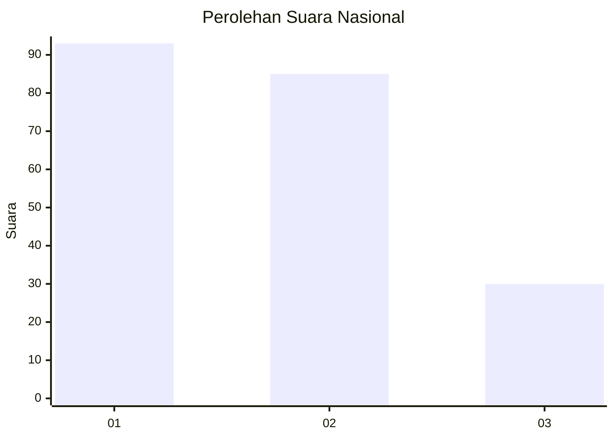
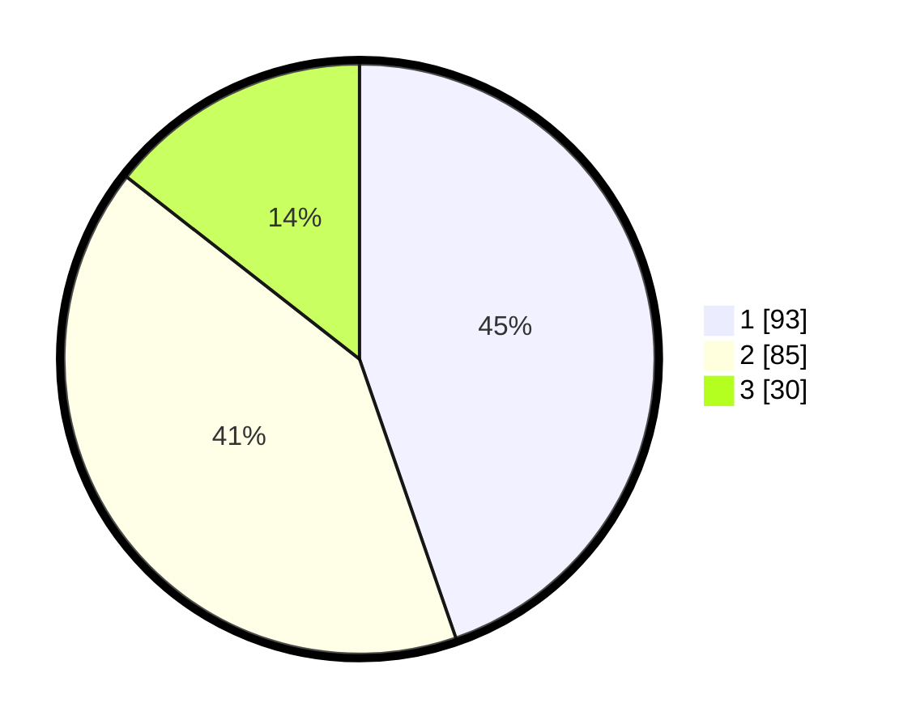

# Hasil

## Grafik

## Tabel

| No.    | Nama Paslon    | Suara | Suara (raw) | Persentase |
|:------ |:-------------- | -----:| -----------:| ----------:|
| 100025 | ANIES MUHAIMIN | 93    | [93][p-1]   | 44,71      |
| 100026 | PRABOWO GIBRAN | 85    | [85][p-2]   | 40,87      |
| 100027 | GANJAR MAHFUD  | 30    | [30][p-3]   | 14,42      |

[p-1]: https://github.com/gigit-pemilu/pemilu-2024/blob/main/pilpres/hitung-suara/sub/31-dki-jakarta/sub/75-jakarta-timur/sub/07-duren-sawit/sub/1006-malaka-jaya/sub/105-tps/sub/paslon-1.txt
[p-2]: https://github.com/gigit-pemilu/pemilu-2024/blob/main/pilpres/hitung-suara/sub/31-dki-jakarta/sub/75-jakarta-timur/sub/07-duren-sawit/sub/1006-malaka-jaya/sub/105-tps/sub/paslon-2.txt
[p-3]: https://github.com/gigit-pemilu/pemilu-2024/blob/main/pilpres/hitung-suara/sub/31-dki-jakarta/sub/75-jakarta-timur/sub/07-duren-sawit/sub/1006-malaka-jaya/sub/105-tps/sub/paslon-3.txt

## Foto C Plano

https://sirekap-obj-formc.kpu.go.id/a599/pemilu/ppwp/31/75/07/10/06/3175071006105-20240214-233751--7ef77f84-86ce-439e-9c7f-da2ebc91cc9f.jpg

https://sirekap-obj-formc.kpu.go.id/a599/pemilu/ppwp/31/75/07/10/06/3175071006105-20240214-233859--c462f0f8-789d-4748-9c0c-0137e47101a5.jpg

https://sirekap-obj-formc.kpu.go.id/a599/pemilu/ppwp/31/75/07/10/06/3175071006105-20240214-234002--f0c47352-3f21-4c01-aad0-4f83dc305d8d.jpg

## Metadata

| Key        | Value               |
| ---------- | ------------------- |
| Time Stamp | 2024-02-24 22:31:28 |

