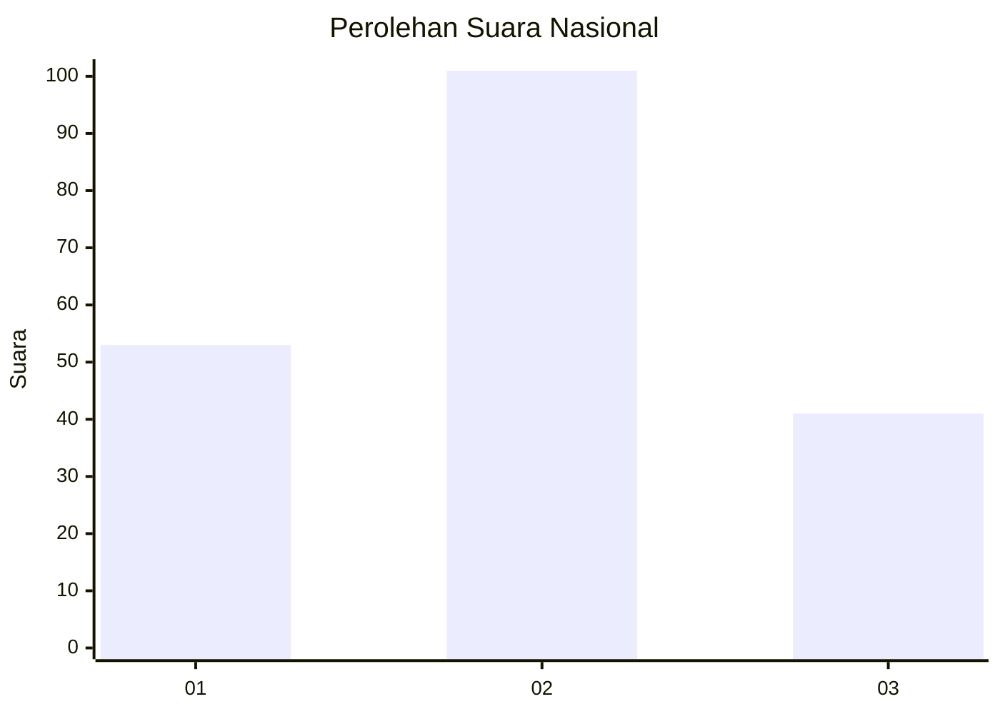
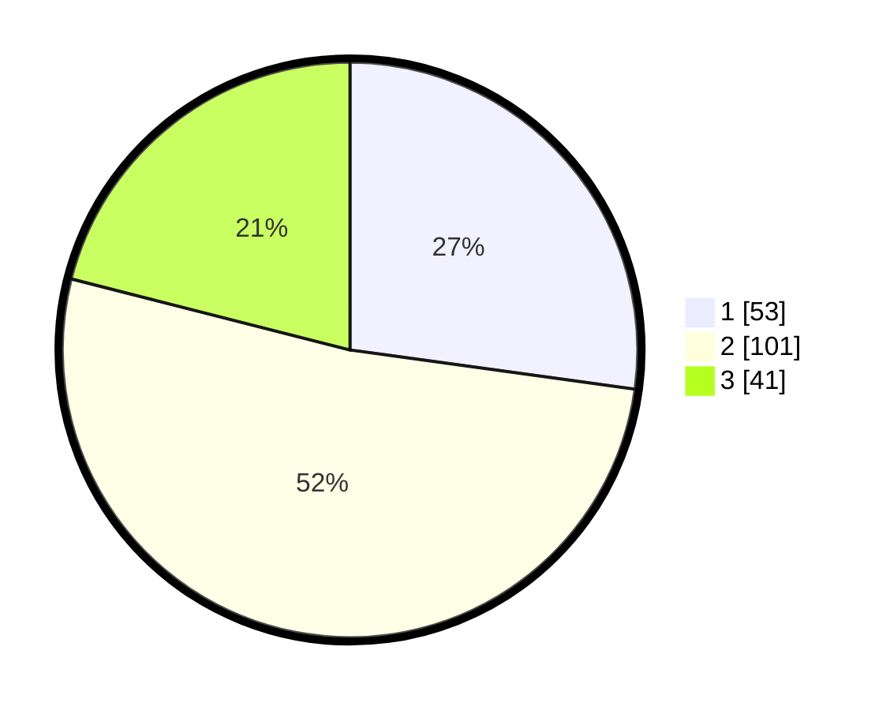

# Hasil

## Grafik

## Tabel

| No.    | Nama Paslon    | Suara | Suara (raw) | Persentase |
|:------ |:-------------- | -----:| -----------:| ----------:|
| 100025 | ANIES MUHAIMIN | 53    | [53][p-1]   | 27,18      |
| 100026 | PRABOWO GIBRAN | 101   | [101][p-2]  | 51,79      |
| 100027 | GANJAR MAHFUD  | 41    | [41][p-3]   | 21,03      |

[p-1]: https://github.com/gigit-pemilu/pemilu-2024/blob/main/pilpres/hitung-suara/sub/31-dki-jakarta/sub/75-jakarta-timur/sub/07-duren-sawit/sub/1007-pondok-kopi/sub/034-tps/sub/paslon-1.txt
[p-2]: https://github.com/gigit-pemilu/pemilu-2024/blob/main/pilpres/hitung-suara/sub/31-dki-jakarta/sub/75-jakarta-timur/sub/07-duren-sawit/sub/1007-pondok-kopi/sub/034-tps/sub/paslon-2.txt
[p-3]: https://github.com/gigit-pemilu/pemilu-2024/blob/main/pilpres/hitung-suara/sub/31-dki-jakarta/sub/75-jakarta-timur/sub/07-duren-sawit/sub/1007-pondok-kopi/sub/034-tps/sub/paslon-3.txt

## Foto C Plano

https://sirekap-obj-formc.kpu.go.id/6b65/pemilu/ppwp/31/75/07/10/07/3175071007034-20240214-224339--c52eeea1-3cba-4bd6-84e2-3c4f1e82eb16.jpg

https://sirekap-obj-formc.kpu.go.id/6b65/pemilu/ppwp/31/75/07/10/07/3175071007034-20240214-224607--00b515b4-b99b-4040-a1ee-f1f88e364921.jpg

https://sirekap-obj-formc.kpu.go.id/6b65/pemilu/ppwp/31/75/07/10/07/3175071007034-20240214-224758--59b77a67-d93b-4a7f-a727-34a9e51c18ca.jpg

## Metadata

| Key        | Value               |
| ---------- | ------------------- |
| Time Stamp | 2024-02-16 04:00:27 |

