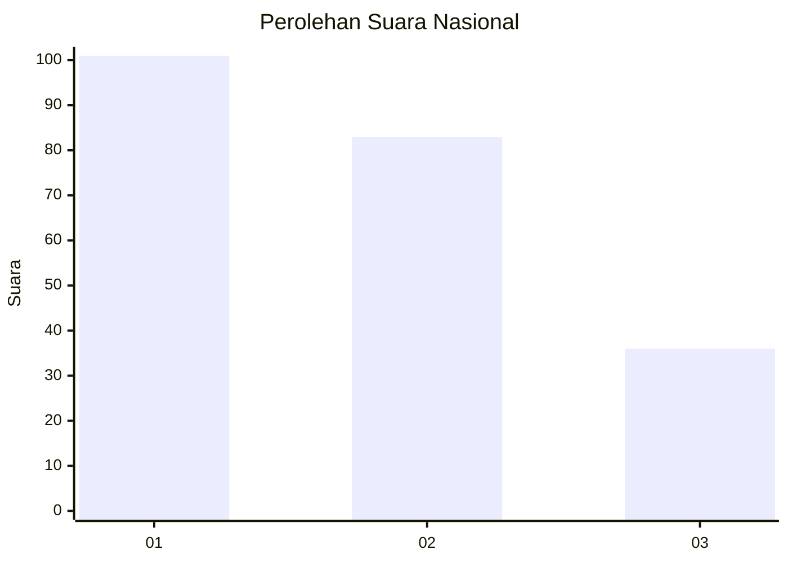
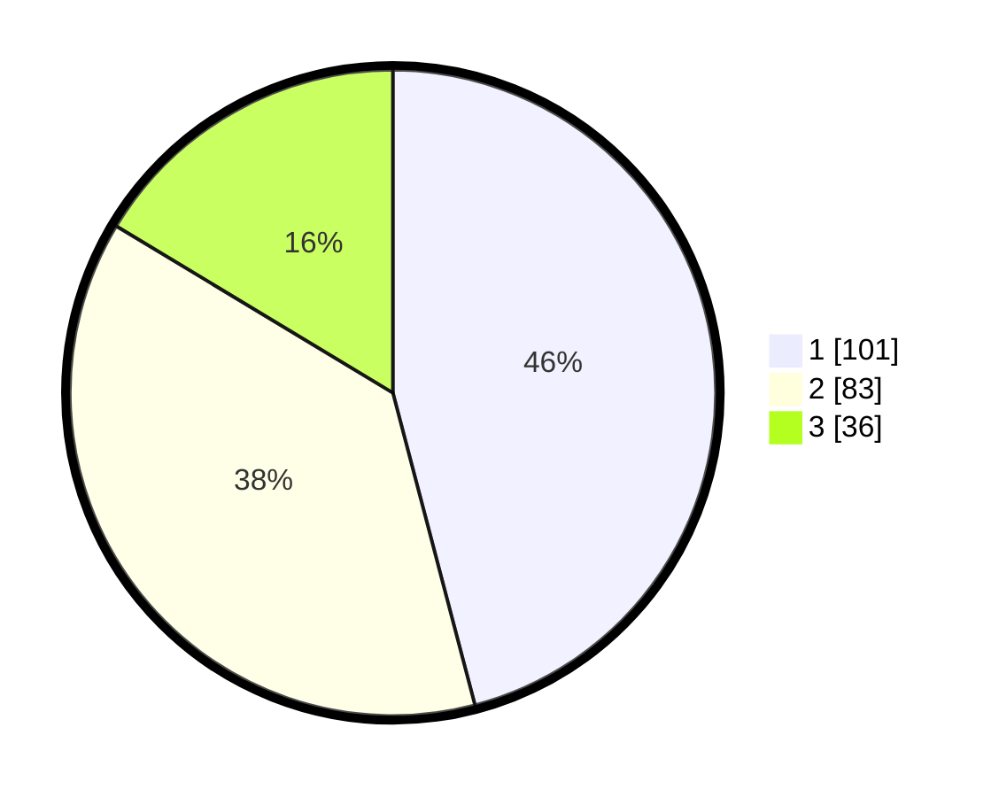

# Hasil

## Grafik

## Tabel

| No.    | Nama Paslon    | Suara | Suara (raw) | Persentase |
|:------ |:-------------- | -----:| -----------:| ----------:|
| 100025 | ANIES MUHAIMIN | 101   | [101][p-1]  | 45,91      |
| 100026 | PRABOWO GIBRAN | 83    | [83][p-2]   | 37,73      |
| 100027 | GANJAR MAHFUD  | 36    | [36][p-3]   | 16,36      |

[p-1]: https://github.com/gigit-pemilu/pemilu-2024/blob/main/pilpres/hitung-suara/sub/31-dki-jakarta/sub/75-jakarta-timur/sub/07-duren-sawit/sub/1007-pondok-kopi/sub/052-tps/sub/paslon-1.txt
[p-2]: https://github.com/gigit-pemilu/pemilu-2024/blob/main/pilpres/hitung-suara/sub/31-dki-jakarta/sub/75-jakarta-timur/sub/07-duren-sawit/sub/1007-pondok-kopi/sub/052-tps/sub/paslon-2.txt
[p-3]: https://github.com/gigit-pemilu/pemilu-2024/blob/main/pilpres/hitung-suara/sub/31-dki-jakarta/sub/75-jakarta-timur/sub/07-duren-sawit/sub/1007-pondok-kopi/sub/052-tps/sub/paslon-3.txt

## Foto C Plano

https://sirekap-obj-formc.kpu.go.id/d2a9/pemilu/ppwp/31/75/07/10/07/3175071007052-20240215-001703--fad36d05-ecfa-40c5-844c-27491d209465.jpg

https://sirekap-obj-formc.kpu.go.id/d2a9/pemilu/ppwp/31/75/07/10/07/3175071007052-20240215-001752--116c473a-9c76-44de-9e86-bb8959623918.jpg

https://sirekap-obj-formc.kpu.go.id/d2a9/pemilu/ppwp/31/75/07/10/07/3175071007052-20240215-001906--300747c3-8a6e-48da-8993-0b56802d61cc.jpg

## Metadata

| Key        | Value               |
| ---------- | ------------------- |
| Time Stamp | 2024-02-24 22:31:28 |

