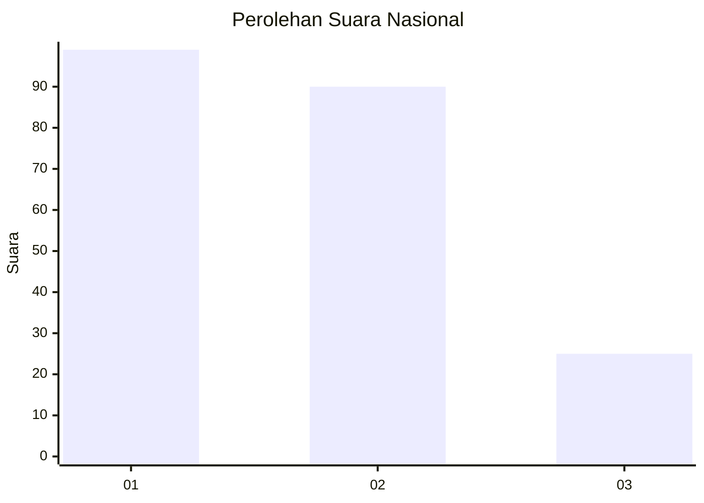
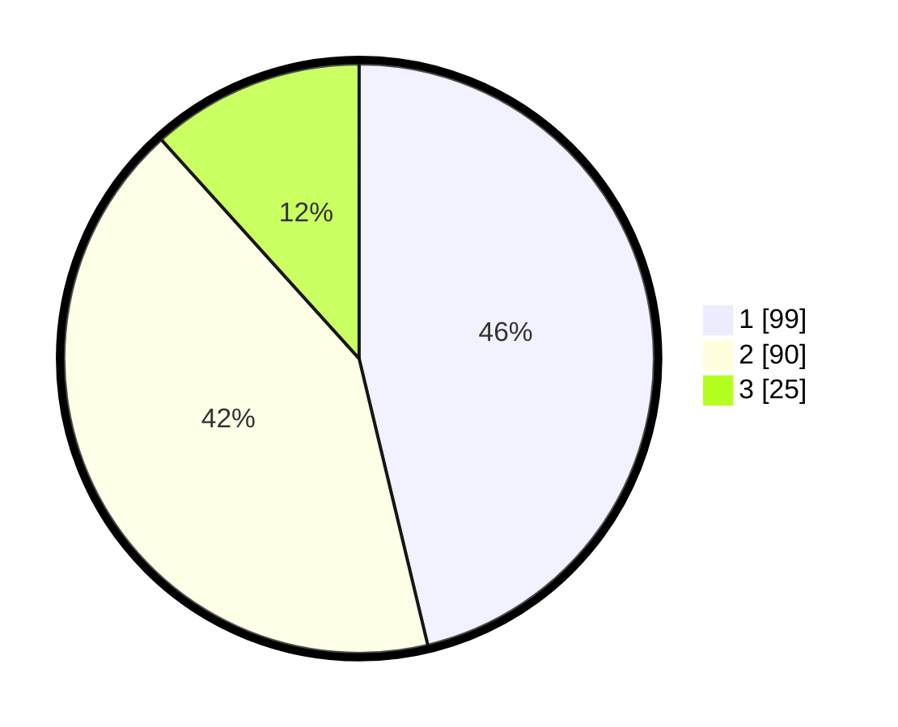

# Hasil

## Grafik

## Tabel

| No.    | Nama Paslon    | Suara | Suara (raw) | Persentase |
|:------ |:-------------- | -----:| -----------:| ----------:|
| 100025 | ANIES MUHAIMIN | 99    | [99][p-1]   | 46,26      |
| 100026 | PRABOWO GIBRAN | 90    | [90][p-2]   | 42,06      |
| 100027 | GANJAR MAHFUD  | 25    | [25][p-3]   | 11,68      |

[p-1]: https://github.com/gigit-pemilu/pemilu-2024/blob/main/pilpres/hitung-suara/sub/31-dki-jakarta/sub/75-jakarta-timur/sub/08-makasar/sub/1001-makasar/sub/003-tps/sub/paslon-1.txt
[p-2]: https://github.com/gigit-pemilu/pemilu-2024/blob/main/pilpres/hitung-suara/sub/31-dki-jakarta/sub/75-jakarta-timur/sub/08-makasar/sub/1001-makasar/sub/003-tps/sub/paslon-2.txt
[p-3]: https://github.com/gigit-pemilu/pemilu-2024/blob/main/pilpres/hitung-suara/sub/31-dki-jakarta/sub/75-jakarta-timur/sub/08-makasar/sub/1001-makasar/sub/003-tps/sub/paslon-3.txt

## Foto C Plano

https://sirekap-obj-formc.kpu.go.id/36a3/pemilu/ppwp/31/75/08/10/01/3175081001003-20240215-034153--4574989a-42f8-4860-8f28-f397f4fdc080.jpg

https://sirekap-obj-formc.kpu.go.id/36a3/pemilu/ppwp/31/75/08/10/01/3175081001003-20240215-034250--9c03c3d3-3572-4dc1-bec8-565de6c4efcb.jpg

https://sirekap-obj-formc.kpu.go.id/36a3/pemilu/ppwp/31/75/08/10/01/3175081001003-20240215-034345--43f0a3bb-4304-46bf-88e5-a8c3e3040711.jpg

## Metadata

| Key        | Value               |
| ---------- | ------------------- |
| Time Stamp | 2024-02-15 15:00:29 |

