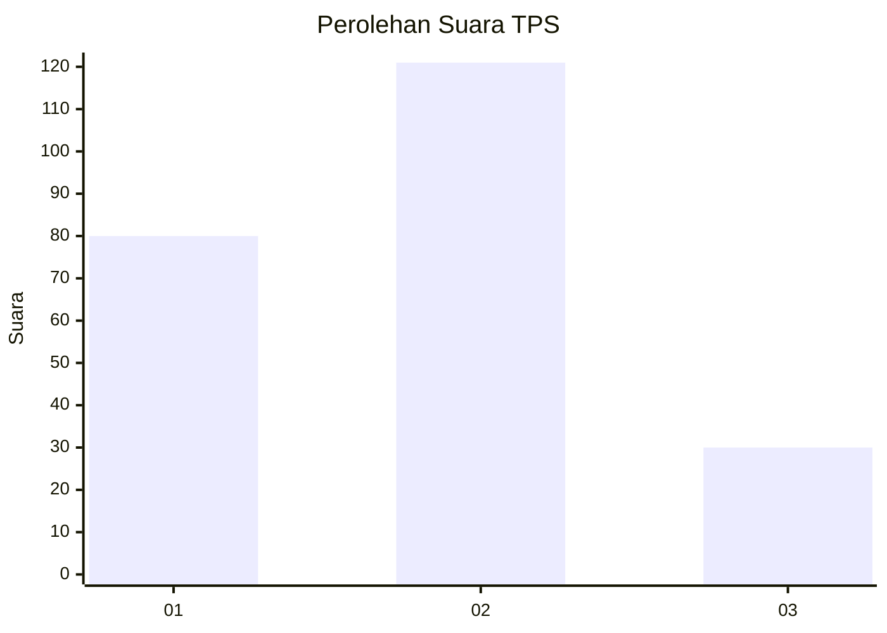
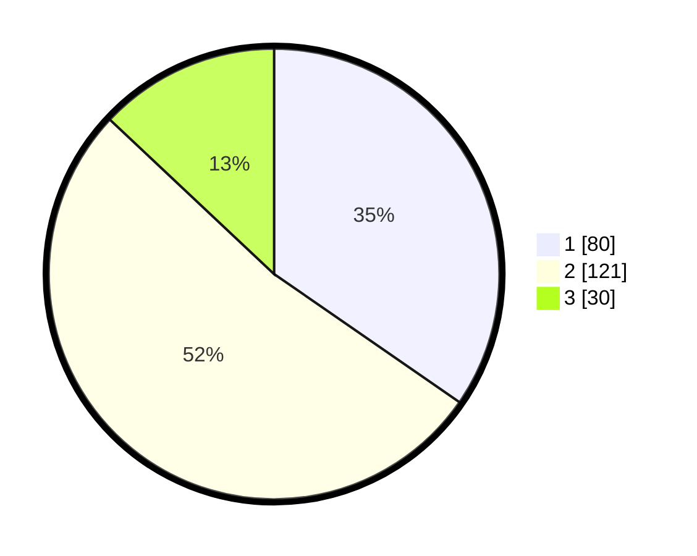

# Hasil

## Grafik

## Tabel

| No. | Nama Paslon    | Suara | Suara (raw) | Persentase |
|:--- |:-------------- | -----:| -----------:| ----------:|
| 1   | ANIES MUHAIMIN | 80    | [80][p-1]   | 34,63      |
| 2   | PRABOWO GIBRAN | 121   | [121][p-2]  | 52,38      |
| 3   | GANJAR MAHFUD  | 30    | [30][p-3]   | 12,99      |

[p-1]: https://github.com/gigit-pemilu/pemilu-2024-31-dki-jakarta/blob/main/pilpres/hitung-suara/sub/31-dki-jakarta/sub/75-jakarta-timur/sub/08-makasar/sub/1001-makasar/sub/011-tps/sub/paslon-1.txt
[p-2]: https://github.com/gigit-pemilu/pemilu-2024-31-dki-jakarta/blob/main/pilpres/hitung-suara/sub/31-dki-jakarta/sub/75-jakarta-timur/sub/08-makasar/sub/1001-makasar/sub/011-tps/sub/paslon-2.txt
[p-3]: https://github.com/gigit-pemilu/pemilu-2024-31-dki-jakarta/blob/main/pilpres/hitung-suara/sub/31-dki-jakarta/sub/75-jakarta-timur/sub/08-makasar/sub/1001-makasar/sub/011-tps/sub/paslon-3.txt

## Foto C Plano

https://sirekap-obj-formc.kpu.go.id/9373/pemilu/ppwp/31/75/08/10/01/3175081001011-20240214-223212--c33d8ea4-bcf7-4d3e-8961-28a1acf20918.jpg

https://sirekap-obj-formc.kpu.go.id/9373/pemilu/ppwp/31/75/08/10/01/3175081001011-20240218-201513--352942d8-bf64-4b37-86f6-07ee8d417d7b.jpg

https://sirekap-obj-formc.kpu.go.id/9373/pemilu/ppwp/31/75/08/10/01/3175081001011-20240218-201127--0b6afd8c-0f42-419f-90b6-ee3f0ebf313c.jpg

## Metadata

| Key        | Value               |
| ---------- | ------------------- |
| Time Stamp | 2024-02-20 12:00:00 |

