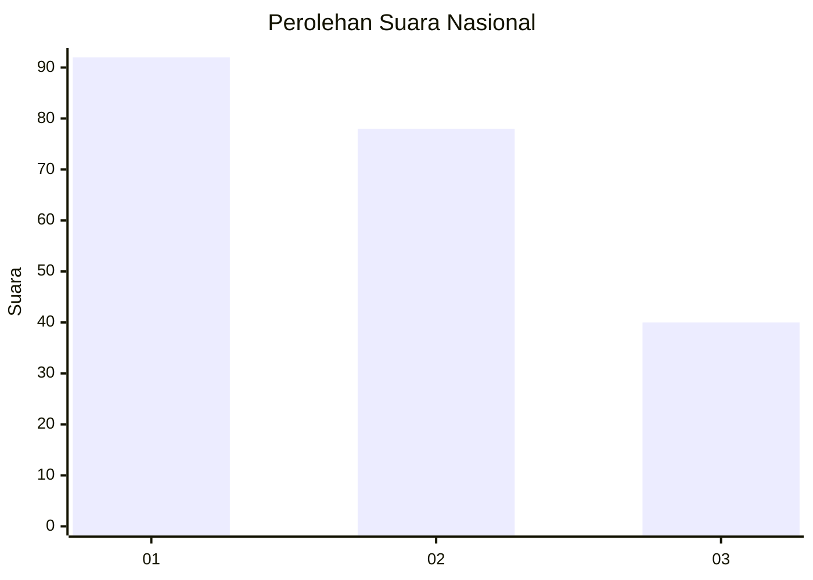
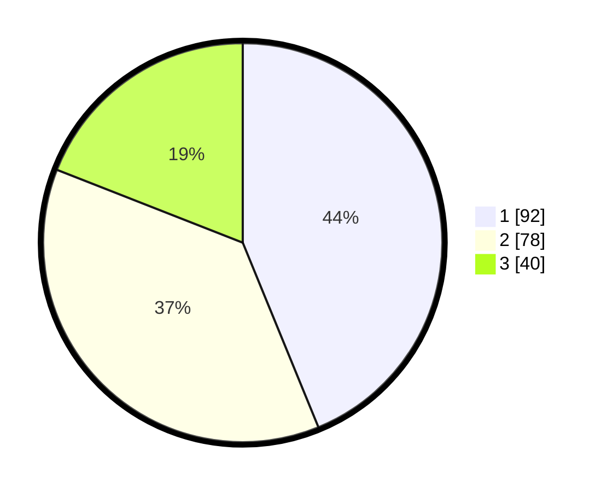

# Hasil

## Grafik

## Tabel

| No.    | Nama Paslon    | Suara | Suara (raw) | Persentase |
|:------ |:-------------- | -----:| -----------:| ----------:|
| 100025 | ANIES MUHAIMIN | 92    | [92][p-1]   | 43,81      |
| 100026 | PRABOWO GIBRAN | 78    | [78][p-2]   | 37,14      |
| 100027 | GANJAR MAHFUD  | 40    | [40][p-3]   | 19,05      |

[p-1]: https://github.com/gigit-pemilu/pemilu-2024/blob/main/pilpres/hitung-suara/sub/31-dki-jakarta/sub/75-jakarta-timur/sub/08-makasar/sub/1001-makasar/sub/014-tps/sub/paslon-1.txt
[p-2]: https://github.com/gigit-pemilu/pemilu-2024/blob/main/pilpres/hitung-suara/sub/31-dki-jakarta/sub/75-jakarta-timur/sub/08-makasar/sub/1001-makasar/sub/014-tps/sub/paslon-2.txt
[p-3]: https://github.com/gigit-pemilu/pemilu-2024/blob/main/pilpres/hitung-suara/sub/31-dki-jakarta/sub/75-jakarta-timur/sub/08-makasar/sub/1001-makasar/sub/014-tps/sub/paslon-3.txt

## Foto C Plano

https://sirekap-obj-formc.kpu.go.id/fb02/pemilu/ppwp/31/75/08/10/01/3175081001014-20240215-005308--c4805d96-9f7b-4880-b644-d0fea043c901.jpg

https://sirekap-obj-formc.kpu.go.id/fb02/pemilu/ppwp/31/75/08/10/01/3175081001014-20240215-005348--84753cdc-f557-4521-954c-f16ca5880bae.jpg

https://sirekap-obj-formc.kpu.go.id/fb02/pemilu/ppwp/31/75/08/10/01/3175081001014-20240215-005545--2288d22e-fd03-4bbf-af06-3d54a96ec34f.jpg

## Metadata

| Key        | Value               |
| ---------- | ------------------- |
| Time Stamp | 2024-02-15 15:00:29 |

