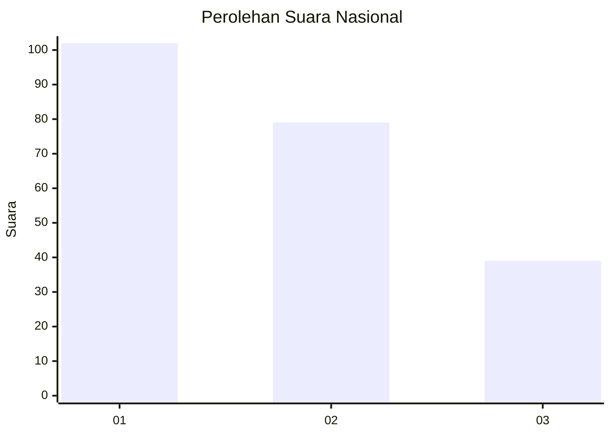
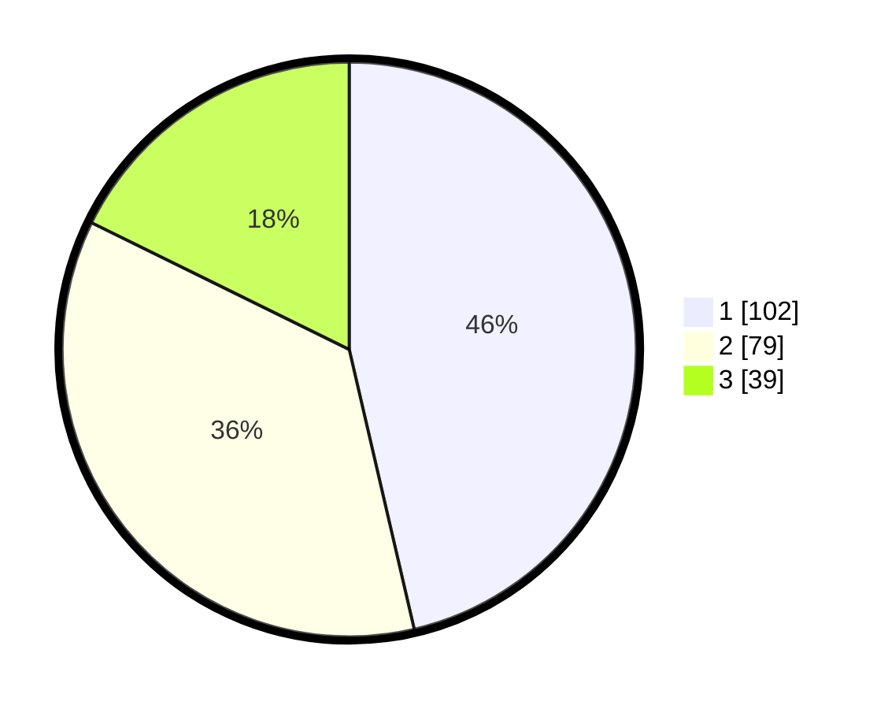

# Hasil

## Grafik

## Tabel

| No.    | Nama Paslon    | Suara | Suara (raw) | Persentase |
|:------ |:-------------- | -----:| -----------:| ----------:|
| 100025 | ANIES MUHAIMIN | 102   | [102][p-1]  | 46,36      |
| 100026 | PRABOWO GIBRAN | 79    | [79][p-2]   | 35,91      |
| 100027 | GANJAR MAHFUD  | 39    | [39][p-3]   | 17,73      |

[p-1]: https://github.com/gigit-pemilu/pemilu-2024/blob/main/pilpres/hitung-suara/sub/31-dki-jakarta/sub/75-jakarta-timur/sub/08-makasar/sub/1001-makasar/sub/016-tps/sub/paslon-1.txt
[p-2]: https://github.com/gigit-pemilu/pemilu-2024/blob/main/pilpres/hitung-suara/sub/31-dki-jakarta/sub/75-jakarta-timur/sub/08-makasar/sub/1001-makasar/sub/016-tps/sub/paslon-2.txt
[p-3]: https://github.com/gigit-pemilu/pemilu-2024/blob/main/pilpres/hitung-suara/sub/31-dki-jakarta/sub/75-jakarta-timur/sub/08-makasar/sub/1001-makasar/sub/016-tps/sub/paslon-3.txt

## Foto C Plano

https://sirekap-obj-formc.kpu.go.id/29cd/pemilu/ppwp/31/75/08/10/01/3175081001016-20240214-224531--368baaed-1db1-4382-844b-92332185d6d7.jpg

https://sirekap-obj-formc.kpu.go.id/29cd/pemilu/ppwp/31/75/08/10/01/3175081001016-20240214-224551--c799e5d0-007c-46ac-95f7-429b3a27c62b.jpg

https://sirekap-obj-formc.kpu.go.id/29cd/pemilu/ppwp/31/75/08/10/01/3175081001016-20240218-095915--137a54e6-9661-4e68-9978-825670fcc950.jpg

## Metadata

| Key        | Value               |
| ---------- | ------------------- |
| Time Stamp | 2024-02-19 06:16:00 |

