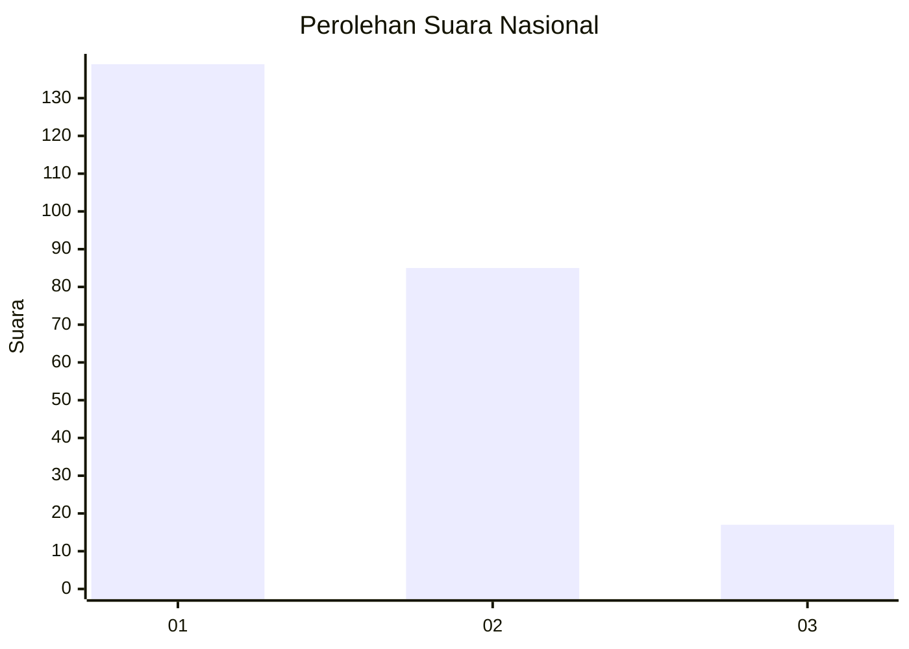
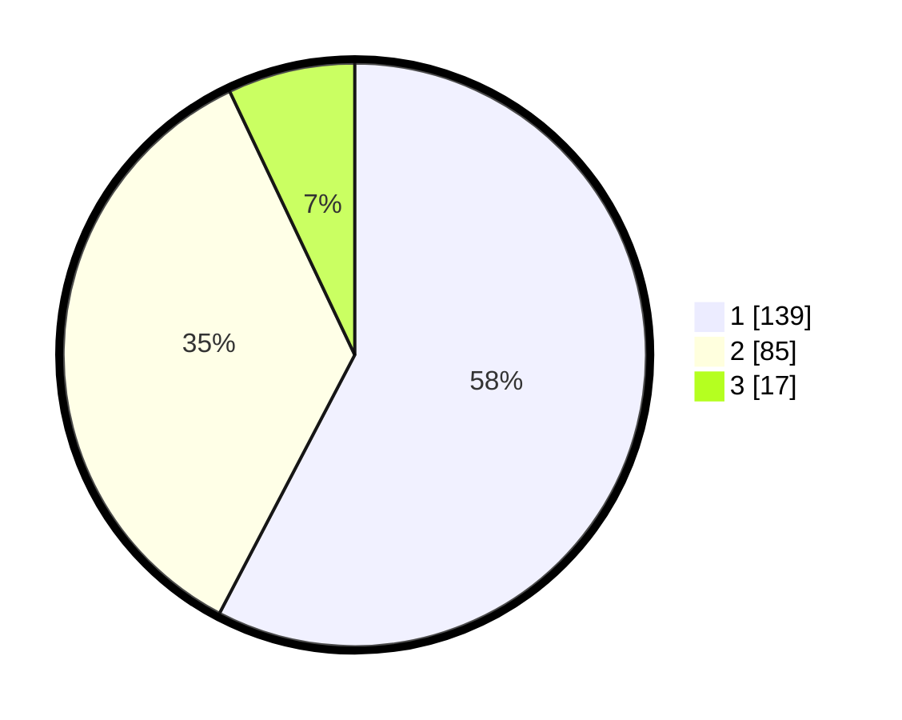

# Hasil

## Grafik

## Tabel

| No.    | Nama Paslon    | Suara | Suara (raw) | Persentase |
|:------ |:-------------- | -----:| -----------:| ----------:|
| 100025 | ANIES MUHAIMIN | 139   | [139][p-1]  | 57,68      |
| 100026 | PRABOWO GIBRAN | 85    | [85][p-2]   | 35,27      |
| 100027 | GANJAR MAHFUD  | 17    | [17][p-3]   | 7,05       |

[p-1]: https://github.com/gigit-pemilu/pemilu-2024/blob/main/pilpres/hitung-suara/sub/31-dki-jakarta/sub/75-jakarta-timur/sub/08-makasar/sub/1001-makasar/sub/029-tps/sub/paslon-1.txt
[p-2]: https://github.com/gigit-pemilu/pemilu-2024/blob/main/pilpres/hitung-suara/sub/31-dki-jakarta/sub/75-jakarta-timur/sub/08-makasar/sub/1001-makasar/sub/029-tps/sub/paslon-2.txt
[p-3]: https://github.com/gigit-pemilu/pemilu-2024/blob/main/pilpres/hitung-suara/sub/31-dki-jakarta/sub/75-jakarta-timur/sub/08-makasar/sub/1001-makasar/sub/029-tps/sub/paslon-3.txt

## Foto C Plano

https://sirekap-obj-formc.kpu.go.id/5722/pemilu/ppwp/31/75/08/10/01/3175081001029-20240214-211630--6b28014e-b81f-453b-ace1-4e6df614d9ea.jpg

https://sirekap-obj-formc.kpu.go.id/5722/pemilu/ppwp/31/75/08/10/01/3175081001029-20240214-201035--5ea0f848-1863-44f4-9a83-9f97bca4c74a.jpg

https://sirekap-obj-formc.kpu.go.id/5722/pemilu/ppwp/31/75/08/10/01/3175081001029-20240214-212103--0de926b7-61bc-4275-bb8a-5156b2fa75e9.jpg

## Metadata

| Key        | Value               |
| ---------- | ------------------- |
| Time Stamp | 2024-02-15 15:00:29 |

