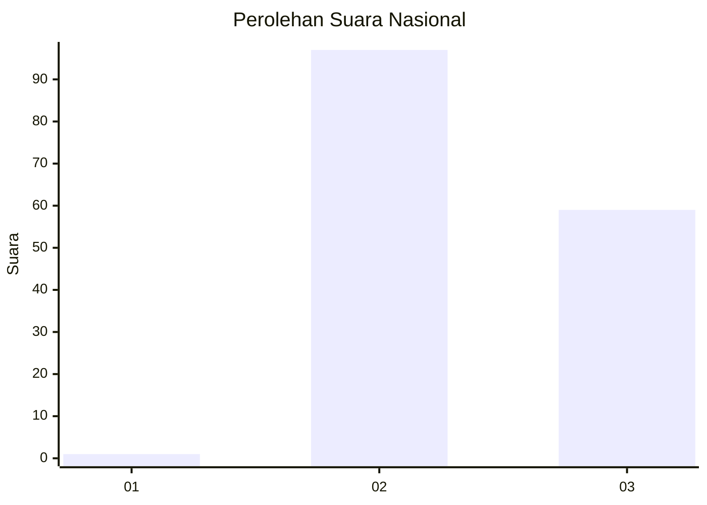
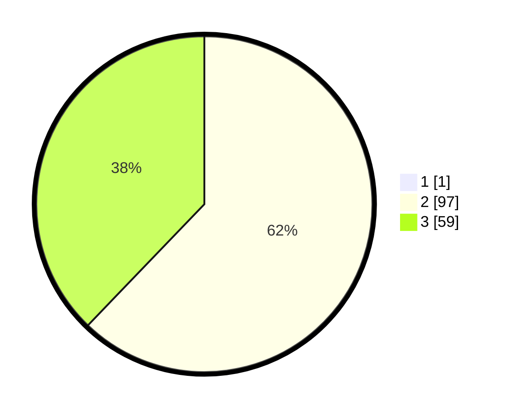

# Hasil

## Grafik

## Tabel

| No.    | Nama Paslon    | Suara | Suara (raw) | Persentase |
|:------ |:-------------- | -----:| -----------:| ----------:|
| 100025 | ANIES MUHAIMIN | 1     | [1][p-1]    | 0,64       |
| 100026 | PRABOWO GIBRAN | 97    | [97][p-2]   | 61,78      |
| 100027 | GANJAR MAHFUD  | 59    | [59][p-3]   | 37,58      |

[p-1]: https://github.com/gigit-pemilu/pemilu-2024/blob/main/pilpres/hitung-suara/sub/31-dki-jakarta/sub/75-jakarta-timur/sub/08-makasar/sub/1001-makasar/sub/033-tps/sub/paslon-1.txt
[p-2]: https://github.com/gigit-pemilu/pemilu-2024/blob/main/pilpres/hitung-suara/sub/31-dki-jakarta/sub/75-jakarta-timur/sub/08-makasar/sub/1001-makasar/sub/033-tps/sub/paslon-2.txt
[p-3]: https://github.com/gigit-pemilu/pemilu-2024/blob/main/pilpres/hitung-suara/sub/31-dki-jakarta/sub/75-jakarta-timur/sub/08-makasar/sub/1001-makasar/sub/033-tps/sub/paslon-3.txt

## Foto C Plano

https://sirekap-obj-formc.kpu.go.id/244f/pemilu/ppwp/31/75/08/10/01/3175081001033-20240214-200402--3a139aae-9001-4f5c-95e5-959a0715cfe8.jpg

https://sirekap-obj-formc.kpu.go.id/244f/pemilu/ppwp/31/75/08/10/01/3175081001033-20240214-193935--b2047167-1306-4e13-8c50-cf98f1f442be.jpg

https://sirekap-obj-formc.kpu.go.id/244f/pemilu/ppwp/31/75/08/10/01/3175081001033-20240214-194011--ddbee81e-1d06-441e-9247-ae8e9ce25d82.jpg

## Metadata

| Key        | Value               |
| ---------- | ------------------- |
| Time Stamp | 2024-02-15 12:00:28 |

