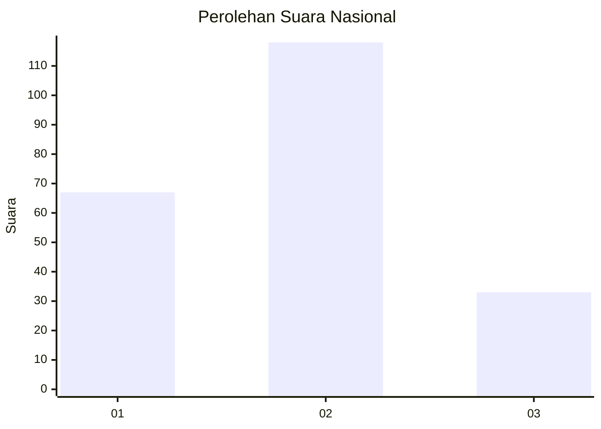
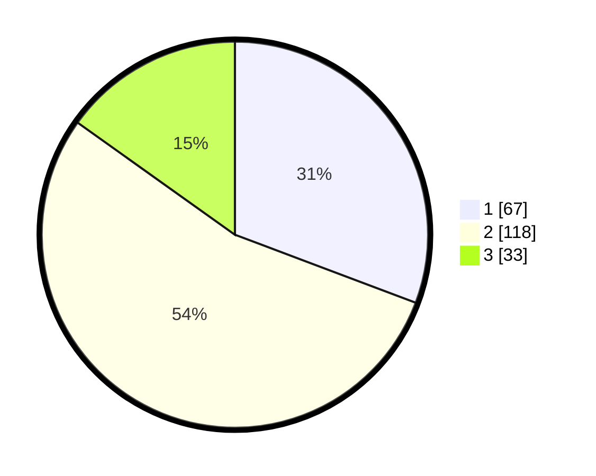

# Hasil

## Grafik

## Tabel

| No.    | Nama Paslon    | Suara | Suara (raw) | Persentase |
|:------ |:-------------- | -----:| -----------:| ----------:|
| 100025 | ANIES MUHAIMIN | 67    | [67][p-1]   | 30,73      |
| 100026 | PRABOWO GIBRAN | 118   | [118][p-2]  | 54,13      |
| 100027 | GANJAR MAHFUD  | 33    | [33][p-3]   | 15,14      |

[p-1]: https://github.com/gigit-pemilu/pemilu-2024/blob/main/pilpres/hitung-suara/sub/31-dki-jakarta/sub/75-jakarta-timur/sub/08-makasar/sub/1001-makasar/sub/061-tps/sub/paslon-1.txt
[p-2]: https://github.com/gigit-pemilu/pemilu-2024/blob/main/pilpres/hitung-suara/sub/31-dki-jakarta/sub/75-jakarta-timur/sub/08-makasar/sub/1001-makasar/sub/061-tps/sub/paslon-2.txt
[p-3]: https://github.com/gigit-pemilu/pemilu-2024/blob/main/pilpres/hitung-suara/sub/31-dki-jakarta/sub/75-jakarta-timur/sub/08-makasar/sub/1001-makasar/sub/061-tps/sub/paslon-3.txt

## Foto C Plano

https://sirekap-obj-formc.kpu.go.id/1c62/pemilu/ppwp/31/75/08/10/01/3175081001061-20240214-205803--82e2b78d-acec-4365-a4f3-4112f5f1bffd.jpg

https://sirekap-obj-formc.kpu.go.id/1c62/pemilu/ppwp/31/75/08/10/01/3175081001061-20240214-205621--a67e9477-da22-43b4-a4f8-cbc68aec5051.jpg

https://sirekap-obj-formc.kpu.go.id/1c62/pemilu/ppwp/31/75/08/10/01/3175081001061-20240214-232054--413bddb2-ff99-45e5-9090-794bac06bf7a.jpg

## Metadata

| Key        | Value               |
| ---------- | ------------------- |
| Time Stamp | 2024-02-15 15:30:25 |

