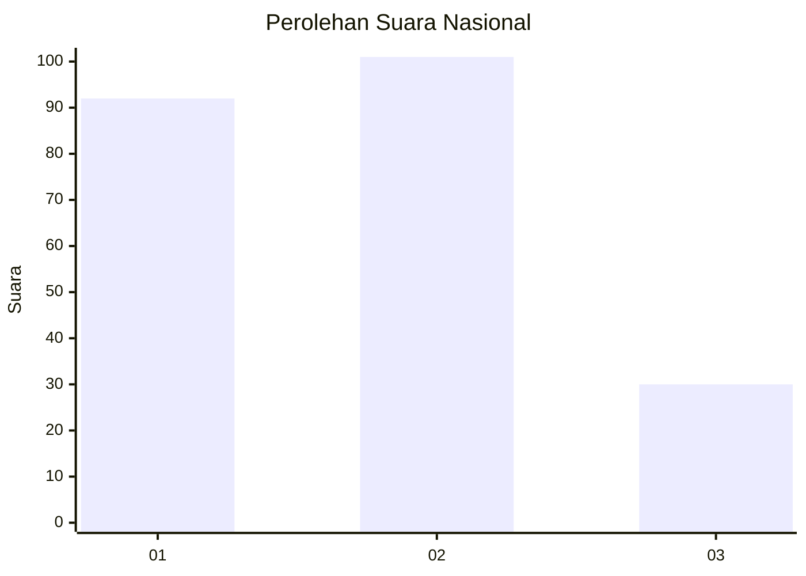
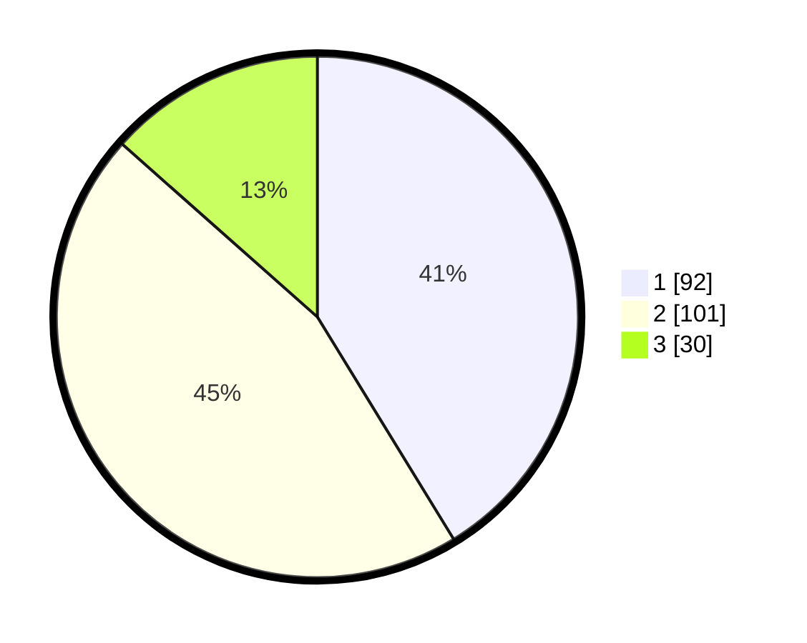

# Hasil

## Grafik

## Tabel

| No.    | Nama Paslon    | Suara | Suara (raw) | Persentase |
|:------ |:-------------- | -----:| -----------:| ----------:|
| 100025 | ANIES MUHAIMIN | 92    | [92][p-1]   | 41,26      |
| 100026 | PRABOWO GIBRAN | 101   | [101][p-2]  | 45,29      |
| 100027 | GANJAR MAHFUD  | 30    | [30][p-3]   | 13,45      |

[p-1]: https://github.com/gigit-pemilu/pemilu-2024/blob/main/pilpres/hitung-suara/sub/31-dki-jakarta/sub/75-jakarta-timur/sub/08-makasar/sub/1001-makasar/sub/072-tps/sub/paslon-1.txt
[p-2]: https://github.com/gigit-pemilu/pemilu-2024/blob/main/pilpres/hitung-suara/sub/31-dki-jakarta/sub/75-jakarta-timur/sub/08-makasar/sub/1001-makasar/sub/072-tps/sub/paslon-2.txt
[p-3]: https://github.com/gigit-pemilu/pemilu-2024/blob/main/pilpres/hitung-suara/sub/31-dki-jakarta/sub/75-jakarta-timur/sub/08-makasar/sub/1001-makasar/sub/072-tps/sub/paslon-3.txt

## Foto C Plano

https://sirekap-obj-formc.kpu.go.id/bab7/pemilu/ppwp/31/75/08/10/01/3175081001072-20240215-015741--12b59cae-aec2-4f6f-b4b1-8bf939aae382.jpg

https://sirekap-obj-formc.kpu.go.id/bab7/pemilu/ppwp/31/75/08/10/01/3175081001072-20240215-015824--31b75a43-3583-4279-9293-9eb700bcaf0d.jpg

https://sirekap-obj-formc.kpu.go.id/bab7/pemilu/ppwp/31/75/08/10/01/3175081001072-20240215-015856--798d40fe-b629-4be1-a960-46137165360d.jpg

## Metadata

| Key        | Value               |
| ---------- | ------------------- |
| Time Stamp | 2024-02-15 15:30:25 |

