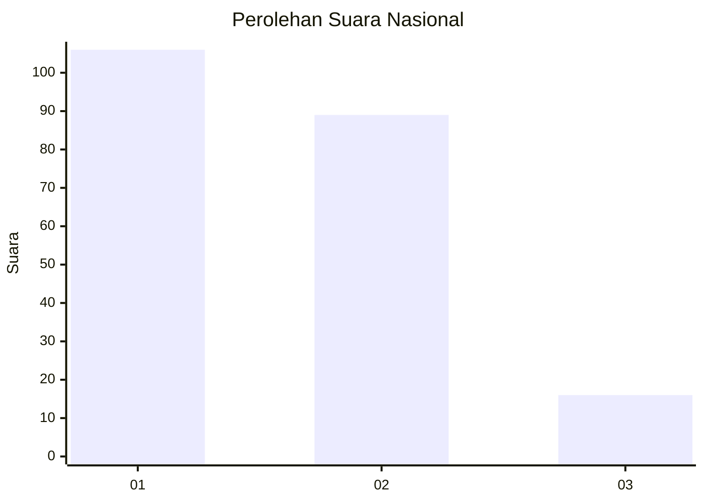
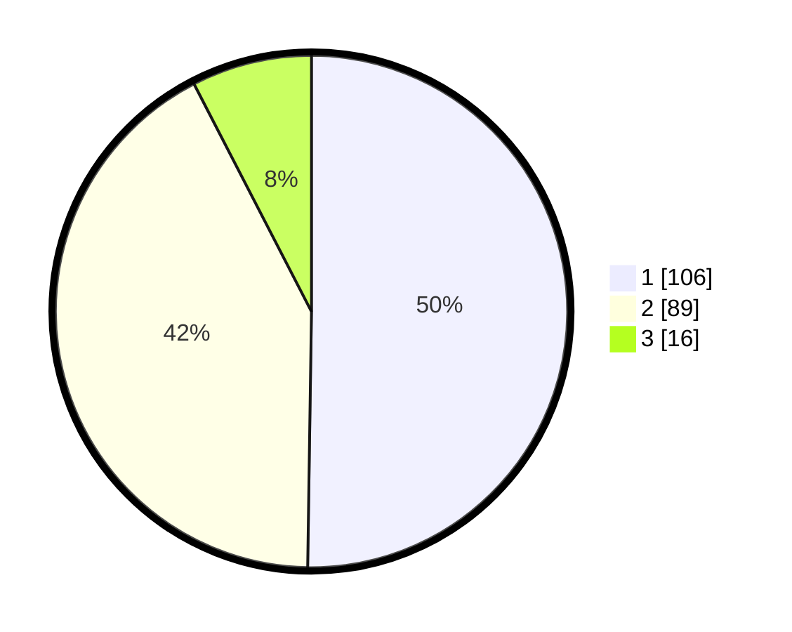

# Hasil

## Grafik

## Tabel

| No.    | Nama Paslon    | Suara | Suara (raw) | Persentase |
|:------ |:-------------- | -----:| -----------:| ----------:|
| 100025 | ANIES MUHAIMIN | 106   | [106][p-1]  | 50,24      |
| 100026 | PRABOWO GIBRAN | 89    | [89][p-2]   | 42,18      |
| 100027 | GANJAR MAHFUD  | 16    | [16][p-3]   | 7,58       |

[p-1]: https://github.com/gigit-pemilu/pemilu-2024/blob/main/pilpres/hitung-suara/sub/31-dki-jakarta/sub/75-jakarta-timur/sub/08-makasar/sub/1001-makasar/sub/089-tps/sub/paslon-1.txt
[p-2]: https://github.com/gigit-pemilu/pemilu-2024/blob/main/pilpres/hitung-suara/sub/31-dki-jakarta/sub/75-jakarta-timur/sub/08-makasar/sub/1001-makasar/sub/089-tps/sub/paslon-2.txt
[p-3]: https://github.com/gigit-pemilu/pemilu-2024/blob/main/pilpres/hitung-suara/sub/31-dki-jakarta/sub/75-jakarta-timur/sub/08-makasar/sub/1001-makasar/sub/089-tps/sub/paslon-3.txt

## Foto C Plano

https://sirekap-obj-formc.kpu.go.id/04b8/pemilu/ppwp/31/75/08/10/01/3175081001089-20240214-233650--bfbeb28d-7f68-48cb-9836-b186517f3747.jpg

https://sirekap-obj-formc.kpu.go.id/04b8/pemilu/ppwp/31/75/08/10/01/3175081001089-20240214-233752--de823a10-0177-486e-97a1-4969443eaebc.jpg

https://sirekap-obj-formc.kpu.go.id/04b8/pemilu/ppwp/31/75/08/10/01/3175081001089-20240214-233854--ec3321cb-2b42-453e-8183-9d4b6e1dd58e.jpg

## Metadata

| Key        | Value               |
| ---------- | ------------------- |
| Time Stamp | 2024-02-15 15:00:29 |

