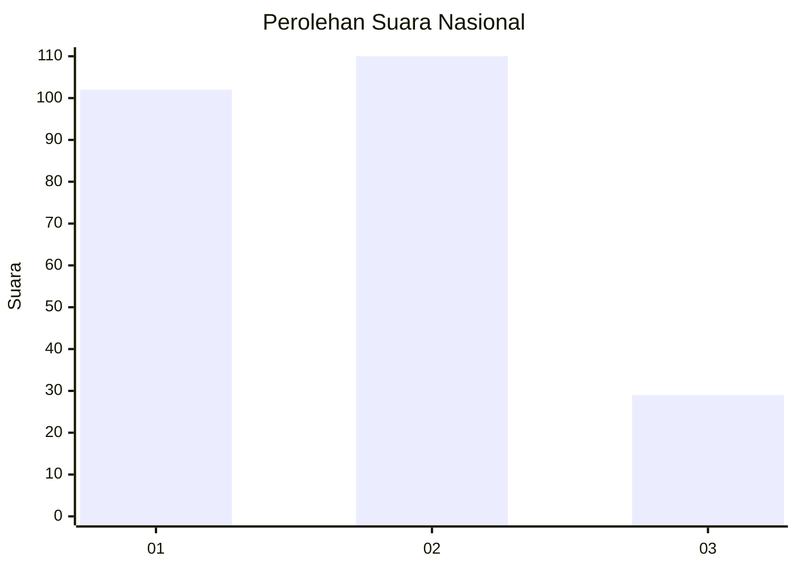
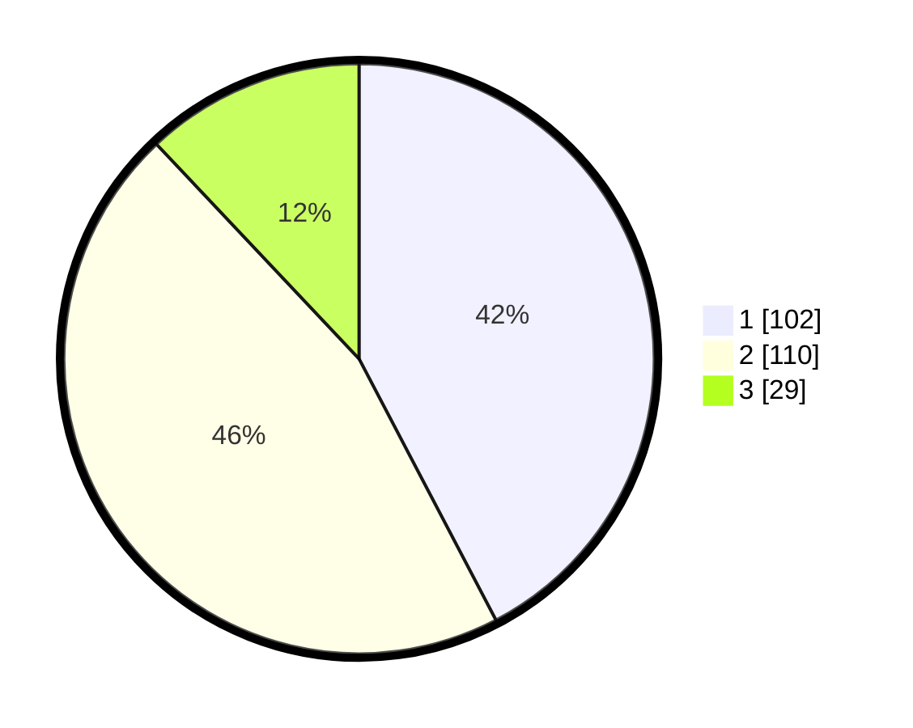

# Hasil

## Grafik

## Tabel

| No.    | Nama Paslon    | Suara | Suara (raw) | Persentase |
|:------ |:-------------- | -----:| -----------:| ----------:|
| 100025 | ANIES MUHAIMIN | 102   | [102][p-1]  | 42,32      |
| 100026 | PRABOWO GIBRAN | 110   | [110][p-2]  | 45,64      |
| 100027 | GANJAR MAHFUD  | 29    | [29][p-3]   | 12,03      |

[p-1]: https://github.com/gigit-pemilu/pemilu-2024/blob/main/pilpres/hitung-suara/sub/31-dki-jakarta/sub/75-jakarta-timur/sub/08-makasar/sub/1001-makasar/sub/114-tps/sub/paslon-1.txt
[p-2]: https://github.com/gigit-pemilu/pemilu-2024/blob/main/pilpres/hitung-suara/sub/31-dki-jakarta/sub/75-jakarta-timur/sub/08-makasar/sub/1001-makasar/sub/114-tps/sub/paslon-2.txt
[p-3]: https://github.com/gigit-pemilu/pemilu-2024/blob/main/pilpres/hitung-suara/sub/31-dki-jakarta/sub/75-jakarta-timur/sub/08-makasar/sub/1001-makasar/sub/114-tps/sub/paslon-3.txt

## Foto C Plano

https://sirekap-obj-formc.kpu.go.id/9cd6/pemilu/ppwp/31/75/08/10/01/3175081001114-20240214-185938--49edd511-b02e-4059-bae3-c6a0d5002a9b.jpg

https://sirekap-obj-formc.kpu.go.id/9cd6/pemilu/ppwp/31/75/08/10/01/3175081001114-20240214-185902--ba85ee52-43cf-405c-b659-74b55e2d0b04.jpg

https://sirekap-obj-formc.kpu.go.id/9cd6/pemilu/ppwp/31/75/08/10/01/3175081001114-20240214-190020--ac7464a5-6932-464c-8d55-d153a28ed740.jpg

## Metadata

| Key        | Value               |
| ---------- | ------------------- |
| Time Stamp | 2024-02-15 15:30:25 |

