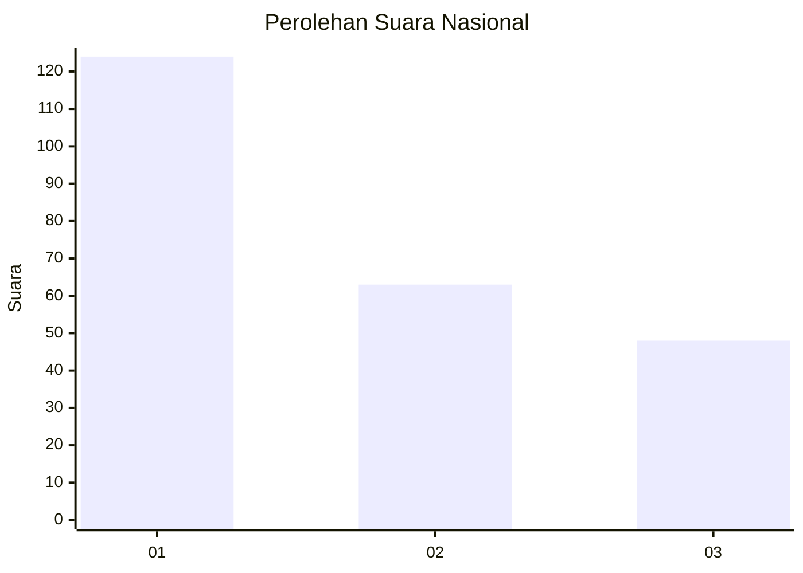
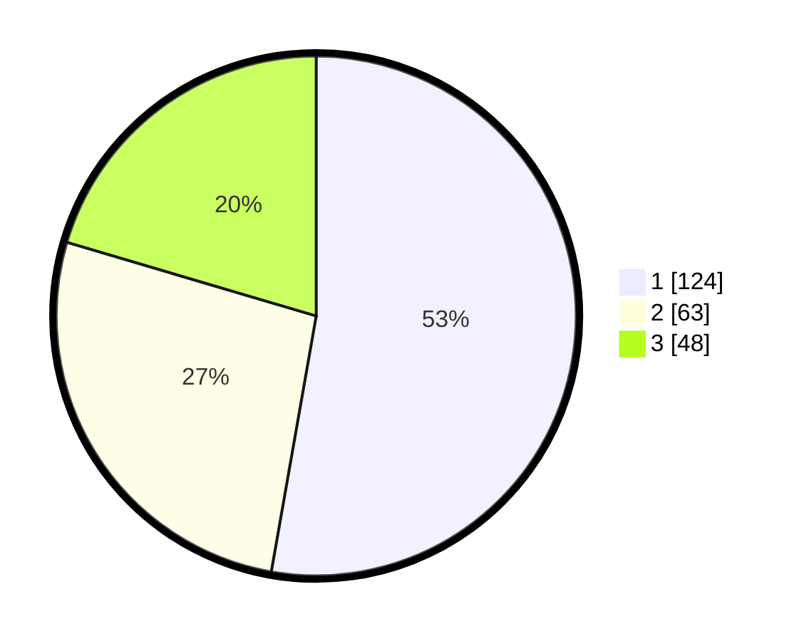

# Hasil

## Grafik

## Tabel

| No.    | Nama Paslon    | Suara | Suara (raw) | Persentase |
|:------ |:-------------- | -----:| -----------:| ----------:|
| 100025 | ANIES MUHAIMIN | 124   | [124][p-1]  | 52,77      |
| 100026 | PRABOWO GIBRAN | 63    | [63][p-2]   | 26,81      |
| 100027 | GANJAR MAHFUD  | 48    | [48][p-3]   | 20,43      |

[p-1]: https://github.com/gigit-pemilu/pemilu-2024/blob/main/pilpres/hitung-suara/sub/31-dki-jakarta/sub/75-jakarta-timur/sub/08-makasar/sub/1002-pinangranti/sub/001-tps/sub/paslon-1.txt
[p-2]: https://github.com/gigit-pemilu/pemilu-2024/blob/main/pilpres/hitung-suara/sub/31-dki-jakarta/sub/75-jakarta-timur/sub/08-makasar/sub/1002-pinangranti/sub/001-tps/sub/paslon-2.txt
[p-3]: https://github.com/gigit-pemilu/pemilu-2024/blob/main/pilpres/hitung-suara/sub/31-dki-jakarta/sub/75-jakarta-timur/sub/08-makasar/sub/1002-pinangranti/sub/001-tps/sub/paslon-3.txt

## Foto C Plano

https://sirekap-obj-formc.kpu.go.id/aef6/pemilu/ppwp/31/75/08/10/02/3175081002001-20240216-154036--4d8e13f0-d62a-4ac2-8271-c082625fcc3b.jpg

https://sirekap-obj-formc.kpu.go.id/aef6/pemilu/ppwp/31/75/08/10/02/3175081002001-20240216-154140--080d9fd5-4198-4aff-9e26-8b12a58413d7.jpg

https://sirekap-obj-formc.kpu.go.id/aef6/pemilu/ppwp/31/75/08/10/02/3175081002001-20240216-154234--b339806a-c612-4a69-83f9-d97cf425cd0b.jpg

## Metadata

| Key        | Value               |
| ---------- | ------------------- |
| Time Stamp | 2024-02-16 21:01:00 |

