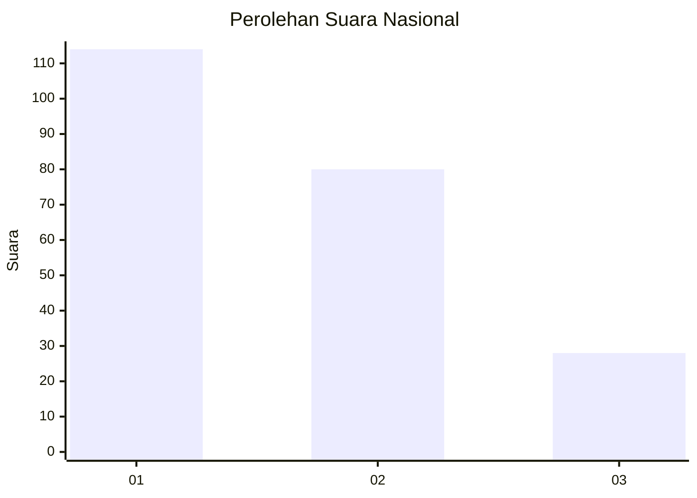
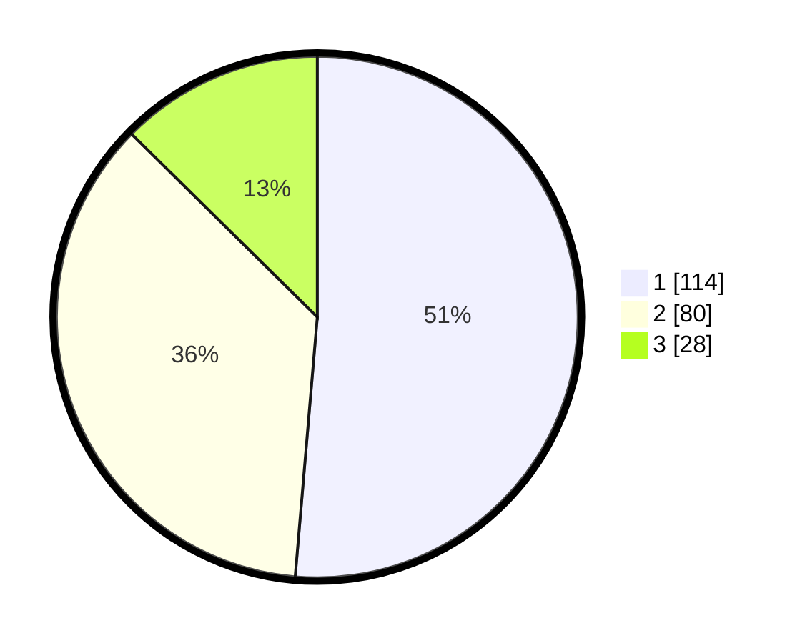

# Hasil

## Grafik

## Tabel

| No.    | Nama Paslon    | Suara | Suara (raw) | Persentase |
|:------ |:-------------- | -----:| -----------:| ----------:|
| 100025 | ANIES MUHAIMIN | 114   | [114][p-1]  | 51,35      |
| 100026 | PRABOWO GIBRAN | 80    | [80][p-2]   | 36,04      |
| 100027 | GANJAR MAHFUD  | 28    | [28][p-3]   | 12,61      |

[p-1]: https://github.com/gigit-pemilu/pemilu-2024/blob/main/pilpres/hitung-suara/sub/31-dki-jakarta/sub/75-jakarta-timur/sub/08-makasar/sub/1002-pinangranti/sub/008-tps/sub/paslon-1.txt
[p-2]: https://github.com/gigit-pemilu/pemilu-2024/blob/main/pilpres/hitung-suara/sub/31-dki-jakarta/sub/75-jakarta-timur/sub/08-makasar/sub/1002-pinangranti/sub/008-tps/sub/paslon-2.txt
[p-3]: https://github.com/gigit-pemilu/pemilu-2024/blob/main/pilpres/hitung-suara/sub/31-dki-jakarta/sub/75-jakarta-timur/sub/08-makasar/sub/1002-pinangranti/sub/008-tps/sub/paslon-3.txt

## Foto C Plano

https://sirekap-obj-formc.kpu.go.id/8a4d/pemilu/ppwp/31/75/08/10/02/3175081002008-20240214-215904--fa0460cc-3753-4c73-8e70-7eec0816f557.jpg

https://sirekap-obj-formc.kpu.go.id/8a4d/pemilu/ppwp/31/75/08/10/02/3175081002008-20240214-220001--8478e9f9-2f9c-4fbf-a4ac-dc9d84e4cd75.jpg

https://sirekap-obj-formc.kpu.go.id/8a4d/pemilu/ppwp/31/75/08/10/02/3175081002008-20240214-220200--54043547-0dcd-4aaa-b9af-3c13940ffc12.jpg

## Metadata

| Key        | Value               |
| ---------- | ------------------- |
| Time Stamp | 2024-02-15 15:00:29 |

