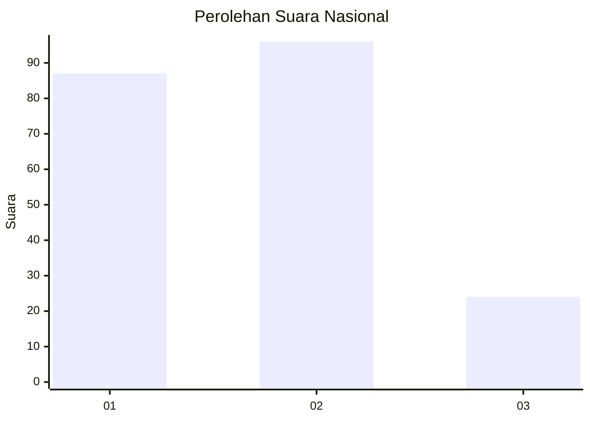
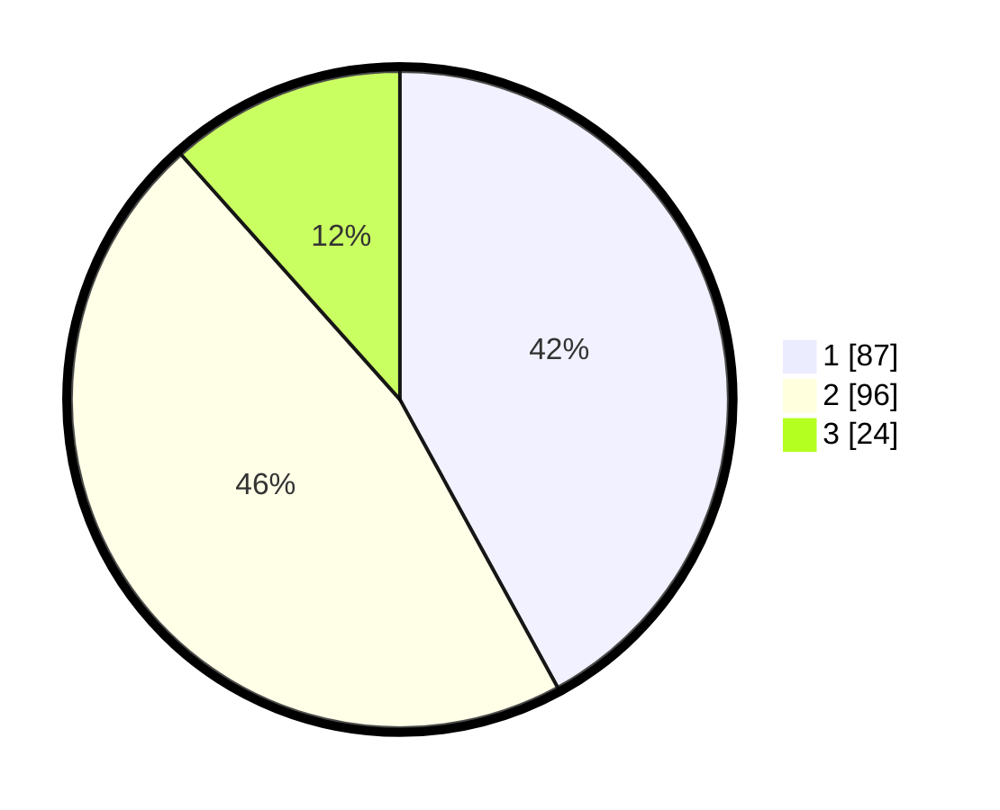

# Hasil

## Grafik

## Tabel

| No.    | Nama Paslon    | Suara | Suara (raw) | Persentase |
|:------ |:-------------- | -----:| -----------:| ----------:|
| 100025 | ANIES MUHAIMIN | 87    | [87][p-1]   | 42,03      |
| 100026 | PRABOWO GIBRAN | 96    | [96][p-2]   | 46,38      |
| 100027 | GANJAR MAHFUD  | 24    | [24][p-3]   | 11,59      |

[p-1]: https://github.com/gigit-pemilu/pemilu-2024/blob/main/pilpres/hitung-suara/sub/31-dki-jakarta/sub/75-jakarta-timur/sub/08-makasar/sub/1002-pinangranti/sub/015-tps/sub/paslon-1.txt
[p-2]: https://github.com/gigit-pemilu/pemilu-2024/blob/main/pilpres/hitung-suara/sub/31-dki-jakarta/sub/75-jakarta-timur/sub/08-makasar/sub/1002-pinangranti/sub/015-tps/sub/paslon-2.txt
[p-3]: https://github.com/gigit-pemilu/pemilu-2024/blob/main/pilpres/hitung-suara/sub/31-dki-jakarta/sub/75-jakarta-timur/sub/08-makasar/sub/1002-pinangranti/sub/015-tps/sub/paslon-3.txt

## Foto C Plano

https://sirekap-obj-formc.kpu.go.id/a17c/pemilu/ppwp/31/75/08/10/02/3175081002015-20240214-232657--11040ee2-912d-4fd9-9f3b-5a2d8eaef3d3.jpg

https://sirekap-obj-formc.kpu.go.id/a17c/pemilu/ppwp/31/75/08/10/02/3175081002015-20240214-232722--10b17db5-23ee-48a0-921b-4ac2fec23540.jpg

https://sirekap-obj-formc.kpu.go.id/a17c/pemilu/ppwp/31/75/08/10/02/3175081002015-20240214-232744--2531e8e9-f909-421a-be63-05f6694e759b.jpg

## Metadata

| Key        | Value               |
| ---------- | ------------------- |
| Time Stamp | 2024-02-15 18:00:26 |

