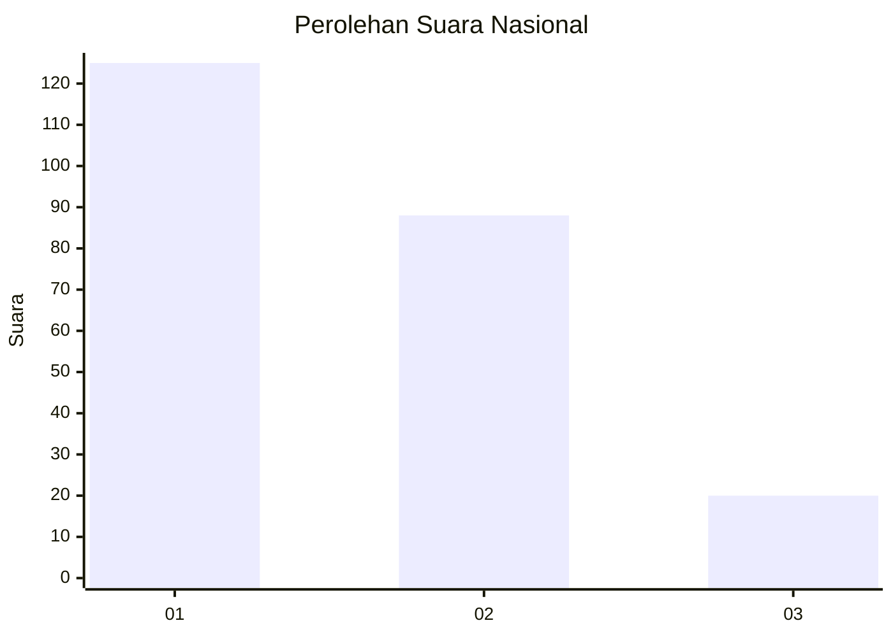
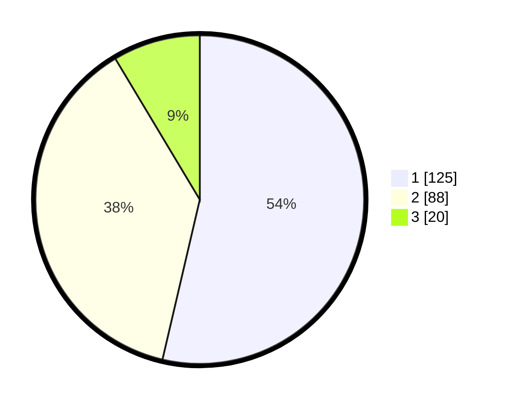

# Hasil

## Grafik

## Tabel

| No.    | Nama Paslon    | Suara | Suara (raw) | Persentase |
|:------ |:-------------- | -----:| -----------:| ----------:|
| 100025 | ANIES MUHAIMIN | 125   | [125][p-1]  | 53,65      |
| 100026 | PRABOWO GIBRAN | 88    | [88][p-2]   | 37,77      |
| 100027 | GANJAR MAHFUD  | 20    | [20][p-3]   | 8,58       |

[p-1]: https://github.com/gigit-pemilu/pemilu-2024/blob/main/pilpres/hitung-suara/sub/31-dki-jakarta/sub/75-jakarta-timur/sub/08-makasar/sub/1002-pinangranti/sub/028-tps/sub/paslon-1.txt
[p-2]: https://github.com/gigit-pemilu/pemilu-2024/blob/main/pilpres/hitung-suara/sub/31-dki-jakarta/sub/75-jakarta-timur/sub/08-makasar/sub/1002-pinangranti/sub/028-tps/sub/paslon-2.txt
[p-3]: https://github.com/gigit-pemilu/pemilu-2024/blob/main/pilpres/hitung-suara/sub/31-dki-jakarta/sub/75-jakarta-timur/sub/08-makasar/sub/1002-pinangranti/sub/028-tps/sub/paslon-3.txt

## Foto C Plano

https://sirekap-obj-formc.kpu.go.id/dba1/pemilu/ppwp/31/75/08/10/02/3175081002028-20240215-012326--6c89c3fb-f3bd-4c53-871d-db52070235a2.jpg

https://sirekap-obj-formc.kpu.go.id/dba1/pemilu/ppwp/31/75/08/10/02/3175081002028-20240215-012406--8a7098ad-26f4-48ed-a7d8-c45b43b67e5f.jpg

https://sirekap-obj-formc.kpu.go.id/dba1/pemilu/ppwp/31/75/08/10/02/3175081002028-20240215-012443--d18b08fe-3df2-4ffc-b960-377abcce88c4.jpg

## Metadata

| Key        | Value               |
| ---------- | ------------------- |
| Time Stamp | 2024-02-15 12:00:28 |

