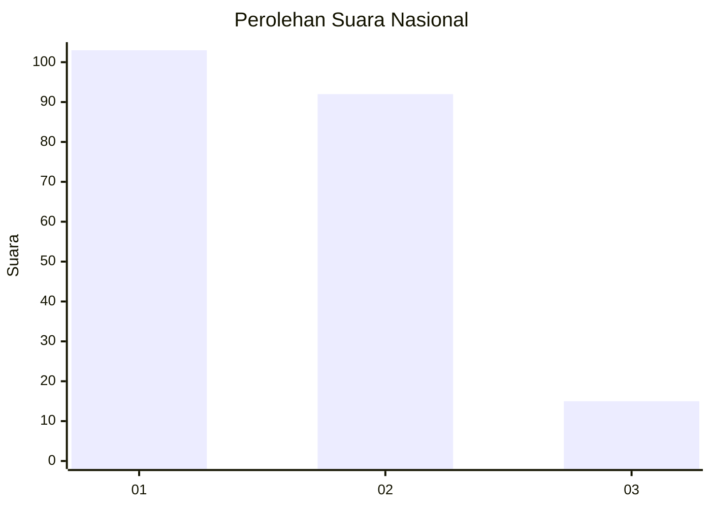
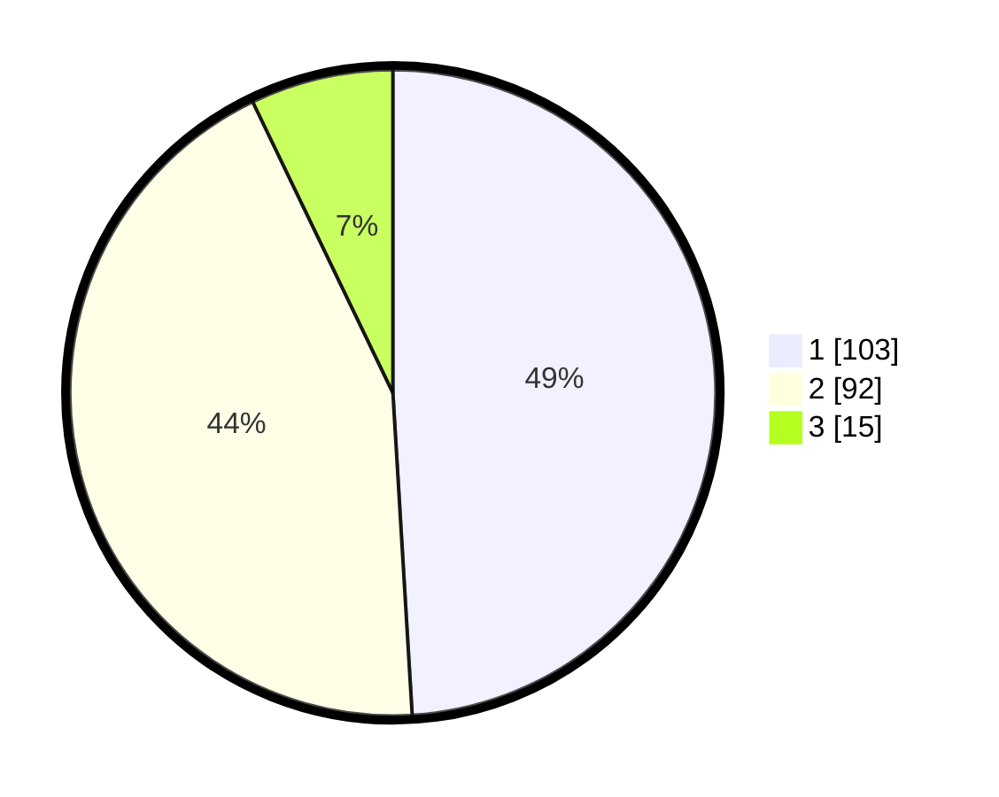

# Hasil

## Grafik

## Tabel

| No.    | Nama Paslon    | Suara | Suara (raw) | Persentase |
|:------ |:-------------- | -----:| -----------:| ----------:|
| 100025 | ANIES MUHAIMIN | 103   | [103][p-1]  | 49,05      |
| 100026 | PRABOWO GIBRAN | 92    | [92][p-2]   | 43,81      |
| 100027 | GANJAR MAHFUD  | 15    | [15][p-3]   | 7,14       |

[p-1]: https://github.com/gigit-pemilu/pemilu-2024/blob/main/pilpres/hitung-suara/sub/31-dki-jakarta/sub/75-jakarta-timur/sub/08-makasar/sub/1002-pinangranti/sub/029-tps/sub/paslon-1.txt
[p-2]: https://github.com/gigit-pemilu/pemilu-2024/blob/main/pilpres/hitung-suara/sub/31-dki-jakarta/sub/75-jakarta-timur/sub/08-makasar/sub/1002-pinangranti/sub/029-tps/sub/paslon-2.txt
[p-3]: https://github.com/gigit-pemilu/pemilu-2024/blob/main/pilpres/hitung-suara/sub/31-dki-jakarta/sub/75-jakarta-timur/sub/08-makasar/sub/1002-pinangranti/sub/029-tps/sub/paslon-3.txt

## Foto C Plano

https://sirekap-obj-formc.kpu.go.id/8c8c/pemilu/ppwp/31/75/08/10/02/3175081002029-20240215-003231--af9930a0-1820-4bd9-bb1b-66f06cf60e17.jpg

https://sirekap-obj-formc.kpu.go.id/8c8c/pemilu/ppwp/31/75/08/10/02/3175081002029-20240215-003348--81d6335a-1931-4643-b547-e3bc1f5e2f2d.jpg

https://sirekap-obj-formc.kpu.go.id/8c8c/pemilu/ppwp/31/75/08/10/02/3175081002029-20240215-020803--4d6c9a95-c199-4f80-9b4a-9177dc622e47.jpg

## Metadata

| Key        | Value               |
| ---------- | ------------------- |
| Time Stamp | 2024-02-15 12:00:28 |

