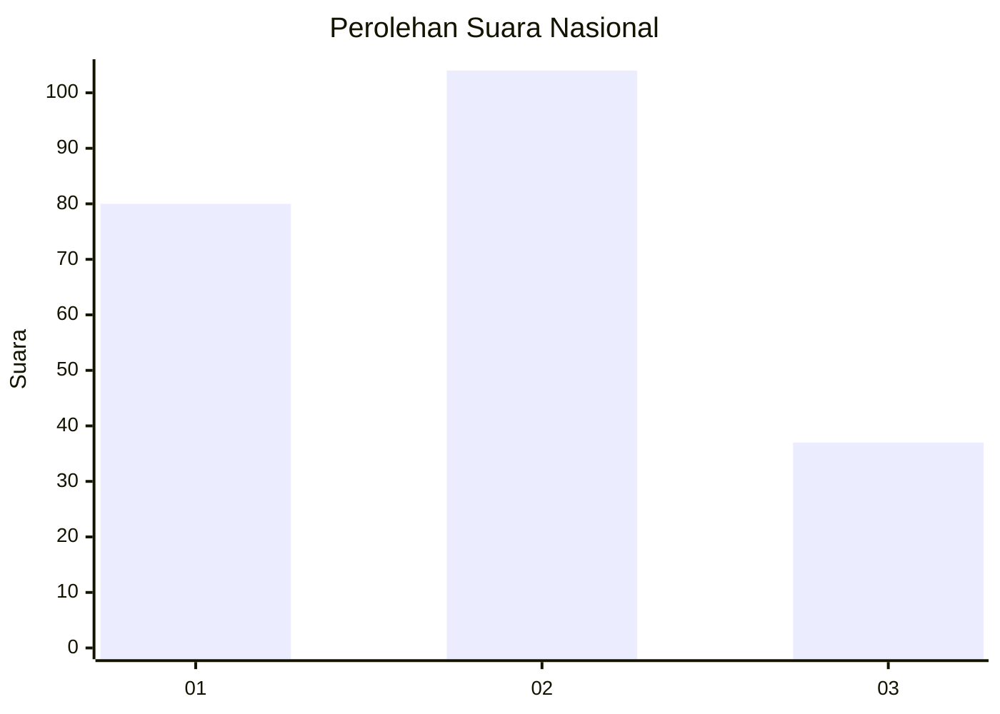
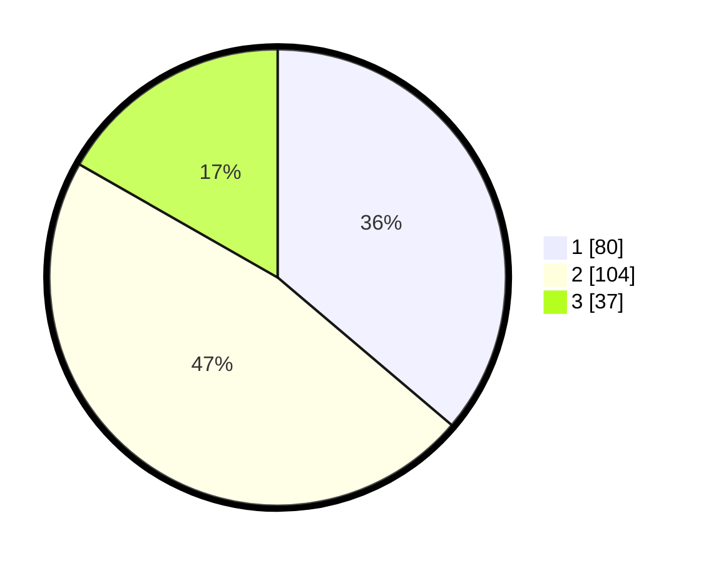

# Hasil

## Grafik

## Tabel

| No.    | Nama Paslon    | Suara | Suara (raw) | Persentase |
|:------ |:-------------- | -----:| -----------:| ----------:|
| 100025 | ANIES MUHAIMIN | 80    | [80][p-1]   | 36,20      |
| 100026 | PRABOWO GIBRAN | 104   | [104][p-2]  | 47,06      |
| 100027 | GANJAR MAHFUD  | 37    | [37][p-3]   | 16,74      |

[p-1]: https://github.com/gigit-pemilu/pemilu-2024/blob/main/pilpres/hitung-suara/sub/31-dki-jakarta/sub/75-jakarta-timur/sub/08-makasar/sub/1002-pinangranti/sub/051-tps/sub/paslon-1.txt
[p-2]: https://github.com/gigit-pemilu/pemilu-2024/blob/main/pilpres/hitung-suara/sub/31-dki-jakarta/sub/75-jakarta-timur/sub/08-makasar/sub/1002-pinangranti/sub/051-tps/sub/paslon-2.txt
[p-3]: https://github.com/gigit-pemilu/pemilu-2024/blob/main/pilpres/hitung-suara/sub/31-dki-jakarta/sub/75-jakarta-timur/sub/08-makasar/sub/1002-pinangranti/sub/051-tps/sub/paslon-3.txt

## Foto C Plano

https://sirekap-obj-formc.kpu.go.id/a246/pemilu/ppwp/31/75/08/10/02/3175081002051-20240214-215655--f71e3ca5-4fac-48b3-b209-d39efce57eec.jpg

https://sirekap-obj-formc.kpu.go.id/a246/pemilu/ppwp/31/75/08/10/02/3175081002051-20240214-180908--58f6013b-f53f-428f-b409-60592f7fc7df.jpg

https://sirekap-obj-formc.kpu.go.id/a246/pemilu/ppwp/31/75/08/10/02/3175081002051-20240214-215505--6d186746-7705-4061-8b65-f9da91e76435.jpg

## Metadata

| Key        | Value               |
| ---------- | ------------------- |
| Time Stamp | 2024-02-15 19:00:26 |

