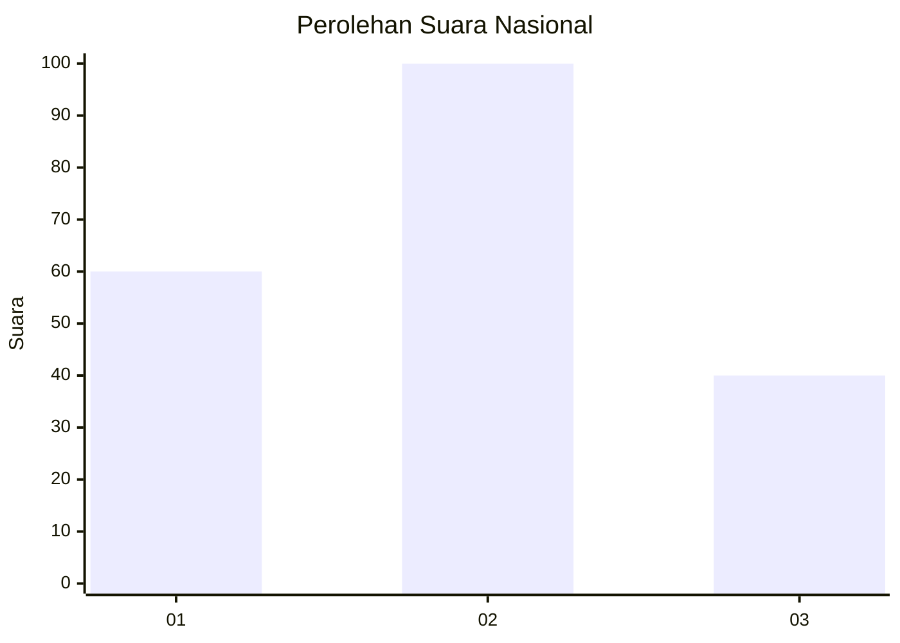
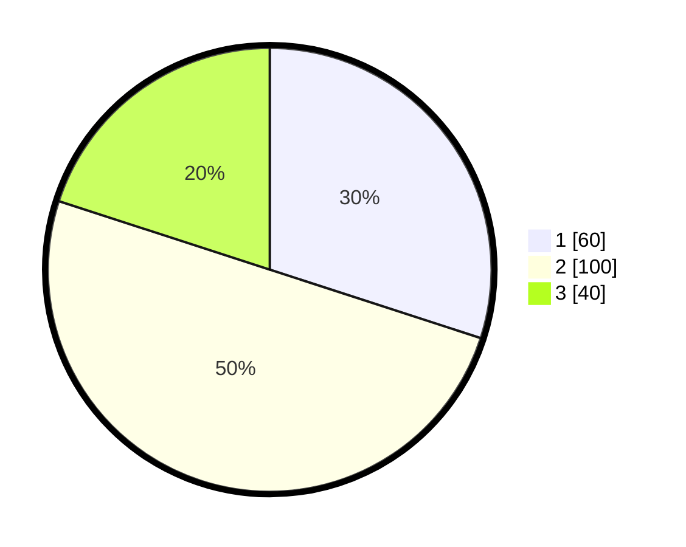

# Hasil

## Grafik

## Tabel

| No.    | Nama Paslon    | Suara | Suara (raw) | Persentase |
|:------ |:-------------- | -----:| -----------:| ----------:|
| 100025 | ANIES MUHAIMIN | 60    | [60][p-1]   | 30,00      |
| 100026 | PRABOWO GIBRAN | 100   | [100][p-2]  | 50,00      |
| 100027 | GANJAR MAHFUD  | 40    | [40][p-3]   | 20,00      |

[p-1]: https://github.com/gigit-pemilu/pemilu-2024/blob/main/pilpres/hitung-suara/sub/31-dki-jakarta/sub/75-jakarta-timur/sub/08-makasar/sub/1002-pinangranti/sub/052-tps/sub/paslon-1.txt
[p-2]: https://github.com/gigit-pemilu/pemilu-2024/blob/main/pilpres/hitung-suara/sub/31-dki-jakarta/sub/75-jakarta-timur/sub/08-makasar/sub/1002-pinangranti/sub/052-tps/sub/paslon-2.txt
[p-3]: https://github.com/gigit-pemilu/pemilu-2024/blob/main/pilpres/hitung-suara/sub/31-dki-jakarta/sub/75-jakarta-timur/sub/08-makasar/sub/1002-pinangranti/sub/052-tps/sub/paslon-3.txt

## Foto C Plano

https://sirekap-obj-formc.kpu.go.id/39aa/pemilu/ppwp/31/75/08/10/02/3175081002052-20240214-225020--ba62b052-f923-4f23-aafc-b7e3cea1ebc2.jpg

https://sirekap-obj-formc.kpu.go.id/39aa/pemilu/ppwp/31/75/08/10/02/3175081002052-20240214-225509--d9eb7e4f-18e3-48a0-9cf8-c7a61afb25bf.jpg

https://sirekap-obj-formc.kpu.go.id/39aa/pemilu/ppwp/31/75/08/10/02/3175081002052-20240214-225642--3c80fa6e-16dc-4340-9e46-3d9093f7b4b8.jpg

## Metadata

| Key        | Value               |
| ---------- | ------------------- |
| Time Stamp | 2024-02-15 12:00:28 |

