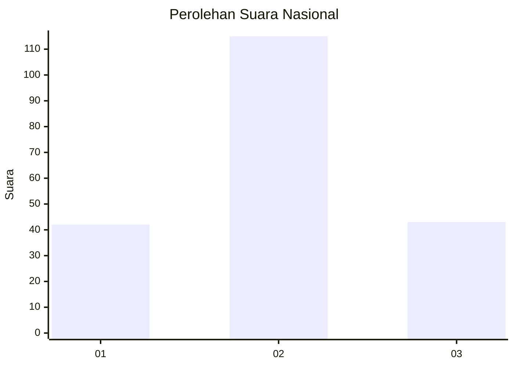
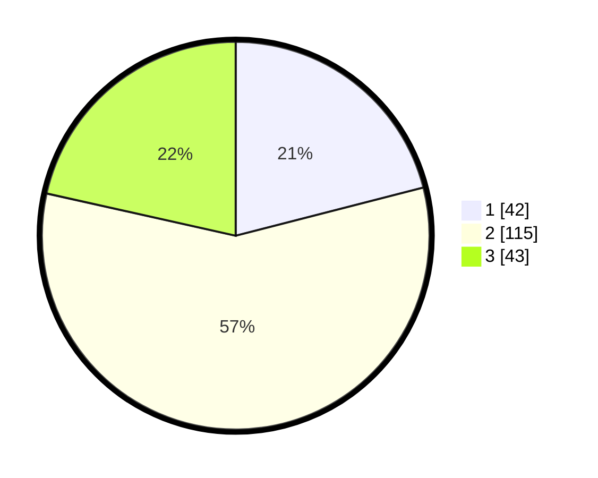

# Hasil

## Grafik

## Tabel

| No.    | Nama Paslon    | Suara | Suara (raw) | Persentase |
|:------ |:-------------- | -----:| -----------:| ----------:|
| 100025 | ANIES MUHAIMIN | 42    | [42][p-1]   | 21,00      |
| 100026 | PRABOWO GIBRAN | 115   | [115][p-2]  | 57,50      |
| 100027 | GANJAR MAHFUD  | 43    | [43][p-3]   | 21,50      |

[p-1]: https://github.com/gigit-pemilu/pemilu-2024/blob/main/pilpres/hitung-suara/sub/31-dki-jakarta/sub/75-jakarta-timur/sub/08-makasar/sub/1002-pinangranti/sub/056-tps/sub/paslon-1.txt
[p-2]: https://github.com/gigit-pemilu/pemilu-2024/blob/main/pilpres/hitung-suara/sub/31-dki-jakarta/sub/75-jakarta-timur/sub/08-makasar/sub/1002-pinangranti/sub/056-tps/sub/paslon-2.txt
[p-3]: https://github.com/gigit-pemilu/pemilu-2024/blob/main/pilpres/hitung-suara/sub/31-dki-jakarta/sub/75-jakarta-timur/sub/08-makasar/sub/1002-pinangranti/sub/056-tps/sub/paslon-3.txt

## Foto C Plano

https://sirekap-obj-formc.kpu.go.id/5357/pemilu/ppwp/31/75/08/10/02/3175081002056-20240214-225913--a478422b-72aa-49a0-9eae-50808237cfca.jpg

https://sirekap-obj-formc.kpu.go.id/5357/pemilu/ppwp/31/75/08/10/02/3175081002056-20240214-230005--1d43ee5d-2686-4212-9781-54f505d61f0d.jpg

https://sirekap-obj-formc.kpu.go.id/5357/pemilu/ppwp/31/75/08/10/02/3175081002056-20240214-230108--5919232e-039e-4077-be90-73e406c0f184.jpg

## Metadata

| Key        | Value               |
| ---------- | ------------------- |
| Time Stamp | 2024-02-15 12:00:28 |

