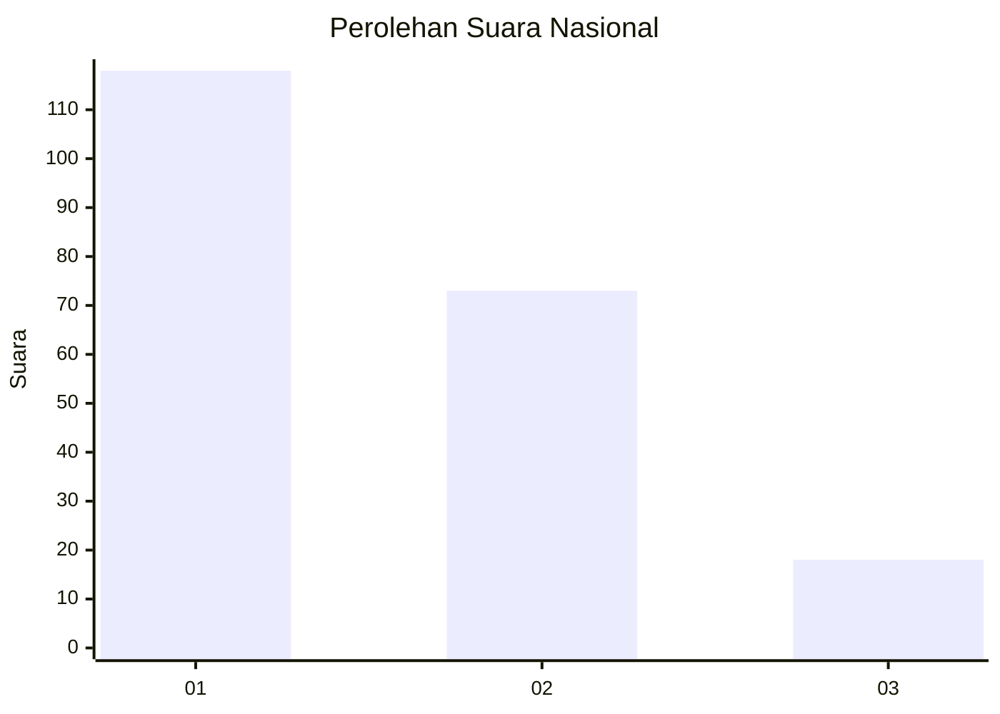
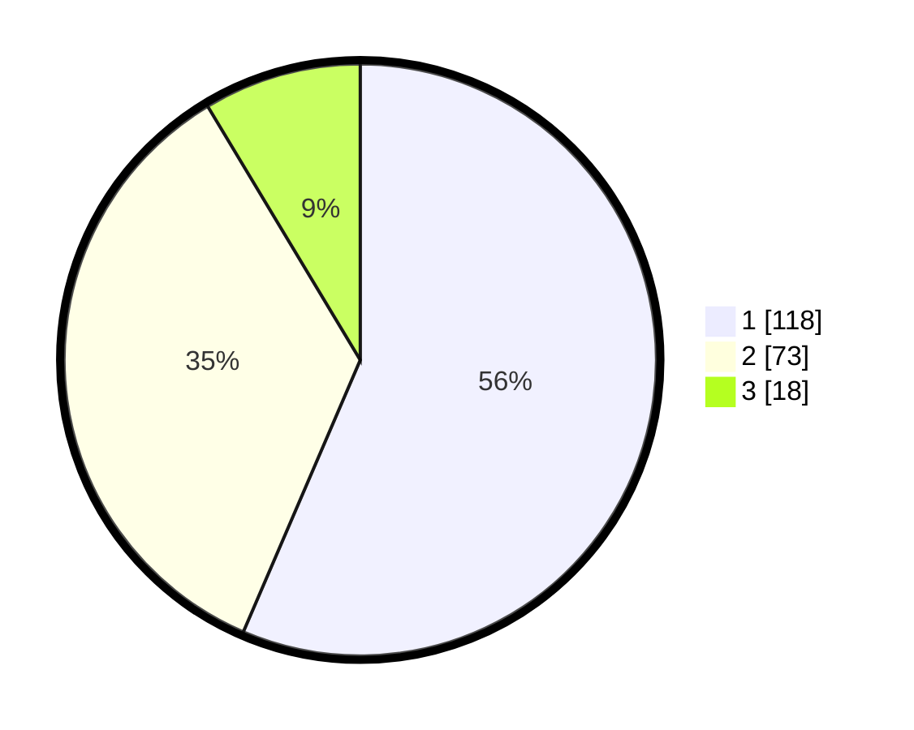

# Hasil

## Grafik

## Tabel

| No.    | Nama Paslon    | Suara | Suara (raw) | Persentase |
|:------ |:-------------- | -----:| -----------:| ----------:|
| 100025 | ANIES MUHAIMIN | 118   | [118][p-1]  | 56,46      |
| 100026 | PRABOWO GIBRAN | 73    | [73][p-2]   | 34,93      |
| 100027 | GANJAR MAHFUD  | 18    | [18][p-3]   | 8,61       |

[p-1]: https://github.com/gigit-pemilu/pemilu-2024/blob/main/pilpres/hitung-suara/sub/31-dki-jakarta/sub/75-jakarta-timur/sub/08-makasar/sub/1002-pinangranti/sub/077-tps/sub/paslon-1.txt
[p-2]: https://github.com/gigit-pemilu/pemilu-2024/blob/main/pilpres/hitung-suara/sub/31-dki-jakarta/sub/75-jakarta-timur/sub/08-makasar/sub/1002-pinangranti/sub/077-tps/sub/paslon-2.txt
[p-3]: https://github.com/gigit-pemilu/pemilu-2024/blob/main/pilpres/hitung-suara/sub/31-dki-jakarta/sub/75-jakarta-timur/sub/08-makasar/sub/1002-pinangranti/sub/077-tps/sub/paslon-3.txt

## Foto C Plano

https://sirekap-obj-formc.kpu.go.id/767d/pemilu/ppwp/31/75/08/10/02/3175081002077-20240214-213231--893c24b7-86fa-4716-b62a-c9b30ba69790.jpg

https://sirekap-obj-formc.kpu.go.id/767d/pemilu/ppwp/31/75/08/10/02/3175081002077-20240214-160115--d6bec9e0-2ce5-4de6-96b6-4f2c0150bbfa.jpg

https://sirekap-obj-formc.kpu.go.id/767d/pemilu/ppwp/31/75/08/10/02/3175081002077-20240214-160119--66e9d6a8-e4de-45dc-9b6d-63dde98b3d9d.jpg

## Metadata

| Key        | Value               |
| ---------- | ------------------- |
| Time Stamp | 2024-02-14 21:46:01 |

