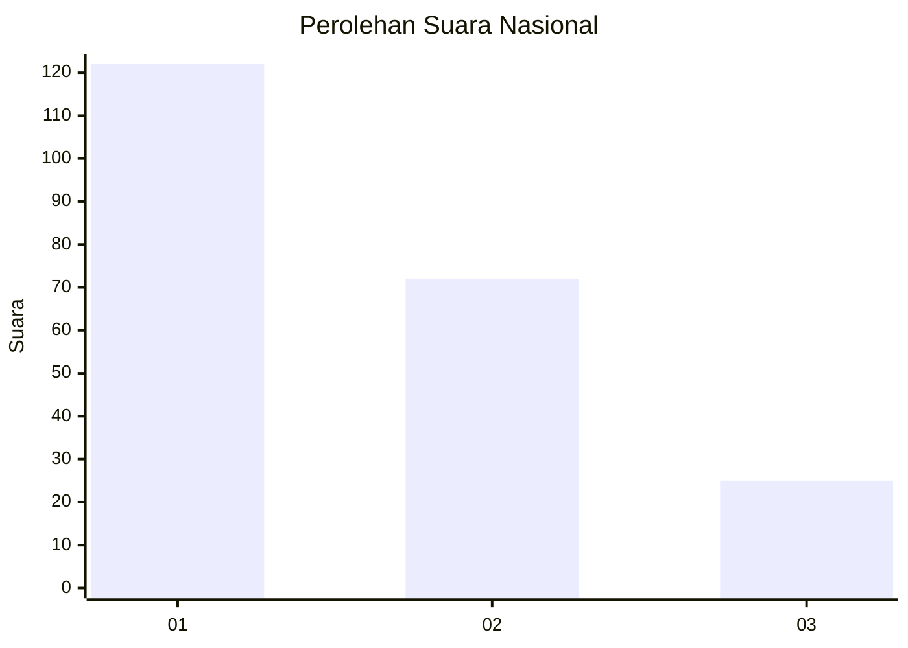
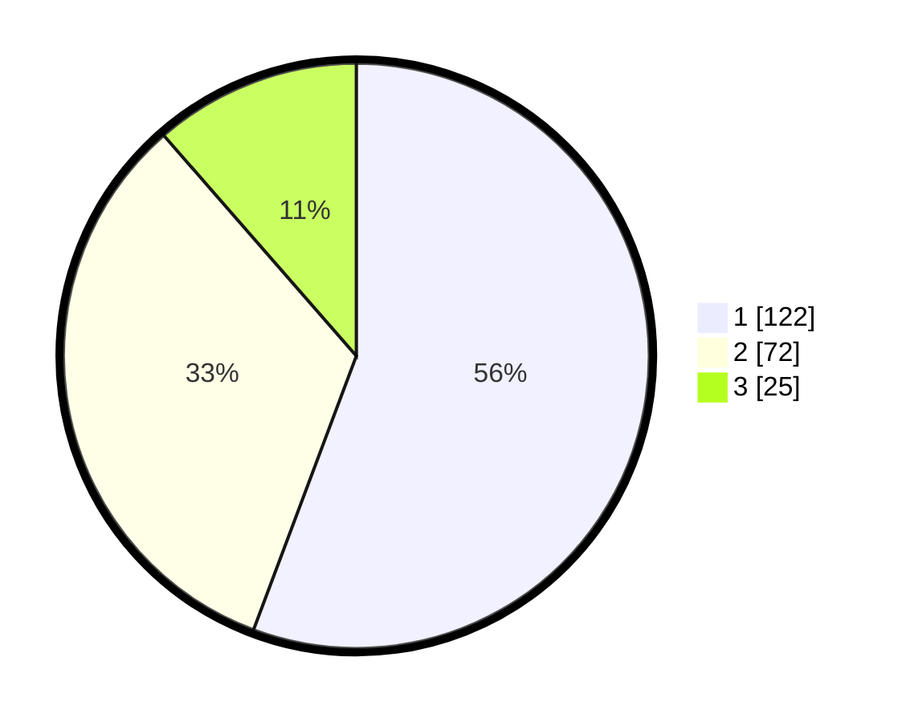

# Hasil

## Grafik

## Tabel

| No.    | Nama Paslon    | Suara | Suara (raw) | Persentase |
|:------ |:-------------- | -----:| -----------:| ----------:|
| 100025 | ANIES MUHAIMIN | 122   | [122][p-1]  | 55,71      |
| 100026 | PRABOWO GIBRAN | 72    | [72][p-2]   | 32,88      |
| 100027 | GANJAR MAHFUD  | 25    | [25][p-3]   | 11,42      |

[p-1]: https://github.com/gigit-pemilu/pemilu-2024/blob/main/pilpres/hitung-suara/sub/31-dki-jakarta/sub/75-jakarta-timur/sub/08-makasar/sub/1002-pinangranti/sub/094-tps/sub/paslon-1.txt
[p-2]: https://github.com/gigit-pemilu/pemilu-2024/blob/main/pilpres/hitung-suara/sub/31-dki-jakarta/sub/75-jakarta-timur/sub/08-makasar/sub/1002-pinangranti/sub/094-tps/sub/paslon-2.txt
[p-3]: https://github.com/gigit-pemilu/pemilu-2024/blob/main/pilpres/hitung-suara/sub/31-dki-jakarta/sub/75-jakarta-timur/sub/08-makasar/sub/1002-pinangranti/sub/094-tps/sub/paslon-3.txt

## Foto C Plano

https://sirekap-obj-formc.kpu.go.id/98e7/pemilu/ppwp/31/75/08/10/02/3175081002094-20240214-192544--58035946-f3eb-4f15-981e-26b12fef2030.jpg

https://sirekap-obj-formc.kpu.go.id/98e7/pemilu/ppwp/31/75/08/10/02/3175081002094-20240214-192558--99658daa-9147-42b2-be3a-fe7a31cbe100.jpg

https://sirekap-obj-formc.kpu.go.id/98e7/pemilu/ppwp/31/75/08/10/02/3175081002094-20240215-020510--028d5e19-7368-407d-b8c0-3440c756f7b3.jpg

## Metadata

| Key        | Value               |
| ---------- | ------------------- |
| Time Stamp | 2024-02-15 12:00:28 |

