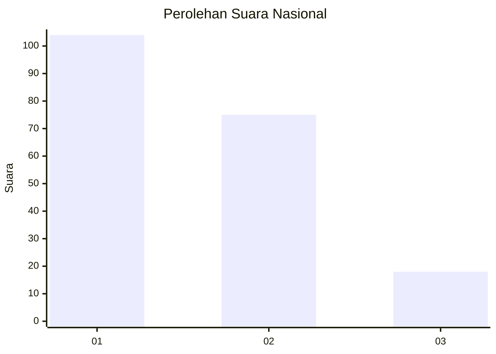
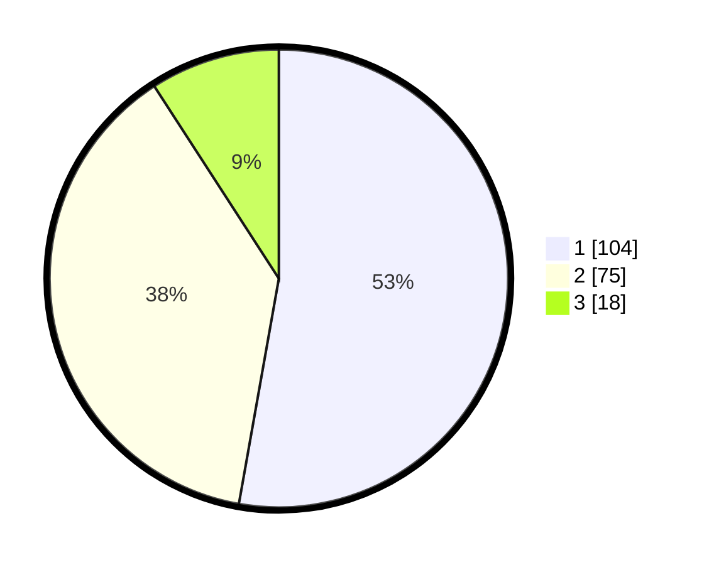

# Hasil

## Grafik

## Tabel

| No.    | Nama Paslon    | Suara | Suara (raw) | Persentase |
|:------ |:-------------- | -----:| -----------:| ----------:|
| 100025 | ANIES MUHAIMIN | 104   | [104][p-1]  | 52,79      |
| 100026 | PRABOWO GIBRAN | 75    | [75][p-2]   | 38,07      |
| 100027 | GANJAR MAHFUD  | 18    | [18][p-3]   | 9,14       |

[p-1]: https://github.com/gigit-pemilu/pemilu-2024/blob/main/pilpres/hitung-suara/sub/31-dki-jakarta/sub/75-jakarta-timur/sub/08-makasar/sub/1003-kebon-pala/sub/001-tps/sub/paslon-1.txt
[p-2]: https://github.com/gigit-pemilu/pemilu-2024/blob/main/pilpres/hitung-suara/sub/31-dki-jakarta/sub/75-jakarta-timur/sub/08-makasar/sub/1003-kebon-pala/sub/001-tps/sub/paslon-2.txt
[p-3]: https://github.com/gigit-pemilu/pemilu-2024/blob/main/pilpres/hitung-suara/sub/31-dki-jakarta/sub/75-jakarta-timur/sub/08-makasar/sub/1003-kebon-pala/sub/001-tps/sub/paslon-3.txt

## Foto C Plano

https://sirekap-obj-formc.kpu.go.id/3d38/pemilu/ppwp/31/75/08/10/03/3175081003001-20240214-205400--9961383d-ad8f-4e5d-ba46-c0c54b2e8851.jpg

https://sirekap-obj-formc.kpu.go.id/3d38/pemilu/ppwp/31/75/08/10/03/3175081003001-20240214-205036--ebcf567e-263c-4091-b0ff-b96526cdf2ac.jpg

https://sirekap-obj-formc.kpu.go.id/3d38/pemilu/ppwp/31/75/08/10/03/3175081003001-20240214-203054--26a1ce19-f6ca-4db1-8b8c-80d098437d58.jpg

## Metadata

| Key        | Value               |
| ---------- | ------------------- |
| Time Stamp | 2024-02-15 15:00:29 |

