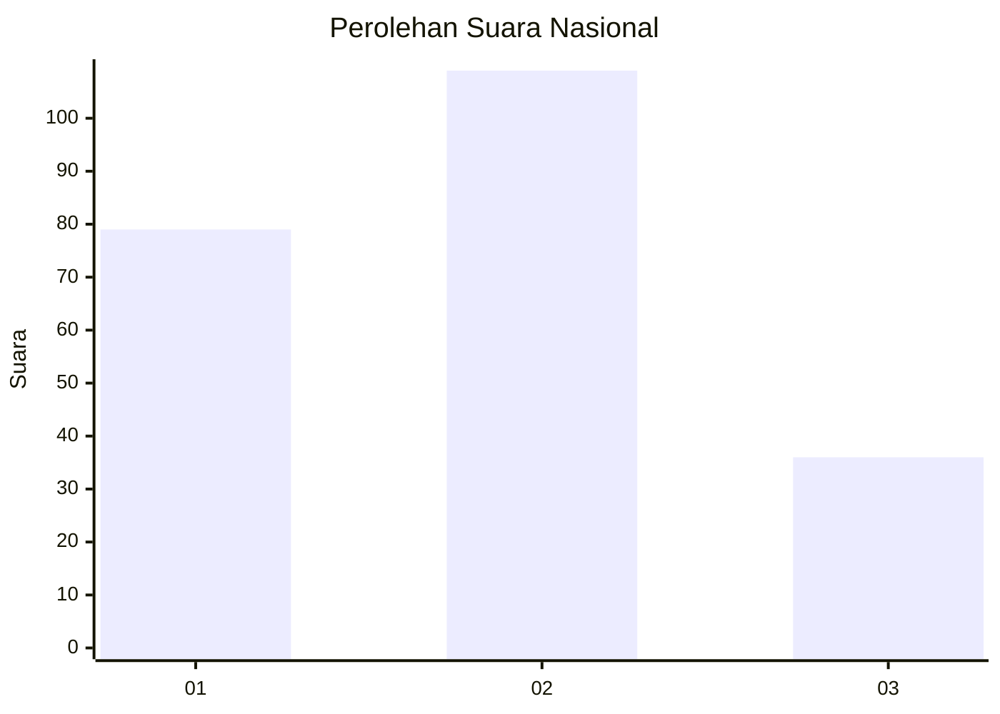
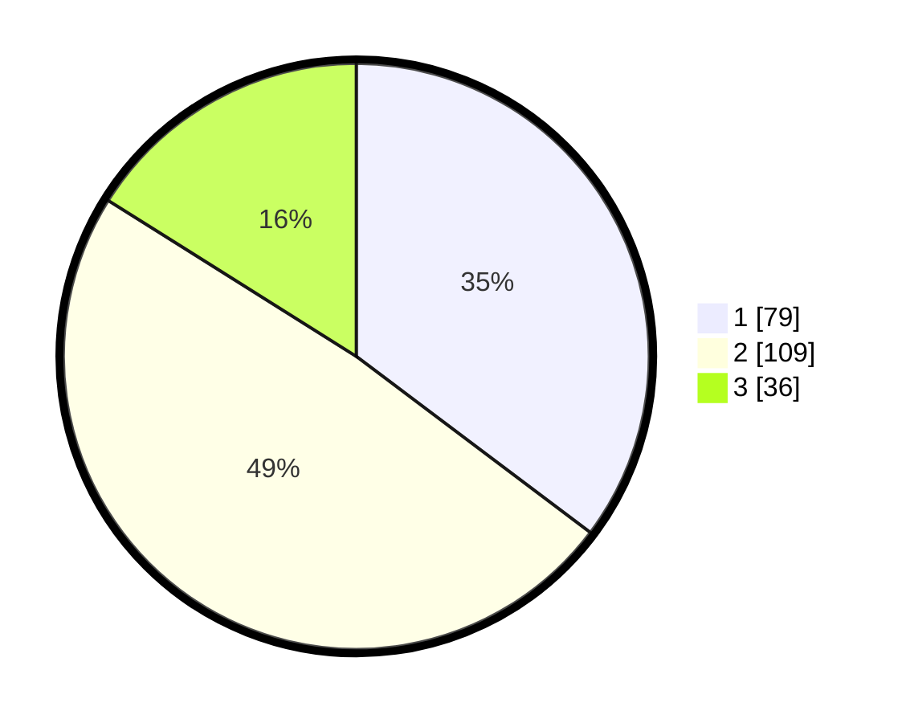

# Hasil

## Grafik

## Tabel

| No.    | Nama Paslon    | Suara | Suara (raw) | Persentase |
|:------ |:-------------- | -----:| -----------:| ----------:|
| 100025 | ANIES MUHAIMIN | 79    | [79][p-1]   | 35,27      |
| 100026 | PRABOWO GIBRAN | 109   | [109][p-2]  | 48,66      |
| 100027 | GANJAR MAHFUD  | 36    | [36][p-3]   | 16,07      |

[p-1]: https://github.com/gigit-pemilu/pemilu-2024/blob/main/pilpres/hitung-suara/sub/31-dki-jakarta/sub/75-jakarta-timur/sub/08-makasar/sub/1003-kebon-pala/sub/015-tps/sub/paslon-1.txt
[p-2]: https://github.com/gigit-pemilu/pemilu-2024/blob/main/pilpres/hitung-suara/sub/31-dki-jakarta/sub/75-jakarta-timur/sub/08-makasar/sub/1003-kebon-pala/sub/015-tps/sub/paslon-2.txt
[p-3]: https://github.com/gigit-pemilu/pemilu-2024/blob/main/pilpres/hitung-suara/sub/31-dki-jakarta/sub/75-jakarta-timur/sub/08-makasar/sub/1003-kebon-pala/sub/015-tps/sub/paslon-3.txt

## Foto C Plano

https://sirekap-obj-formc.kpu.go.id/c86d/pemilu/ppwp/31/75/08/10/03/3175081003015-20240214-220526--25ef43db-2332-447b-bc4c-2a84cad04c8c.jpg

https://sirekap-obj-formc.kpu.go.id/c86d/pemilu/ppwp/31/75/08/10/03/3175081003015-20240214-211931--1b0031be-2991-4754-be72-1a7a8fa9834d.jpg

https://sirekap-obj-formc.kpu.go.id/c86d/pemilu/ppwp/31/75/08/10/03/3175081003015-20240214-212337--fa0b5db8-7e75-467c-8a4c-5980ff7cbcfc.jpg

## Metadata

| Key        | Value               |
| ---------- | ------------------- |
| Time Stamp | 2024-02-15 15:00:29 |

