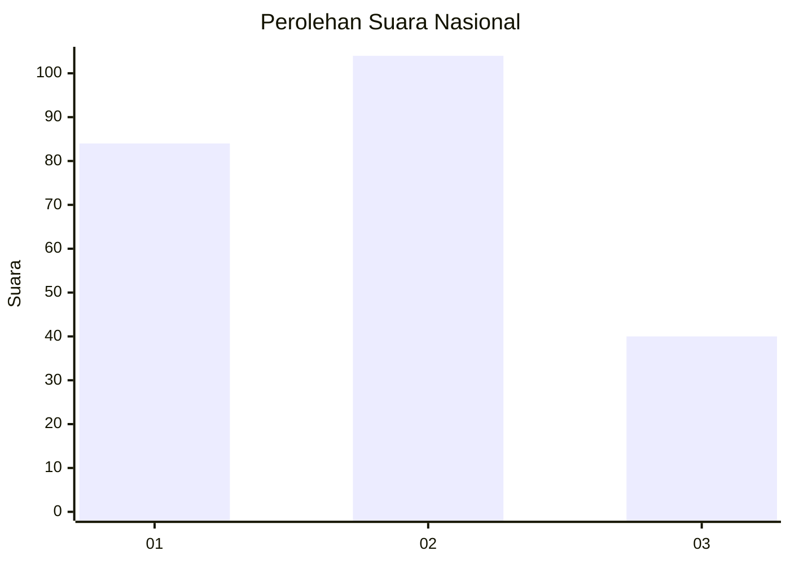
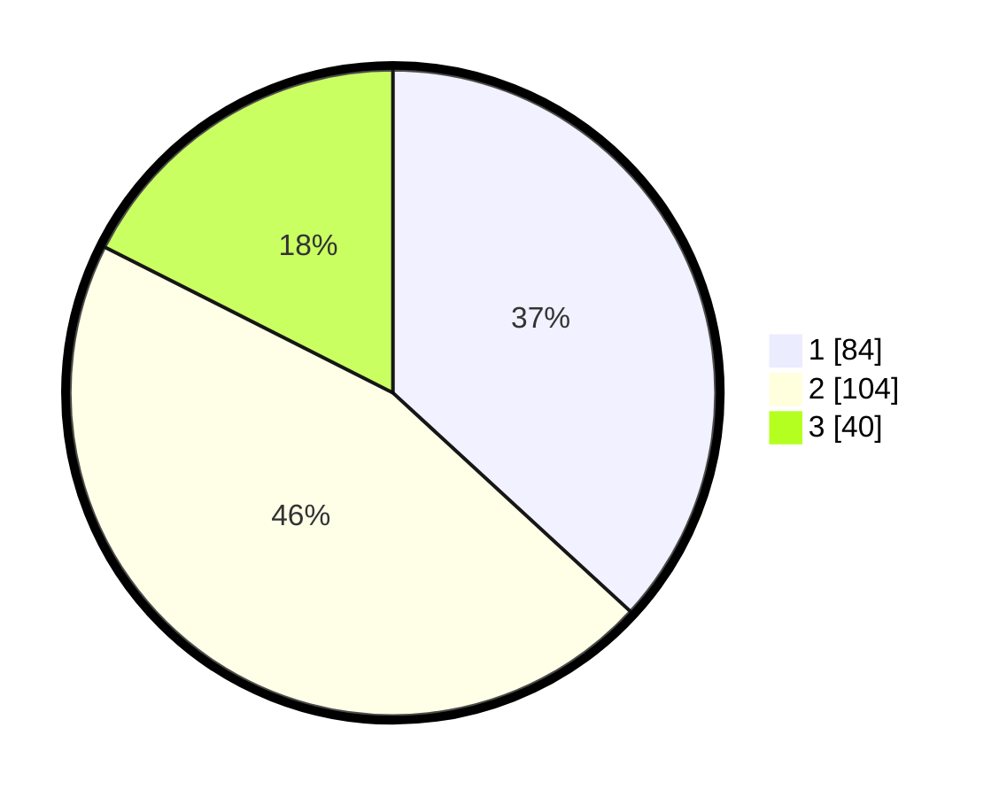

# Hasil

## Grafik

## Tabel

| No.    | Nama Paslon    | Suara | Suara (raw) | Persentase |
|:------ |:-------------- | -----:| -----------:| ----------:|
| 100025 | ANIES MUHAIMIN | 84    | [84][p-1]   | 36,84      |
| 100026 | PRABOWO GIBRAN | 104   | [104][p-2]  | 45,61      |
| 100027 | GANJAR MAHFUD  | 40    | [40][p-3]   | 17,54      |

[p-1]: https://github.com/gigit-pemilu/pemilu-2024/blob/main/pilpres/hitung-suara/sub/31-dki-jakarta/sub/75-jakarta-timur/sub/08-makasar/sub/1003-kebon-pala/sub/039-tps/sub/paslon-1.txt
[p-2]: https://github.com/gigit-pemilu/pemilu-2024/blob/main/pilpres/hitung-suara/sub/31-dki-jakarta/sub/75-jakarta-timur/sub/08-makasar/sub/1003-kebon-pala/sub/039-tps/sub/paslon-2.txt
[p-3]: https://github.com/gigit-pemilu/pemilu-2024/blob/main/pilpres/hitung-suara/sub/31-dki-jakarta/sub/75-jakarta-timur/sub/08-makasar/sub/1003-kebon-pala/sub/039-tps/sub/paslon-3.txt

## Foto C Plano

https://sirekap-obj-formc.kpu.go.id/0a68/pemilu/ppwp/31/75/08/10/03/3175081003039-20240215-010905--d99fecd6-4125-4ebe-a83e-4460bd9bd75e.jpg

https://sirekap-obj-formc.kpu.go.id/0a68/pemilu/ppwp/31/75/08/10/03/3175081003039-20240214-215226--5a443980-c129-43ff-bce2-ffebd86d7062.jpg

https://sirekap-obj-formc.kpu.go.id/0a68/pemilu/ppwp/31/75/08/10/03/3175081003039-20240214-215525--c330d7d6-e4b1-42e5-b6f9-54122c1296a3.jpg

## Metadata

| Key        | Value               |
| ---------- | ------------------- |
| Time Stamp | 2024-02-25 15:00:00 |

