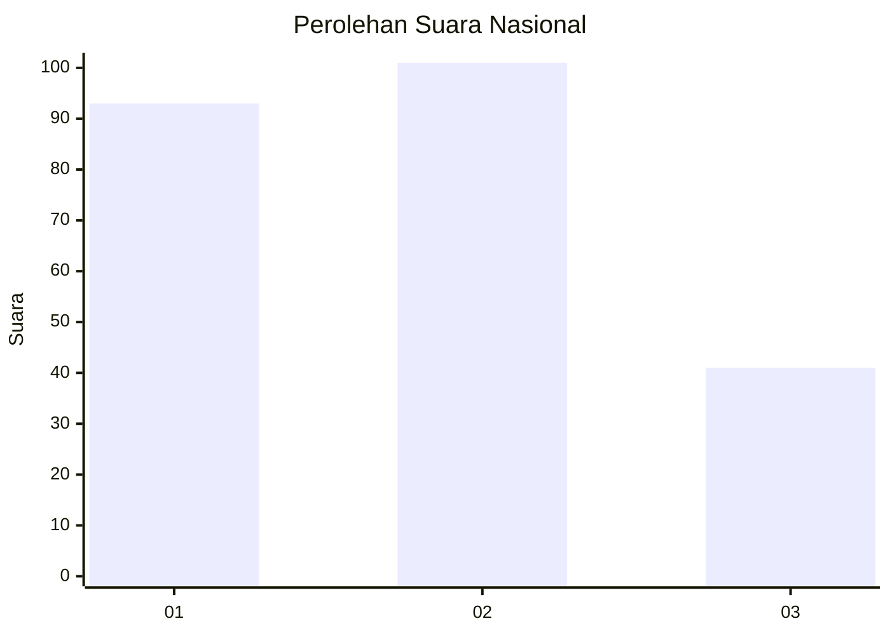
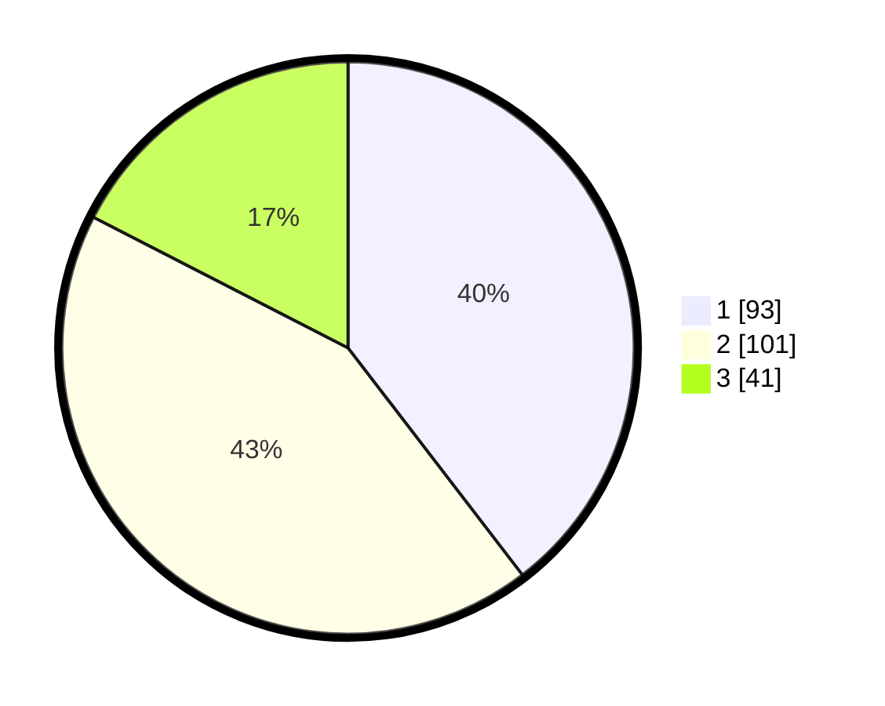

# Hasil

## Grafik

## Tabel

| No.    | Nama Paslon    | Suara | Suara (raw) | Persentase |
|:------ |:-------------- | -----:| -----------:| ----------:|
| 100025 | ANIES MUHAIMIN | 93    | [93][p-1]   | 39,57      |
| 100026 | PRABOWO GIBRAN | 101   | [101][p-2]  | 42,98      |
| 100027 | GANJAR MAHFUD  | 41    | [41][p-3]   | 17,45      |

[p-1]: https://github.com/gigit-pemilu/pemilu-2024/blob/main/pilpres/hitung-suara/sub/31-dki-jakarta/sub/75-jakarta-timur/sub/08-makasar/sub/1003-kebon-pala/sub/040-tps/sub/paslon-1.txt
[p-2]: https://github.com/gigit-pemilu/pemilu-2024/blob/main/pilpres/hitung-suara/sub/31-dki-jakarta/sub/75-jakarta-timur/sub/08-makasar/sub/1003-kebon-pala/sub/040-tps/sub/paslon-2.txt
[p-3]: https://github.com/gigit-pemilu/pemilu-2024/blob/main/pilpres/hitung-suara/sub/31-dki-jakarta/sub/75-jakarta-timur/sub/08-makasar/sub/1003-kebon-pala/sub/040-tps/sub/paslon-3.txt

## Foto C Plano

https://sirekap-obj-formc.kpu.go.id/8164/pemilu/ppwp/31/75/08/10/03/3175081003040-20240214-160056--e47e2cc2-fbc3-437f-84b4-87d432e83de2.jpg

https://sirekap-obj-formc.kpu.go.id/8164/pemilu/ppwp/31/75/08/10/03/3175081003040-20240214-155443--2c52d68c-c93a-498f-b972-c6727abc1d8d.jpg

https://sirekap-obj-formc.kpu.go.id/8164/pemilu/ppwp/31/75/08/10/03/3175081003040-20240214-155609--908b5fe4-46c6-4466-be8b-173970b3a123.jpg

## Metadata

| Key        | Value               |
| ---------- | ------------------- |
| Time Stamp | 2024-02-16 21:01:00 |

