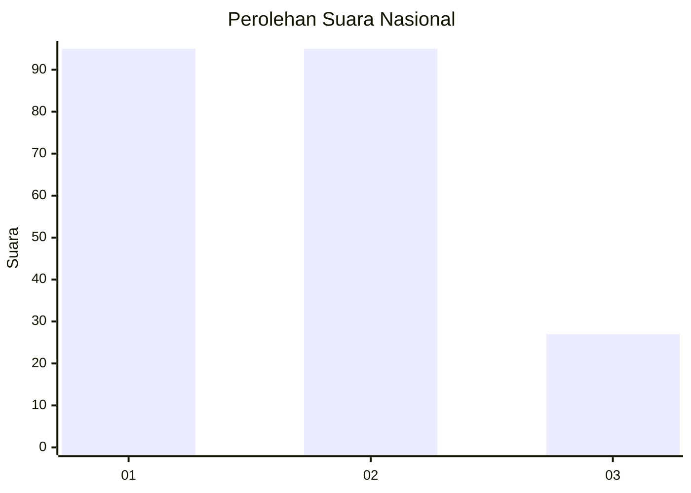
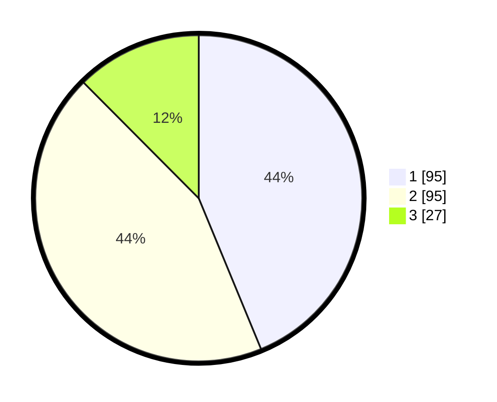

# Hasil

## Grafik

## Tabel

| No.    | Nama Paslon    | Suara | Suara (raw) | Persentase |
|:------ |:-------------- | -----:| -----------:| ----------:|
| 100025 | ANIES MUHAIMIN | 95    | [95][p-1]   | 43,78      |
| 100026 | PRABOWO GIBRAN | 95    | [95][p-2]   | 43,78      |
| 100027 | GANJAR MAHFUD  | 27    | [27][p-3]   | 12,44      |

[p-1]: https://github.com/gigit-pemilu/pemilu-2024/blob/main/pilpres/hitung-suara/sub/31-dki-jakarta/sub/75-jakarta-timur/sub/08-makasar/sub/1003-kebon-pala/sub/045-tps/sub/paslon-1.txt
[p-2]: https://github.com/gigit-pemilu/pemilu-2024/blob/main/pilpres/hitung-suara/sub/31-dki-jakarta/sub/75-jakarta-timur/sub/08-makasar/sub/1003-kebon-pala/sub/045-tps/sub/paslon-2.txt
[p-3]: https://github.com/gigit-pemilu/pemilu-2024/blob/main/pilpres/hitung-suara/sub/31-dki-jakarta/sub/75-jakarta-timur/sub/08-makasar/sub/1003-kebon-pala/sub/045-tps/sub/paslon-3.txt

## Foto C Plano

https://sirekap-obj-formc.kpu.go.id/6996/pemilu/ppwp/31/75/08/10/03/3175081003045-20240215-011322--cd6a0a2c-6dea-44f7-b346-624616f36776.jpg

https://sirekap-obj-formc.kpu.go.id/6996/pemilu/ppwp/31/75/08/10/03/3175081003045-20240215-011329--20ceddf8-c6cb-4115-9802-5994ce32f54e.jpg

https://sirekap-obj-formc.kpu.go.id/6996/pemilu/ppwp/31/75/08/10/03/3175081003045-20240215-011334--5c6a647f-4cb9-40b4-89b5-7b514afa4409.jpg

## Metadata

| Key        | Value               |
| ---------- | ------------------- |
| Time Stamp | 2024-02-15 15:00:29 |

